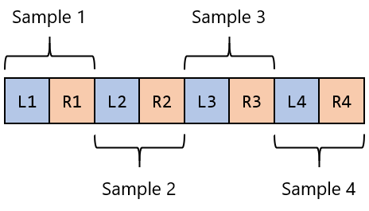
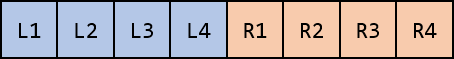

Programmer's Guide
==================

.. highlight:: c++

Initialization
--------------

Before using any Steam Audio functionality, you must create an ``IPLContext`` object. This contains various global settings and data structures used internally by Steam Audio::

    IPLContextSettings contextSettings{};

    // this is the version of the Steam Audio API that your program has been compiled against
    contextSettings.version = STEAMAUDIO_VERSION;

    // this is a handle to a context object, which we will initialize next
    IPLContext context = nullptr;

    IPLerror errorCode = iplContextCreate(&contextSettings, &context);
    if (errorCode) {
        // handle the error
    }

Memory Allocation
~~~~~~~~~~~~~~~~~

By default, Steam Audio uses the OS aligned memory allocation functions (``_aligned_malloc`` on Windows, and ``posix_memalign`` on Linux, macOS, Android, and iOS) whenever it needs to allocate memory internally. You can instead specify callbacks that Steam Audio will call whenever it needs to allocate or free memory::

    void* my_malloc(size_t size, size_t alignment)
    {
        // ...
    }

    void my_free(void* block)
    {
        // ...
    }

    // ...

    // pass pointers to these functions when creating the context
    contextSettings.allocateCallback = my_malloc;
    contextSettings.freeCallback = my_free;

This can be useful if you want to use a custom, optimized memory allocator instead of the OS default. It can also be used to instrument calls to the memory allocator and keep track of how much memory is being used by Steam Audio.

SIMD Optimizations
~~~~~~~~~~~~~~~~~~

Steam Audio uses Single Instruction Multiple Data (SIMD) instructions to optimize various operations. Steam Audio automatically selects the fastest SIMD instruction set to use based on the CPU it's running on. For example, when running on a CPU that supports Intel Advanced Vector eXtensions (AVX), it will use AVX optimized code. On older processors that do not support AVX, it will fall back to Streaming SIMD Extensions (SSE) instructions.

You can specify which SIMD instruction sets Steam Audio should consider::

    // this specifies that Steam Audio should _not_ consider any SIMD instructions newer than AVX2
    contextSettings.simdLevel = IPL_SIMDLEVEL_AVX2;

Using newer SIMD instruction sets like AVX512 can result in significant performance gains for the computations that use those instructions. However, it may result in increased CPU energy usage, which may in turn lead to the CPU clock frequency being throttled, resulting in a decrease in performance in other tasks that your program might be running.

Destroying Steam Audio API objects
~~~~~~~~~~~~~~~~~~~~~~~~~~~~~~~~~~

Steam Audio objects may be used from multiple threads. For this reason, they are *reference counted*. When you create a context, for example, it starts out with a reference count of 1. You can increment this reference count by calling ``iplContextRetain``, and decrement the reference count by calling ``iplContextRelease``. When the reference count reaches 0, Steam Audio will destroy the context. Every other Steam Audio API object works the same way.

Audio Buffers
-------------

Steam Audio processes audio in *audio buffers*, which contain uncompressed Pulse Code Modulated (PCM) data (just like a ``.wav`` file).

Audio buffers contain one or more *channels*; for example, a stereo audio buffer contains 2 channels. Each channel typically contains several *samples*, which are values of the audio signal's level at discrete points of time. Each channel has the same number of samples.

The time interval between two successive samples is specified using the *sampling rate*. Typical sampling rates are 44100 Hz (CD quality) or 48000 Hz.

Steam Audio always uses 32-bit floating-point samples.

Audio buffers are passed to Steam Audio using the ``IPLAudioBuffer`` structure::

    IPLAudioBuffer buffer;
    buffer.numChannels = 2;
    buffer.numSamples = 512;
    buffer.data = ...; // see below

This specifies an audio buffer containing 2 channels, each of which contains 512 samples, for a total of 2 * 512 = 1024 floating point values.

Interleaved vs. deinterleaved audio
~~~~~~~~~~~~~~~~~~~~~~~~~~~~~~~~~~~

Most audio file formats, and many audio engines, store audio buffers in an *interleaved* layout. This means that all the channel values for the first sample are stored contiguously, followed by all the channel values for the second sample, and so on. For example, an interleaved stereo buffer looks like:

Steam Audio, on the other hand, stores audio buffers in a *deinterleaved* layout. This means that all the samples for the first channel are store contiguously, followed by all the samples for the second channel, and so on. A deinterleaved stereo buffer looks like this:

In Steam Audio, the buffers for different channels do not need to be allocated in adjacent memory locations. So to specify the data for an audio buffer, you set the ``data`` field of the ``IPLAudioBuffer`` structure to point to an array, each element of which is a pointer to an array containing the samples for a single channel::

    float leftChannel[512];
    float rightChannel[512];
    float* channels[2] = {leftChannel, rightChannel};

    // ...

    buffer.data = channels;

Some audio engines use deinterleaved audio buffers natively, in which case you can just pass pointers to the data provided by the audio engine to Steam Audio via the ``IPLAudioBuffer`` structure. Otherwise, you can use ``iplAudioBufferDeinterleave`` and ``iplAudioBufferInterleave`` to exchange data between interleaved buffers provided by the audio engine, and deinterleaved buffers needed by Steam Audio::

    // these are pointers to interleaved data provided by external code
    float* inData;
    float* outData;

    // these are temporary buffers allocated by your application
    IPLAudioBuffer inBuffer;
    IPLAudioBuffer outBuffer;

    // ...

    // convert from interleaved to deinterleaved
    iplAudioBufferDeinterleave(context, inData, inBuffer);

    // pass inBuffer to some Steam Audio function, which populates outBuffer with some output

    // convert from deinterleaved back to interleaved
    iplAudioBufferInterleave(context, outBuffer, outData);

Allocating audio buffers
~~~~~~~~~~~~~~~~~~~~~~~~

If you need to create temporary audio buffers, either for conversion between interleaved and deinterleaved layouts, or because you need to apply a series of effects to an input audio buffer, you can use the ``iplAudioBufferAllocate`` function::

    IPLAudioBuffer tempBuffer;
    iplAudioBufferAllocate(context, 2, 512, &tempBuffer);

The buffer can then be freed using the ``iplAudioBufferFree`` function.

HRTF
----

The key component of spatial audio is the *Head-Related Transfer Function* (HRTF). For any direction around the listener, there is an HRTF, which is a pair of filters that specifies how sound arriving from that direction is modified before it reaches the left and right ears of the listener.

The HRTF filters encode the subtle changes to amplitude, arrival time, and spectral content that are caused by the listener's head, torso, and outer ear. These are the same cues that our brain uses to perceive the spatial origin of sound in the real world.

Since the audio presented to the left and right ears is processed using different filters, this approach is also called *binaural* rendering. This is also why spatial audio is best experienced over headphones.

Since there are infinite directions around the listener, an HRTF data set typically includes filters for a fixed number of discrete directions only.

Loading an HRTF
~~~~~~~~~~~~~~~

To load an HRTF, create an ``IPLHRTF`` object. Steam Audio provides a built-in HRTF, which can be loaded easily::

    IPLAudioSettings audioSettings{};
    audioSettings.samplingRate = 44100;
    audioSettings.frameSize = 1024; // the size of audio buffers we intend to process

    IPLHRTFSettings hrtfSettings{};
    hrtfSettings.type = IPL_HRTFTYPE_DEFAULT;

    IPLHRTF hrtf = nullptr;
    iplHRTFCreate(context, &audioSettings, &hrtfSettings, &hrtf);

.. _ref_guide_sofa:

Custom HRTFs
~~~~~~~~~~~~

You can also load a custom HRTF from an external file. This is useful if you want to experiment with other publicly available HRTF data sets, or use a personalized HRTF that is obtained using simulation or measurement.

Custom HRTFs are loaded from SOFA (Spatially Oriented File format for Acoustics) files::

    hrtfSettings.type = IPL_HRTFTYPE_SOFA;
    hrtfSettings.sofaFileName = "/path/to/hrtf.sofa";

Click `here <https://www.sofaconventions.org>`_ for more information on this file format.

.. warning::

    The SOFA file format allows for very flexible ways of defining HRTFs, but Steam Audio only supports a restricted subset. The following restrictions apply (for more information, including definitions of the terms below, click `here <https://www.sofaconventions.org>`_:

    -   SOFA files must use the ``SimpleFreeFieldHRIR`` convention.
    -   The ``Data.SamplingRate`` variable may be specified only once, and may contain only a single value. Steam Audio will automatically resample the HRTF data to the user's output sampling rate at run-time.
    -   The ``SourcePosition`` variable must be specified once for each measurement.
    -   Each source must have a single emitter, with ``EmitterPosition`` set to ``[0 0 0]``.
    -   The ``ListenerPosition`` variable may be specified only once (and not once per measurement). Its value must be ``[0 0 0]``.
    -   The ``ListenerView`` variable is optional. If specified, its value must be ``[1 0 0]`` (in Cartesian coordinates) or ``[0 0 1]`` (in spherical coordinates).
    -   The ``ListenerUp`` variable is optional. If specified, its value must be ``[0 0 1]`` (in Cartesian coordinates) or ``[0 90 1]`` (in spherical coordinates).
    -   The listener must have two receivers. The receiver positions are ignored.
    -   The ``Data.Delay`` variable may be specified only once. Its value must be 0.

Binaural Effect
---------------

To spatialize an audio buffer, you first need to create an ``IPLBinauralEffect`` object. This object maintains the internal state of a single stream of audio across frames. Typically, you will create one ``IPLBinauralEffect`` object for each sound source that you want to spatialize::

    IPLBinauralEffectSettings effectSettings{};
    effectSettings.hrtf = hrtf;

    IPLBinauralEffect effect = nullptr;
    iplBinauralEffectCreate(context, &audioSettings, &effectSettings, &effect);

Then, to spatialize an audio buffer, call the ``iplBinauralEffectApply`` function::

    IPLAudioBuffer inBuffer; // must be mono or stereo
    IPLAudioBuffer outBuffer; // must be stereo

    // ...

    IPLBinauralEffectParams params{};
    params.direction = IPLVector3{1.0f, 1.0f, 1.0f}; // direction from listener to source
    params.hrtf = hrtf;
    params.interpolation = IPL_HRTFINTERPOLATION_NEAREST; // see below
    params.spatialBlend = 1.0f; // see below
    params.peakDelays = nullptr;

    iplBinauralEffectApply(effect, &params, inBuffer, outBuffer);

The direction from the listener to the source is specified in the listener's coordinate system.

You can change the HRTF on the fly, which is why you must specify the HRTF both in the ``IPLBinauralEffectSettings`` and the ``IPLBinauralEffectParams`` structures.

HRTF interpolation
~~~~~~~~~~~~~~~~~~

When the direction from the listener to the source is *not* one of the directions for which HRTF filters are available, Steam Audio must estimate the HRTF filter using available data. This is controlled using the ``interpolation`` field of the ``IPLBinauralEffectParams`` structure.

*Nearest-neighbor* interpolation (specified by ``IPL_HRTFINTERPOLATION_NEAREST``) means selecting the closest direction to the actual source direction for which HRTF data is available. This is the fastest approach. However, for moving sources, you may hear audible transitions as the HRTF switches abruptly from one pair of filters to another. This is most noticeable with wide-band audio, such as white noise, or engine noise.

*Bilinear* interpolation (specified by ``IPL_HRTFINTERPOLATION_BILINEAR``) means blending between the 4 closest directions to the actual source direction. This is slower than nearest-neighbor filtering, but results in significantly smoother rendering of moving sources.

Spatial blend
~~~~~~~~~~~~~

You can use Steam Audio to blend between spatialized and unspatialized audio. For example, a radio playing in the distance can be spatialized (or *diegetic*), but as the listener moves closer, the sound can become less spatialized, until eventually it becomes part of the soundtrack (or *non-diegetic*).

This is controlled using the ``spatialBlend`` parameter::

    params.spatialBlend = 0.25f;

A value of ``0.25f`` means that the output of the binaural effect will be a blend of 25% spatialized and 75% unspatialized audio.

Ambisonics
----------

Ambisonics is a surround sound format that is especially well-suited to spatial audio applications. Ambisonic audio differs from traditional surround sound formats (5.1, 7.1, etc.) in a few important ways.

Ambisonic audio can describe sound reaching the listener from a full sphere of directions, including sounds that are vertically above or below the listener. On the other hand, traditional surround sound formats can only describe sounds in a horizontal plane around the listener.

Traditional surround sound formats represent the directional variation of sound using discrete channels, each of which is intended to be played back from a specific speaker. For example, a 5.1 surround sound system includes front-left, front-right, center, rear-left, and rear-right speakers. A sound source that is between the front-left and center speakers is then approximated by panning the audio signal between those two speakers.

In contrast, Ambisonic audio expresses any directional variation as a weighted sum of *basis functions* defined over the sphere of directions around the listener. (This is analogous to how the Fourier transform represents any time-varying function as a weighted sum of sinusoids.) For more information, click `here <https://en.wikipedia.org/wiki/Ambisonics>`_.

Ambisonic audio has an *order*, which essentially defines the number of channels. Ambisonic order N requires (N + 1)^2 channels. Order 0 has 1 channel, order 1 has 4 channels, order 2 has 9 channels, and so on. The higher the order, the more precisely a given directional variation can be represented.

You can use Ambisonic audio to represent *sound fields*. These are sounds that arrive from a variety of directions around the listener, all represented in a single audio clip. These are often useful for ambient sounds, or spatialized music.

Another common use for Ambisonics is as an intermediate mixing format. Point sources and sound fields can both be represented, processed and mixed in Ambisonic format. Once the final mix is obtained, it can be spatialized and rendered over the user's speakers or headphones.

Encoding a point source to Ambisonics
~~~~~~~~~~~~~~~~~~~~~~~~~~~~~~~~~~~~~

Given an audio signal being emitted by a point source, you can encode it into an Ambisonic sound field arriving at the listener using an ``IPLAmbisonicsEncodeEffect`` object. To create an Ambisonics encode effect, specify the Ambisonic order you want to encode to::

    IPLAmbisonicsEncodeEffectSettings effectSettings{};
    effectSettings.maxOrder = 2; // 2nd order Ambisonics (9 channels)

    IPLAmbisonicsEncodeEffect effect = nullptr;
    iplAmbisonicsEncodeEffectCreate(context, &audioSettings, &effectSettings, &effect);

You can then use ``iplAmbisonicsEncodeEffectApply`` to encode an audio buffer::

    IPLAudioBuffer inBuffer; // must be mono
    IPLAudioBuffer outBuffer; // must have 9 channels in this example

    // ...

    IPLAmbisonicsEncodeEffectParams params{};
    params.direction = IPLVector3{1.0f, 1.0f, 1.0f};
    params.order = 2;

    iplAmbisonicsEncodeEffectApply(effect, &params, inBuffer, outBuffer);

Decoding Ambisonics for rendering
~~~~~~~~~~~~~~~~~~~~~~~~~~~~~~~~~

To decode Ambisonics and render it to a multichannel audio buffer, use an ``IPLAmbisonicsDecodeEffect``. To create one, use the ``iplAmbisonicsDecodeEffectCreate`` function::

    IPLAmbisonicsDecodeEffectSettings effectSettings{};
    effectSettings.maxOrder = 2;
    effectSettings.hrtf = hrtf;

    IPLAmbisonicsDecodeEffect effect = nullptr;
    iplAmbisonicsDecodeEffectCreate(context, &audioSettings, &effectSettings, &effect);

You can then use ``iplAmbisonicsDecodeEffectApply`` to decode an audio buffer::

    IPLAudioBuffer inBuffer; // must have 9 channels in this example
    IPLAudioBuffer outBuffer; // must be stereo

    IPLCoordinateSpace3 listenerCoordinates; // the listener's coordinate system

    // ...

    IPLAmbisonicsDecodeEffectParams params{};
    params.order = 2;
    params.hrtf = hrtf;
    params.orientation = listenerCoordinates;
    params.binaural = IPL_TRUE;

    iplAmbisonicsDecodeEffectApply(effect, &params, inBuffer, outBuffer);

This decodes a 2nd order Ambisonic audio buffer, spatializes it using the HRTF, and stores the result in a stereo audio buffer.

You can instead decode to a multichannel surround sound format as follows. First, when creating the effect, specify the speaker layout you want to decode to::

    effectSettings.speakerLayout.type = IPL_SPEAKERLAYOUTTYPE_SURROUND_7_1;

Then, when applying the effect, disable binaural rendering::

    params.binaural = IPL_FALSE;

Rotating Ambisonic sound fields
~~~~~~~~~~~~~~~~~~~~~~~~~~~~~~~

One of the key advantages of Ambisonic audio is that Ambisonic sound fields can be efficiently rotated around the listener. Steam Audio does this using the ``orientation`` field of the ``IPLAmbisonicsDecodeEffectParams`` structure. This field stores the orientation of the listener *relative to the sound field*.

If you want the sound field to remain fixed in world space as the listener looks around, pass in the world space direction vectors of the listener's coordinate system.

If you want the sound field to remain fixed around the listener's head, pass in the coordinate axes::

    params.orientation.right = IPLVector3{1.0f, 0.0f, 0.0f};
    params.orientation.up = IPLVector3{0.0f, 1.0f, 0.0f};
    params.orientation.ahead = IPLVector3{0.0f, 0.0f, -1.0f};

Other effects, such as a sound field that slowly swirls around the listener's head, can be obtained by animating the ``orientation`` field over multiple audio frames.

Direct Effect
-------------

Sound propagating along the direct (straight line) path from the source to the listener can be affected by many things. It can attenuate over distance. It can be affected by the source's *directivity pattern*, which describes how the source emits sound in different directions. It can also be occluded by geometry.

Steam Audio renders all of these effects using an ``IPLDirectEffect`` object::

    IPLDirectEffectSettings effectSettings{};
    effectSettings.numChannels = 1; // input and output buffers will have 1 channel

    IPLDirectEffect effect = nullptr;
    iplDirectEffectCreate(context, &audioSettings, &effectSettings, &effect);

To apply the direct effect::

    IPLAudioBuffer inBuffer; // must be mono in this example
    IPLAudioBuffer outBuffer; // must be mono in this example

    IPLDirectEffectParams params{};
    params.flags = ...; // see below

    iplDirectEffectApply(effect, &params, inBuffer, outBuffer);

A direct effect can combine the effects of distance attenuation, directivity, occlusion, and more. Below are some common examples.

Distance attenuation
~~~~~~~~~~~~~~~~~~~~

The attenuation of sound over distance can be modeled as follows::

    params.flags = IPL_DIRECTEFFECTFLAGS_DISTANCEATTENUATION;
    params.distanceAttenuation = 0.6f;

This enables the rendering of distance attenuation, and causes the output to be rendered at 60% of the volume of the input. Typically, the value of the ``distanceAttenuation`` field will be determined based on the actual distance between the source and the listener.

Steam Audio provides a flexible way of specifying distance attenuation models using the ``IPLDistanceAttenuationModel`` structure::

    IPLDistanceAttenuationModel distanceAttenuationModel{};
    distanceAttenuationModel.type = IPL_DISTANCEATTENUATIONTYPE_DEFAULT;

This specifies Steam Audio's default attenuation model. You can also tweak the default attenuation model, or specify any arbitrary model of your own.

You can then use the ``iplDistanceAttenuationCalculate`` function to calculate distance attenuation for a specific source and listener::

    IPLVector3 sourcePosition; // the world-space position of the source
    IPLVector3 listenerPosition; // the world-space position of the listener

    float distanceAttenuation = iplDistanceAttenuationCalculate(context, sourcePosition, listenerPosition, distanceAttenuationModel);

    params.distanceAttenuation = distanceAttenuation;

Air absorption
~~~~~~~~~~~~~~

Different frequencies of sound can attenuate differently over distance. For example, distant explosions sound muffled because higher frequencies attenuate faster than lower frequencies. Steam Audio models this phenomenon as *air absorption*. This involves providing the direct effect with 3-band EQ values describing the sound after attenuation::

    params.flags = IPL_DIRECTEFFECTFLAGS_AIRABSORPTION;
    params.airAbsorption[0] = 0.9f;
    params.airAbsorption[1] = 0.7f;
    params.airAbsorption[2] = 0.5f;

Typically, the air absorption EQ values will be determined based on the actual distance between the source and the listener.

Steam Audio provides a flexible way of specifying air absorption models using the ``IPLAirAbsorptionModel`` structure::

    IPLAirAbsorptionModel airAbsorptionModel{};
    airAbsorptionModel.type = IPL_AIRABSORPTIONTYPE_DEFAULT;

This specifies Steam Audio's default air absorption model. You can also tweak the default air absorption model, or specify any arbitrary model of your own.

You can then use the ``iplAirAbsorptionCalculate`` function to calculate air absorption for a specific source and listener::

    IPLVector3 sourcePosition; // the world-space position of the source
    IPLVector3 listenerPosition; // the world-space position of the listener

    iplAirAbsorptionCalculate(context, sourcePosition, listenerPosition, airAbsorptionModel, params.airAbsorption);

Directivity
~~~~~~~~~~~

Sound sources can emit sound with different intensities in different directions. For example, a megaphone mostly projects sound towards the front. Steam Audio models this using a *directivity pattern*. Due to a source's directivity pattern, and its orientation and position relative to the listener, a further attenuation is applied to it, on top of any distance attenuation or air absorption::

    params.flags = IPL_DIRECTEFFECTFLAGS_DIRECTIVITY;
    params.directivity = 0.7f;

Typically, the directivity value will be determined based on the actual position and orientation of the source.

Steam Audio provides a flexible way of specifying directivity patterns using the ``IPLDirectivity`` structure::

    IPLDirectivity directivity{};
    directivity.dipoleWeight = 0.5f;
    directivity.dipolePower = 2.0f;

Steam Audio's default directivity pattern is a weighted dipole. The ``dipoleWeight`` field specifies a blend between a monopole (a source that emits sound equally in all directions) and a dipole (a source that emits sound mostly to the front and the back). In this example, a ``dipoleWeight`` value of ``0.5f`` results in a 50% monopole and 50% dipole blend. This is also called a *cardioid* directivity pattern.

The ``dipolePower`` field controls the sharpness of the dipole pattern. Higher values result in more focused sound.

You can also specify any arbitrary directivity pattern of your own.

You can then use the ``iplDirectivityCalculate`` function to calculate directivity for a specific source and listener::

    IPLCoordinateSpace3 sourceCoordinates; // the world-space position and orientation of the source
    IPLVector3 listenerPosition; // the world-space position of the listener

    params.directivity = iplDirectivityCalculate(context, sourceCoordinates, listenerPosition, directivity);

Occlusion and transmission
~~~~~~~~~~~~~~~~~~~~~~~~~~

Geometry, like a wall, can completely or partially occlude the direct sound path from a source to the listener. Here, partial occlusion means that some portion of the source is visible to the listener.

In addition, some portion of the occluded sound may be transmitted through the occluding geometry. This transmitted sound is affected by the material properties of the occluding geometry.

Steam Audio models occlusion as a fraction value between 0 and 1, where 0 means fully occluded and 1 means not occluded at all. Transmission is modeled as 3-band EQ values. The EQ values are only applied to the portion of sound that is occluded::

    params.flags = IPL_DIRECTEFFECTFLAGS_OCCLUSION | IPL_DIRECTEFFECTFLAGS_TRANSMISSION;
    params.occlusion = 0.4f;
    params.transmission[0] = 0.3f;
    params.transmission[1] = 0.2f;
    params.transmission[2] = 0.1f;

This describes a configuration where 40% of the source's sound is occluded, and an EQ is applied to this occluded portion of the sound.

Typically, the occlusion and transmission values will be determined by tracing rays through the scene to find occluding geometry.

Scene
-----

Any geometry that might interact with sound should be contained in an ``IPLScene`` object::

    IPLSceneSettings sceneSettings{};
    sceneSettings.type = IPL_SCENETYPE_DEFAULT;

    IPLScene scene = nullptr;
    iplSceneCreate(context, &sceneSettings, &scene);

The ``IPLScene`` itself doesn't contain any geometry. Instead you create one or more ``IPLStaticMesh`` or ``IPLInstancedMesh`` objects that contain the actual geometry, then add them to the scene.

Static geometry
~~~~~~~~~~~~~~~

Geometry that will not move or deform in any way should be specified using ``IPLStaticMesh`` objects::

    // four vertices of a unit square in the x-y plane
    IPLVector3 vertices[4] = {
        {0.0f, 0.0f, 0.0f},
        {1.0f, 0.0f, 0.0f},
        {1.0f, 1.0f, 0.0f},
        {0.0f, 1.0f, 0.0f}
    };

    // triangle indices use counter-clockwise winding order
    IPLTriangle triangles[2] = {
        {0, 1, 2},
        {0, 2, 3}
    };

    IPLMaterial materials[1] = {
        { {0.1f, 0.1f, 0.1f}, 0.5f, {0.2f, 0.2f, 0.2f} }
    };

    // both triangles use the same material
    IPLint32 materialIndices[2] = {0, 0};

    IPLStaticMeshSettings staticMeshSettings{};
    staticMeshSettings.numVertices = 4;
    staticMeshSettings.numTriangles = 2;
    staticMeshSettings.numMaterials = 1;
    staticMeshSettings.vertices = vertices;
    staticMeshSettings.triangles = triangles;
    staticMeshSettings.materialIndices = materialIndices;
    staticMeshSettings.materials = materials;

    IPLStaticMesh staticMesh = nullptr;
    iplStaticMeshCreate(scene, &staticMeshSettings, &staticMesh);

Triangles are defined as *indices* into the ``vertices`` array. The indices should be provided in counter-clockwise order, meaning if the triangle is viewed with its front side facing the viewer, then the vertices appear in counter-clockwise order.

Once the static mesh is created, the ``vertices``, ``triangles``, ``materialIndices``, and ``materials`` arrays can be freed if needed.

You can add a static mesh to a scene (using ``iplStaticMeshAdd``) or remove it (using ``iplStaticMeshRemove``) on the fly. You must call ``iplSceneCommit`` for the changes to take effect::

    iplStaticMeshAdd(staticMesh, scene);
    iplSceneCommit(scene);

Dynamic geometry
~~~~~~~~~~~~~~~~

Geometry that might move should be specified using ``IPLInstancedMesh`` objects. Instanced meshes cannot deform in any way; they can only undergo rigid-body motion.

As the name suggests, instanced meshes are defined as instances of some ``IPLScene`` (called the *sub-scene*) which can be placed inside another scene with a specified 4x4 affine transform matrix applied::

    // this should contain at least 1 static mesh
    IPLScene subScene;

    // this should be a transform that maps from the subScene's local coordinates
    // to the scene's global (world-space) coordinates
    IPLMatrix4x4 transform;

    IPLInstancedMeshSettings instancedMeshSettings{};
    instancedMeshSettings.subScene = subScene;
    instancedMeshSettings.transform = transform;

    IPLInstancedMesh instancedMesh = nullptr;
    iplInstancedMeshCreate(scene, &instancedMeshSettings, &instancedMesh);

As with static meshes, you can add an instanced mesh to a scene (using ``iplInstancedMeshAdd``) or remove it (using ``iplInstancedMeshRemove``) on the fly. You can also modify the transform over time, using ``iplInstancedMeshUpdateTransform``. You must call ``iplSceneCommit`` for the changes to take effect::

    // some new transform that results in the instanced mesh moving in world space
    IPLMatrix4x4 newTransform;

    iplInstancedMeshUpdateTransform(instancedMesh, scene, newTransform);
    iplSceneCommit(scene);

Serializing scenes
~~~~~~~~~~~~~~~~~~

Some game engines may not provide a means for accessing geometry at run-time. In such cases, you can export static meshes to disk for Steam Audio to load them later.

To serialize a static mesh to disk, start by creating an empty ``IPLSerializedObject``::

    IPLSerializedObjectSettings soSettings{};

    IPLSerializedObject serializedObject = nullptr;
    iplSerializedObjectCreate(context, &soSettings, &serializedObject);

Next, use ``iplStaticMeshSave`` to serialize the static mesh to an in-memory buffer::

    iplStaticMeshSave(staticMesh, serializedObject);

The serialized object now contains an array of bytes containing a representation of the static mesh that can be saved to disk::

    IPLsize size = iplSerializedObjectGetSize(serializedObject);
    IPLbyte* buffer = iplSerializedObjectGetData(serializedObject);

    // you can now write 'size' bytes starting at the address 'buffer' to disk

To load the static mesh, you first read from the file on disk into a serialized object, then create the static mesh from the serialized object::

    IPLsize size; // size in bytes of the file
    IPLbyte* buffer; // buffer containing the entire file

    IPLSerializedObjectSettings soSettings{};
    soSettings.size = size;
    soSettings.data = buffer;

    IPLSerializedObject serializedObject = nullptr;
    iplSerializedObjectCreate(context, &soSettings, &serializedObject);

    IPLStaticMesh staticMesh = nullptr;
    iplStaticMeshLoad(scene, serializedObject, nullptr, nullptr, &staticMesh);

    // you can now free the memory in 'buffer'

Using your own ray tracer
~~~~~~~~~~~~~~~~~~~~~~~~~

Steam Audio provides multiple ray tracing implementations with different trade-offs:

-   Steam Audio's built-in ray tracer, which works on all platforms.
-   Intel's Embree ray tracer, which works on Windows, Linux, and macOS, and is faster than the built-in ray tracer.
-   AMD's Radeon Rays ray tracer, which works on 64-bit Windows and requires a GPU that supports OpenCL 1.2 or later. It is significantly faster than the built-in ray tracer or Embree, but requires care to ensure that it doesn't take up too much GPU processing time from graphical rendering or other GPU workloads.

You can also provide callbacks to your own ray tracing implementation. This way, you can reuse your existing ray tracing infrastructure, which may be better optimized for your specific application. For more details, see :ref:`ref_scene`.

Simulation
----------

To simulate occlusion, transmission, reflections, reverb, or pathing, you must first create an ``IPLSimulator`` object. Typically, a simulator is created once at app startup, and persists throughout the lifetime of the application::

    IPLSimulationSettings simulationSettings{};
    simulationSettings.flags = IPL_SIMULATIONFLAGS_DIRECT; // this enables occlusion/transmission simulation
    simulationSettings.sceneType = IPL_SCENETYPE_DEFAULT;
    // see below for examples of how to initialize the remaining fields of this structure

    IPLSimulator simulator = nullptr;
    iplSimulatorCreate(context, &simulationSettings, &simulator);

Next, specify the scene within which you want to run simulations. This determines the geometry against which rays will be traced::

    iplSimulatorSetScene(simulator, scene);
    iplSimulatorCommit(simulator);

You must call ``iplSimulatorCommit`` after calling ``iplSimulatorSetScene`` for the changes to take effect.

Sources
~~~~~~~

For each sound source for which you want to run simulations, you must create an ``IPLSource`` object. These objects typically persist throughout the lifetime of the in-game object they are associated with::

    iplSourceSettings sourceSettings{};
    sourceSettings.flags = IPL_SIMULATIONFLAGS_DIRECT; // this enables occlusion/transmission simulator for this source

    IPLSource source = nullptr;
    iplSourceCreate(simulator, &sourceSettings, &source);

Next, add it to the simulator so as to include it in any future simulations::

    iplSourceAdd(source, simulator);
    iplSimulatorCommit(simulator);

You can call ``iplSourceRemove`` to prevent a source from being included in any future simulations. Again, you must call ``iplSimulatorCommit`` after calling ``iplSourceAdd`` or ``iplSourceRemove`` for the changes to take effect.

Simulating occlusion and transmission
~~~~~~~~~~~~~~~~~~~~~~~~~~~~~~~~~~~~~

Now that we have created a simulator, created a source, and added the source to the simulator, we can simulate occlusion and transmission for the source. First, we specify values for various properties of the source::

    IPLCoordinateSpace3 sourceCoordinates; // the world-space position and orientation of the source

    IPLSimulationInputs inputs{};
    inputs.flags = IPL_SIMULATIONFLAGS_DIRECT;
    inputs.directFlags = IPL_DIRECTSIMULATIONFLAGS_OCCLUSION | IPL_DIRECTSIMULATIONFLAGS_TRANSMISSION;
    inputs.source = sourceCoordinates;
    inputs.occlusionType = IPL_OCCLUSIONTYPE_RAYCAST;

    iplSourceSetInputs(source, IPL_SIMULATIONFLAGS_DIRECT, &inputs);

This causes occlusion and transmission to be simulated the next time the simulator is run (see below). It also specifies that occlusion should be simulated by tracing a single ray from the source to the listener. This is an efficient occlusion algorithm, but may result in sudden transitions in and out of occlusion. There are other parameters you can configure to enable smoother transitions, at the cost of increased CPU usage. See :ref:`ref_simulation` for more details.

Next, we specify values for various global properties of the simulation::

    IPLCoordinateSpace3 listenerCoordinates; // the world-space position and orientation of the listener

    IPLSimulationSharedInputs sharedInputs{};
    sharedInputs.listener = listenerCoordinates;

    iplSimulatorSetSharedInputs(simulator, IPL_SIMULATIONFLAGS_DIRECT, sharedInputs);

Next, we run the simulation::

    iplSimulatorRunDirect(simulator);

This is a blocking call that runs occlusion and transmission simulations for all sources that have been added to the simulator. You may choose to run this in your game's main update thread, or from a separate thread, depending on CPU usage.

Finally, we retrieve the simulation results::

    IPLSimulationOutputs outputs{};
    iplSourceGetOutputs(source, IPL_SIMULATIONFLAGS_DIRECT, &outputs);

    IPLDirectEffectParams params = outputs.direct; // this can be passed to a direct effect

Reflections
-----------

Steam Audio can simulate how sound from a source is reflected off of surrounding geometry. This can lead to better spatialization and increased immersion, but comes at a significant CPU usage cost. For this reason, Steam Audio provides many options for controlling how and when reflections are simulated, so you can find the right trade-off between simulation quality and performance for your application.

In this section, we will describe the basic steps required to enable real-time reflection simulation, without focusing too much on performance.

Initializing a simulator for reflections
~~~~~~~~~~~~~~~~~~~~~~~~~~~~~~~~~~~~~~~~

First, when creating the simulator, you must specify parameters related to reflection simulation::

    IPLSimulationSettings simulationSettings{};
    simulationSettings.flags = IPL_SIMULATIONFLAGS_REFLECTIONS; // this enables reflection simulation
    simulationSettings.sceneType = IPL_SCENETYPE_DEFAULT;
    simulationSettings.reflectionType = IPL_REFLECTIONEFFECTTYPE_CONVOLUTION; // see below
    simulationSettings.maxNumRays = 4096;
    simulationSettings.numDiffuseSamples = 32;
    simulationSettings.maxDuration = 2.0f;
    simulationSettings.maxOrder = 1;
    simulationSettings.maxNumSources = 8;
    simulationSettings.numThreads = 2;
    simulationSettings.samplingRate = audioSettings.samplingRate;
    simulationSettings.frameSize = audioSettings.frameSize;

For information on the various parameters configured here, see :ref:`ref_simulation`. Among other things, the above code enables reflection simulation, specifies that up to 4096 rays will be traced from the listener, that the simulation should use 2 threads, and the result of the simulation should be stored in a 4-channel (1st order Ambisonics) impulse response (IR) that is 2.0 seconds long.

Simulating reflections
~~~~~~~~~~~~~~~~~~~~~~

To simulate reflections, first specify relevant properties of the source::

    IPLSimulationInputs inputs{};
    inputs.flags = IPL_SIMULATIONFLAGS_REFLECTIONS;
    inputs.source = sourceCoordinates;

    iplSourceSetInputs(source, IPL_SIMULATIONFLAGS_REFLECTIONS, &inputs);

Then, specify global properties of the simulation::

    IPLSimulationSharedInputs sharedInputs{};
    sharedInputs.listener = listenerCoordinates;
    sharedInputs.numRays = 4096;
    sharedInputs.numBounces = 16;
    sharedInputs.duration = 2.0f;
    sharedInputs.order = 1;
    sharedInputs.irradianceMinDistance = 1.0f;

    iplSimulatorSetSharedInputs(simulator, IPL_SIMULATIONFLAGS_REFLECTIONS, &sharedInputs);

This specifies that when the simulation is run next, all 4096 rays should be traced from the listener, up to the full 2.0 seconds of IR should be calculated, and all 4 channels should be calculated. The rays should also be bounced up to 16 times. Steam Audio lets you change the number of rays traced, or the length or IR computed, from one simulation to the next; for more details, see :ref:`ref_simulation`.

Finally, run the simulation and retrieve the results::

    // typically run in a separate thread
    iplSimulatorRunReflections(simulator);

    // typically run in the main update thread
    IPLSimulationOutputs outputs{};
    iplSourceGetOutputs(source, IPL_SIMULATIONFLAGS_REFLECTIONS, &outputs);

    IPLReflectionEffectParams params = outputs.reflections; // this can be passed to a reflection effect (see below)

Rendering reflections
~~~~~~~~~~~~~~~~~~~~~

To render the results of a reflection simulation, you use an ``IPLReflectionEffect`` object::

    IPLReflectionEffectSettings effectSettings{};
    effectSettings.type = IPL_REFLECTIONEFFECTTYPE_CONVOLUTION;
    effectSettings.irSize = 88200; // 2.0f (IR duration) * 44100 (sampling rate)
    effectSettings.numChannels = 4; // 1st order Ambisonics

    IPLReflectionEffect effect = nullptr;
    iplReflectionEffectCreate(context, &audioSettings, &effectSettings, &effect);

As usual, apply reflections to an audio buffer using ``iplReflectionEffectApply``::

    IPLAudioBuffer inBuffer; // must be mono
    IPLAudioBuffer outBuffer; // must have 4 channels (1st order Ambisonics) for this example

    IPLReflectionEffectParams params = outputs.reflections; // as above
    params.numChannels = 4; // use all channels of the IR
    params.irSize = 88200; // use the full duration of the IR

    iplReflectionEffectApply(effect, &params, inBuffer, outBuffer);

Reverb
~~~~~~

Reflection simulation models sound reflecting from the source to the listener. You can also use it to model reverberation within the listener's space (i.e., independent of any sources) by placing the source at the listener position. This lets you model smoothly-varying, physics-based reverb, with a CPU usage cost that is independent of the number of sources in your scene.

You can also use reflection simulation to model the reverb of the *source's* space, by placing the listener at the source position.

Baking
------

Simulating reflections in real-time is a very compute-intensive process. So Steam Audio lets you *bake*, or precompute reflections throughout a scene (or part of a scene) beforehand.

Reflections are baked at several points that you specify. Each of these points is called a *probe*. Just like game engines use *light probes* to store the variation of lighting throughout a scene, Steam Audio uses acoustic probes to store the variation of acoustic data (in this case, reflections) throughout a scene.

Generating probes
~~~~~~~~~~~~~~~~~

While you can place probes manually, you can also generate them automatically. Probes are generated and placed in ``IPLProbeArray`` objects::

    // this specifies a 100x100x100 axis-aligned box
    IPLMatrix4x4 boxTransform = {
        {100.0f,   0.0f,   0.0f,   0.0f},
        {  0.0f, 100.0f,   0.0f,   0.0f},
        {  0.0f,   0.0f, 100.0f,   0.0f},
        {  0.0f,   0.0f,   0.0f,   1.0f}
    };

    IPLProbeGenerationParams probeParams{};
    probeParams.type = IPL_PROBEGENERATIONTYPE_UNIFORMFLOOR;
    probeParams.spacing = 2.0f;
    probeParams.height = 1.5f;
    probeParams.transform = boxTransform;

    IPLProbeArray probeArray = nullptr;
    iplProbeArrayCreate(context, &probeArray);
    iplProbeArrayGenerateProbes(probeArray, scene, &probeParams);

Probes are then added to ``IPLProbeBatch`` objects, which are the atomic units in which probes are loaded and unloaded at run-time::

    IPLProbeBatch probeBatch = nullptr;
    iplProbeBatchCreate(context, &probeBatch);
    iplProbeBatchAddProbeArray(probeBatch, probeArray);
    iplProbeBatchCommit(probeBatch);

Probe batches can be serialized using ``iplProbeBatchSave`` and deserialized using ``iplProbeBatchLoad``.

Baking reflections
~~~~~~~~~~~~~~~~~~

For a static source, you can bake reflections that would reach every probe in a probe batch. First, you set up a *baked data identifier* that specifies what data you want to bake::

    IPLBakeDataIdentifier identifier{};
    identifier.type = IPL_BAKEDDATATYPE_REFLECTIONS;
    identifier.variation = IPL_BAKEDDATAVARIATION_STATICSOURCE;
    identifier.endpointInfluence.center = sourcePosition; // world-space position of the source
    identifier.endpointInfluence.radius = 100.0f; // only bake reflections for probes within 100m of the source

Next, specify various parameters to use for baking reflections::

    IPLReflectionsBakeParams bakeParams{};
    bakeParams.scene = scene;
    bakeParams.probeBatch = probeBatch;
    bakeParams.sceneType = IPL_SCENETYPE_DEFAULT;
    bakeParams.identifier = identifier;
    bakeParams.bakeFlags = IPL_REFLECTIONSBAKEFLAGS_BAKECONVOLUTION;
    bakeParams.numRays = 32768;
    bakeParams.numDiffuseSamples = 1024;
    bakeParams.numBounces = 64;
    bakeParams.simulatedDuration = 2.0f;
    bakeParams.savedDuration = 2.0f;
    bakeParams.order = 2;
    bakeParams.numThreads = 8;
    bakeParams.irradianceMinDistance = 1.0f;

Among other things, this specifies that Steam Audio should use a large number of rays (32768), bounce them many times (64 times), and use several threads for simulation (8 in this case). Since baking is an offline preprocess, you will typically use much higher settings for baking than you would for real-time reflection simulation.

Finally, run the bake process::

    iplReflectionsBakerBake(context, &bakeParams, nullptr, nullptr);

This is a blocking function that returns once the bake is complete. When the bake is complete, you can serialize the probe batch to disk; it will contain the baked reflections data.

Using baked reflections data
~~~~~~~~~~~~~~~~~~~~~~~~~~~~

To use baked data at run-time, first load and add the probe batch to your simulator::

    IPLProbeBatch probeBatch; // load from disk

    iplSimulatorAddProbeBatch(simulator, probeBatch);
    iplSimulatorCommit(simulator);

Then configure the relevant ``IPLSource`` object to use the baked data::

    IPLSimulationInputs inputs{};
    inputs.baked = IPL_TRUE;
    inputs.bakedDataIdentifier = identifier;
    // set up other properties as usual

Steam Audio will then use the baked data from probes in ``probeBatch`` that are near the listener to estimate the reflections at the listener position.

Pathing
-------

Simulating reflections lets you model how sound propagates from a source to the listener. However, you may need to trace a very large number of rays to ensure that indirect propagation paths are found correctly. This is especially true if the sound has to propagate large distances, bend around corners, or pass through multiple openings.

For this reason, Steam Audio provides an alternative type of simulation: pathing. Pathing involves taking a probe batch, and finding the shortest paths from a source to the listener that travel from one probe to another, without being occluded.

Baking pathing data
~~~~~~~~~~~~~~~~~~~

Since pathing requires probes to be generated, pathing data is typically baked in an offline step::

    IPLBakeDataIdentifier identifier{};
    identifier.type = IPL_BAKEDDATATYPE_PATHING;
    identifier.variation = IPL_BAKEDDATAVARIATION_DYNAMIC;

    IPLPathBakeParams bakeParams{};
    bakeParams.scene = scene;
    bakeParams.probeBatch = probeBatch;
    bakeParams.identifier = identifier;
    bakeParams.numSamples = 1; // trace a single ray to test if one probe can see another probe
    bakeParams.visRange = 50.0f; // don't check visibility between probes that are > 50m apart
    bakeParams.pathRange = 100.0f; // don't store paths between probes that are > 100m apart
    bakeParams.numThreads = 8;

    iplPathBakerBake(context, &bakeParams, nullptr, nullptr);

Using baked pathing data
~~~~~~~~~~~~~~~~~~~~~~~~

To use baked pathing data at run-time, make sure the simulator and the source is configured appropriately::

    IPLSimulationSettings simulationSettings{};
    simulationSettings.flags = IPL_SIMULATIONFLAGS_PATHING;
    // configure other parameters as needed

    // ... create the simulator ...

    IPLSourceSettings sourceSettings{};
    sourceSettings.flags = IPL_SIMULATIONFLAGS_PATHING;

    // ... create the source ...

Just like with baked reflections data, you must configure an ``IPLSource`` to use baked pathing data::

    IPLSimulationInputs inputs{};
    inputs.flags = IPL_SIMULATIONFLAGS_PATHING;
    inputs.identifier = identifier;
    inputs.pathingProbes = probeBatch; // look for paths within this probe batch
    inputs.pathingOrder = 1; // paths are rendered as a 1st order Ambisonic sound field

    iplSourceSetInputs(source, IPL_SIMULATIONFLAGS_PATHING, &inputs);

Then you can run pathing simulation and retrieve the results::

    iplSimulatorRunPathing(simulator);

    IPLSimulationOutputs outputs{};
    iplSourceGetOutputs(source, IPL_SIMULATIONFLAGS_PATHING, &outputs);

    IPLPathEffectParams params = outputs.pathing; // see below

Since pathing data is baked, the paths assume all geometry is static. You can also configure Steam Audio to re-check paths for occlusion by dynamic geometry, and optionally, to find alternate paths around the dynamic occluders. For more information, see :ref:`ref_simulation`.

Rendering paths
~~~~~~~~~~~~~~~

Sound arriving at the listener via indirect paths found by pathing simulation is rendered as an Ambisonic sound field. This rendering is performed using an ``IPLPathEffect`` object::

    IPLPathEffectSettings effectSettings{};
    effectSettings.maxOrder = 1; // render up to 1st order Ambisonic sound fields

    IPLPathEffect effect = nullptr;
    iplPathEffectCreate(context, &audioSettings, &effectSettings, &effect);

The results of pathing simulation can then be passed to ``iplPathEffectApply``::

    IPLAudioBuffer inBuffer; // must be mono
    IPLAudioBuffer outBuffer; // must have 4 channels (1st order Ambisonics) in this example

    IPLPathEffectParams params = outputs.pathing; // as above
    params.order = 1; // render all 4 channels

    iplPathEffectApply(effect, &params, inBuffer, outBuffer);
