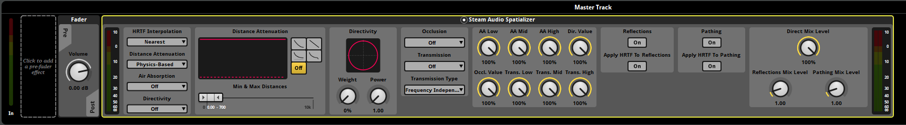

Getting Started
===============

.. highlight:: c++

Requirements
------------

Steam Audio requires **FMOD Studio 2.00** or later.

The Steam Audio FMOD Studio integration supports the following platforms:

-  Windows 7 or later (32-bit and 64-bit)
-  Linux (32-bit and 64-bit, tested with Ubuntu 18.04 LTS)
-  macOS 10.7 or later (64-bit Intel)
-  Android 5.0 or later (32-bit ARM, 64-bit ARM, 32-bit Intel)
-  iOS 11.0 or later (64-bit ARM)

Add Steam Audio to your FMOD Studio project
-------------------------------------------

To add Steam Audio to your FMOD Studio project:

1.  Download the latest version of the Steam Audio FMOD Studio integration: ``steamaudio_fmod.zip``. Extract the contents of this file to any directory of your choosing.
2.  In your project directory (this is the directory containing your project's ``.fspro`` file), create a subdirectory called ``Plugins``, if it doesn't already exist.
3.  Copy the following files from the directory you extracted ``steamaudio_fmod.zip`` into, to the ``Plugins`` directory of your FMOD Studio project.

    -   (Windows 32-bit editor only) ``lib/windows-x86/phonon.dll`` and ``lib/windows-x86/phonon_fmod.dll``
    -   (Windows 64-bit editor only) ``lib/windows-x64/phonon.dll`` and ``lib/windows-x64/phonon_fmod.dll``
    -   (macOS editor only) ``lib/osx/phonon.bundle`` and ``lib/osx/libphonon_fmod.dylib``
    -   (all platforms) ``src/phonon_fmod.plugin.js``

Spatialize an event
-------------------

Once Steam Audio is added to your project, you can spatialize any event:

1.  Select the event you want to spatialize.
2.  Click the **Master** track for the event.
3.  In the effects deck at the bottom of the window, right-click an empty spot, and choose **Add Effect** > **Plug-in Effects** > **Valve** > **Steam Audio Spatializer**.
4.  Drag the Steam Audio Spatializer to an appropriate position in the effect chain.

If the event already contains FMOD's built-in spatializer effect, you can delete or bypass it.

Integrate Steam Audio with your game engine
-------------------------------------------

Before you can use the Steam Audio FMOD Studio integration in your game, you must configure your game engine to use Steam Audio and load the Steam Audio FMOD Studio integration.

If you are using Unity as your game engine, see the Unity tab below. If you are using Unreal Engine as your game engine, see the Unreal Engine tab below. Otherwise, see the C++ tab for instructions on how to configure your game engine to load the Steam Audio FMOD Studio integration via C++ code.

.. tabs::

    .. group-tab:: Unity

        These instructions assume that you have added the FMOD Studio Unity integration and the Steam Audio Unity integration to your Unity project.

        .. rubric:: Import the Steam Audio FMOD Studio support package

        1.  In Unity's main menu, click **Assets** > **Import Package** > **Custom Package**.
        2.  Navigate to the ``unity`` subdirectory of the directory into which you extracted ``steamaudio_unity.zip``, and double-click the ``SteamAudioFMODStudio.unitypackage`` file.
        3.  In the Import dialog box, make sure everything is selected, and click **Import**.

        .. rubric:: Configure the FMOD Studio Unity integration to use Steam Audio

        1.  In Unity's main menu, click **FMOD** > **Edit Settings**.
        2.  Under **Dynamic Plugins**, click **Add Plugin**.
        3.  In the text box that appears, enter ``phonon_fmod``.

        .. image:: media/unity_fmodsettings.png

        If you are building for iOS, do the following instead:

        1.  In Unity's main menu, click **FMOD** > **Edit Settings**.
        2.  Under **Static Plugins**, click **Add Plugin**.
        3.  In the text box that appears, enter ``FMOD_SteamAudio_Spatialize_GetDSPDescription``.
        4.  Click **Add Plugin** again.
        5.  In the text box that appears, enter ``FMOD_SteamAudio_MixerReturn_GetDSPDescription``.
        6.  Click **Add Plugin** again.
        7.  In the text box that appears, enter ``FMOD_SteamAudio_Reverb_GetDSPDescription``.

        You can configure these static plugins as a platform-specific override for iOS, while using the ``phonon_fmod`` dynamic plugin on other platforms. For more information on how to do this, refer to the documentation for the FMOD Studio Unity integration.

        .. rubric:: Configure the Steam Audio Unity integration to use FMOD Studio

        1.  In Unity's main menu, click **Steam Audio** > **Settings**.
        2.  Set **Audio Engine** to **FMOD Studio**.

        .. image:: media/unity_steamaudiosettings.png

    .. group-tab:: Unreal Engine

        These instructions assume that you have enabled the FMOD Studio Unreal Engine plugin and the Steam Audio Unreal Engine plugin for your Unreal Engine project.

        .. rubric:: Enable the Steam Audio FMOD Studio Support plugin

        1.  In Unreal's main menu, click **Edit** > **Plugins**.
        2.  Under **Audio**, check **Enabled** under **Steam Audio FMOD Studio Support**.

        .. image:: media/unreal_fmodplugin.png

        .. rubric:: Configure the FMOD Studio Unreal Engine plugin to use Steam Audio

        1.  In Unreal's main menu, click **Edit** > **Project Settings**.
        2.  Under **Plugins** > **FMOD Studio**, expand the **Advanced** section, and click the **+** button next to **Plugin Files**.
        3.  In the text box that appears, enter ``phonon_fmod``.

        .. image:: media/unreal_fmodsettings.png

        If you are building for iOS, the version of the FMOD Studio Unreal Engine plugin you are using may not correctly initialize static DSP plugins, leading to errors at runtime. As a workaround, you can modify the ``Source/FMODStudio/Private/FMODStudioModule.cpp`` file in the FMOD Studio plugin's root directory:

        1.  Near the top of the file, after all the ``#include`` directives, add::

                #if PLATFORM_IOS
                extern "C" {
                FMOD_DSP_DESCRIPTION* F_CALL FMOD_SteamAudio_Spatialize_GetDSPDescription();
                FMOD_DSP_DESCRIPTION* F_CALL FMOD_SteamAudio_MixerReturn_GetDSPDescription();
                FMOD_DSP_DESCRIPTION* F_CALL FMOD_SteamAudio_Reverb_GetDSPDescription();
                }
                #endif

        2.  Next, in the ``FFMODStudioModule::CreateStudioSystem`` function, add the following lines after the code for loading dynamic plugins::

                #if PLATFORM_IOS
                    unsigned int Handle = 0;
                    lowLevelSystem->registerDSP(FMOD_SteamAudio_Spatialize_GetDSPDescription(), &Handle);
                    lowLevelSystem->registerDSP(FMOD_SteamAudio_MixerReturn_GetDSPDescription(), &Handle);
                    lowLevelSystem->registerDSP(FMOD_SteamAudio_Reverb_GetDSPDescription(), &Handle);
                #endif

        This issue may be fixed in a newer version of FMOD Studio.

        .. rubric:: Configure the Steam Audio Unreal Engine plugin to use FMOD Studio

        1.  In Unreal's main menu, click **Edit** > **Project Settings**.
        2.  Under **Plugins** > **Steam Audio**, set **Audio Engine** to **FMOD Studio**.

        .. image:: media/unreal_steamaudiosettings.png

    .. group-tab:: C++

        These instructions assume that you have integrated Steam Audio with your game engine via the Steam Audio SDK.

        .. rubric:: Load the Steam Audio FMOD Studio integration

        When initializing FMOD Studio in your game engine, call ``FMOD::System::loadPlugin`` to load the Steam Audio FMOD Studio integration. The plugin files can be found in the ``steamaudio_fmod.zip`` file you downloaded earlier. The file name of the plugin depends on the platform:

        -   Windows 32-bit: ``lib/windows-x86/phonon_fmod.dll``
        -   Windows 64-bit: ``lib/windows-x64/phonon_fmod.dll``
        -   Linux 32-bit: ``lib/linux-x86/libphonon_fmod.so``
        -   Linux 64-bit: ``lib/linux-x64/libphonon_fmod.so``
        -   macOS: ``lib/osx/libphonon_fmod.dylib``
        -   Android ARMv7 (32-bit): ``lib/android-armv7/libphonon_fmod.so``
        -   Android ARMv8/AArch64 (64-bit): ``lib/android-armv8/libphonon_fmod.so``
        -   Android x86 (32-bit): ``lib/android-x86/libphonon_fmod.so``

        On iOS, instead of calling ``FMOD::System::loadPlugin``, you will have to statically link to ``lib/ios/libphonon_fmod.a`` and use ``FMOD::System::registerDSP`` to register each of the Steam Audio DSP plugins. For example::

            extern "C" {
            FMOD_DSP_DESCRIPTION* F_CALL FMOD_SteamAudio_Spatialize_GetDSPDescription();
            FMOD_DSP_DESCRIPTION* F_CALL FMOD_SteamAudio_MixerReturn_GetDSPDescription();
            FMOD_DSP_DESCRIPTION* F_CALL FMOD_SteamAudio_Reverb_GetDSPDescription();
            }

            FMOD::System* system = ...; // initialized elsewhere

            unsigned int handle = 0;
            system->registerDSP(FMOD_SteamAudio_Spatialize_GetDSPDescription(), &handle);
            system->registerDSP(FMOD_SteamAudio_MixerReturn_GetDSPDescription(), &handle);
            system->registerDSP(FMOD_SteamAudio_Reverb_GetDSPDescription(), &handle);

        .. rubric:: Initialize the Steam Audio FMOD Studio integration

        1.  Call ``iplFMODInitialize`` after creating the Steam Audio context.
        2.  Create an HRTF (typically the default HRTF), and call ``iplFMODSetHRTF``.
        3.  Determine the simulation settings to use for subsequent simulations, and call ``iplFMODSetSimulationSettings``.
