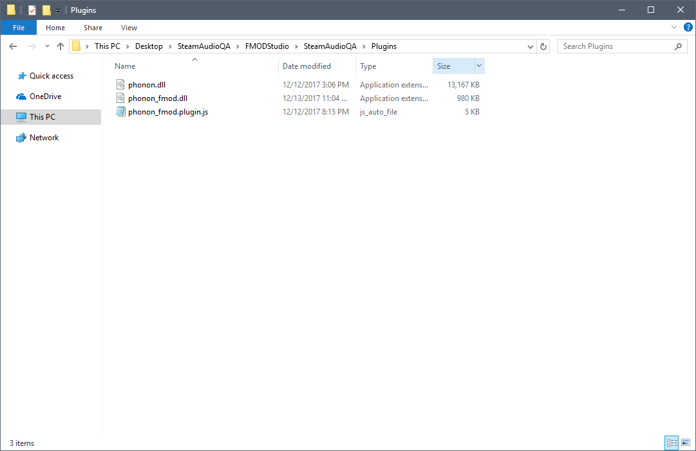
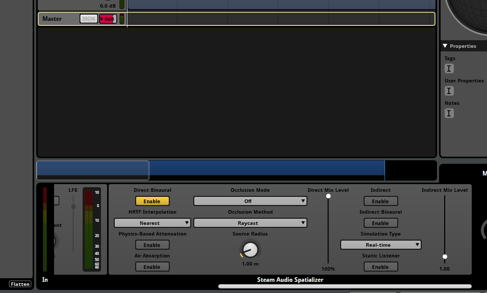
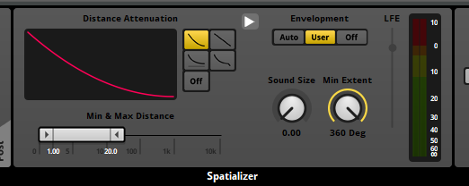
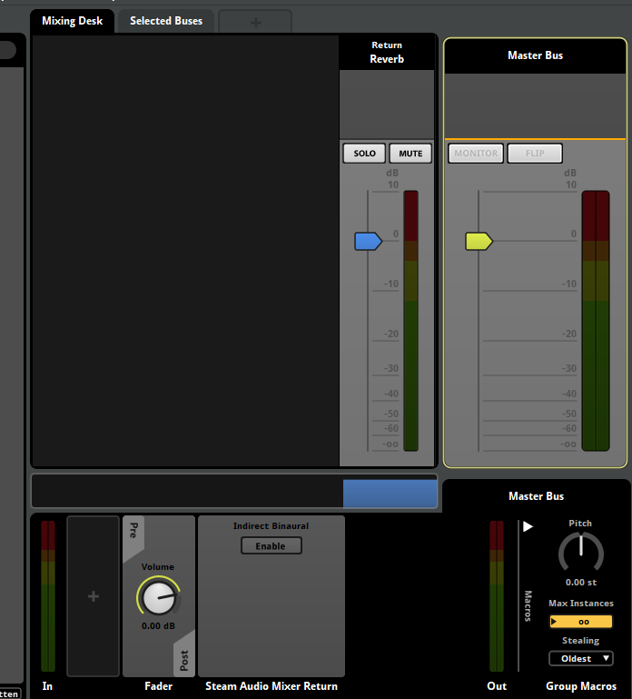
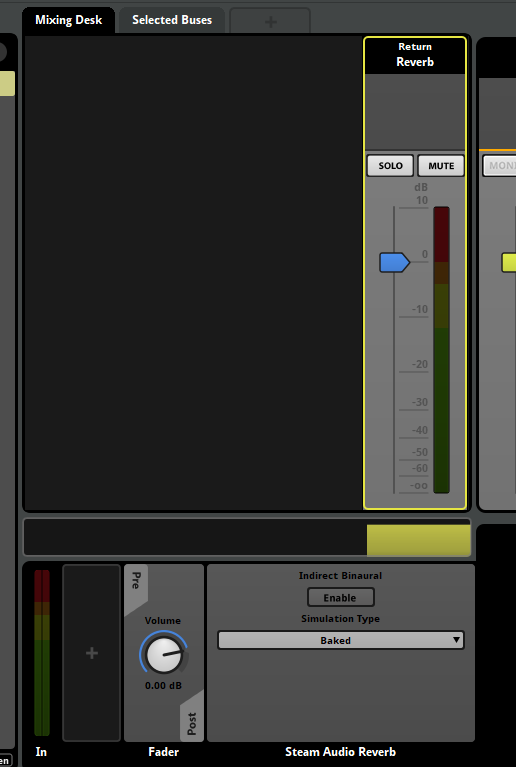
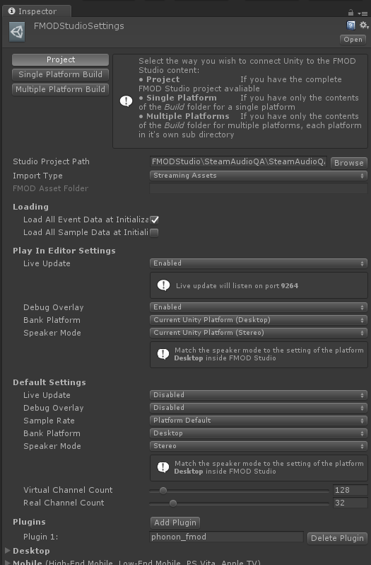

% Steam Audio FMOD Studio Plugin 2.0-beta.19

# Steam Audio FMOD Studio Plugin <small><small>2.0-beta.19</small></small>

Copyright 2017 Valve Corporation. All rights reserved. Subject to the following license: 
[https://valvesoftware.github.io/steam-audio/license.html](https://valvesoftware.github.io/steam-audio/license.html)

## Introduction

### Supported Platforms
- Windows 7 or later (32-bit and 64-bit)
- Linux (32-bit and 64-bit, tested with Ubuntu 16.04 LTS)
- macOS 10.7 or later
- Android 5.0 or later (32-bit ARM, 64-bit ARM, 32-bit Intel)

### Supported Integrations
- FMOD Studio 1.10.01 or later
- Unity 2017.1 or later

## FMOD Studio Integration

### Adding Steam Audio to FMOD Studio
Before using Steam Audio in your FMOD Studio project, you must install it to a location from which FMOD Studio can
load it. After unzipping Steam Audio for FMOD Studio, navigate to the `bin/fmod/` subdirectory and copy the following files:

- Windows 64-bit editor only: `windows/x64/phonon.dll` and `windows/x64/phonon_fmod.dll`
- Windows 32-bit editor only: `windows/x86/phonon.dll` and `windows/x86/phonon_fmod.dll`
- macOS editor only: `osx/phonon.bundle` and `osx/libphonon_fmod.dylib`
- All platforms: `phonon_fmod.plugin.js`

to one of the directories from which FMOD Studio loads plugins. For more information on these directories, refer to
the [FMOD Studio documentation](https://fmod.com/resources/documentation-studio?page=plugin-reference.html).

### Spatializing Events
Steam Audio is used to spatialize individual events in FMOD Studio, via the **Steam Audio Spatializer** plugin effect.
To add the Steam Audio Spatializer to an event:

1.	In the **Event Editor** window, in the **Events** tab, click the event you want to spatialize.
2.	Click the **Master** track for the event.
3.	In the effects deck at the bottom of the window, right-click an empty spot, and choose **Add Effect** > **Plug-in 
    Effects**	> **Valve** > **Steam Audio Spatializer**.
4.	Drag the Steam Audio Spatializer to an appropriate position in the effect chain.

#### Disabling FMOD Studio Spatialization
When using the Steam Audio Spatializer, you will want to disable FMOD Studio's built-in spatialization, which is
performed by the **Spatializer** effect. Any one of the following approaches can be used:

- Delete the **Spatializer** effect, by right-clicking it and choosing **Delete**.
- Bypass the **Spatializer** effect, by right-clicking it and choosing **Bypass**.
- If you want to use the distance attenuation curves defined in the **Spatializer** effect, you can disable just the
  spatialization, by setting **Envelopment** to **User** and **Min Extent** to 360 degrees.

#### Steam Audio Spatializer Settings
The Steam Audio Spatializer provides several settings; these are discussed below.

##### Direct Binaural
When enabled, uses HRTF-based 3D audio for direct sound. Otherwise, panning is used.

##### HRTF Interpolation
HRTF Interpolation specifies what interpolation scheme to use for HRTF-based 3D audio processing.

- **Nearest**. This option uses the HRTF from the direction nearest to the direction of the source for which HRTF data 
  is available.

- **Bilinear**. This option uses an HRTF generated after interpolating from four directions nearest to the direction of 
  the source, for which HRTF data is available. Bilinear HRTF interpolation may result in smoother audio for some kinds 
  of sources when the listener looks around, but has higher CPU usage (up to 2x) than Nearest HRTF interpolation.

Ignored if **Direct Binaural** is disabled.

##### Physics-Based Attenuation
When enabled, physics-based distance attenuation (inverse distance falloff) is applied to the audio.

##### Air Absorption
When enabled, frequency-dependent, distance-based air absorption is applied to the audio. Higher frequencies are
attenuated more quickly than lower frequencies over distance.

##### Occlusion Mode
This specifies how occlusion is modeled, i.e., how solid objects affect sound passing through them.

- **Off**. Occlusion calculations are disabled. Sounds can be heard through walls and other solid objects. The scene
  setup does not need to be performed.

- **On, No Transmission**. Occlusion calculations are enabled. Occluded sound is inaudible.

- **On, Frequency Independent Transmission**. Occlusion calculations are enabled. Occluded sound is attenuated as it
  passes through geometry, based on the material properties of the occluding object. The attenuation is independent of
  frequency: the low, medium, and high frequency transmission coefficients are averaged, and the average value is used
  as a frequency-independent transmission coefficient.

- **On, Frequency Dependent Transmission**. Occlusion calculations are enabled. Occluded sound is filtered as it passes
  through geometry, based on the material properties of the occluding object. The filtering is dependent on frequency,
  so for example high frequencies may be attenuated more than low frequencies as the sound passes through geometry.

Requires scene setup in the game engine. If set to anything other than **Off**, the event should be auditioned from within
the game engine.

##### Occlusion Method
This dropdown controls how occlusion calculations are performed.

- **Raycast**. Performs a single raycast from the source to the listener to determine occlusion. If the ray is occluded, 
  direct sound is considered occluded.

- **Partial**. Performs multiple raycasts from the source to the listener based on the Source Radius setting. The 
  proportion of rays that are occluded determine how much of the direct sound is considered occluded. Transmission 
  calculations, if enabled, are only applied to the occluded portion of the direct sound.

Ignored if **Occlusion Mode** is set to **Off**.

##### Source Radius
Configures the apparent size of the sound source. The larger the source radius, the larger an object must be in order 
to fully occlude sound emitted by the source.

Ignored if **Occlusion Mode** is set to **Off** or **Occlusion Method** is set to **Raycast**.

##### Direct Mix Level
Direct Mix Level adjusts the contribution of direct sound to the overall mix.

##### Indirect
If enabled, Steam Audio will apply physics-based environmental effects to the audio emitted by the event emitter. If 
disabled, only direct sound settings (including occlusion) are applied.

Requires scene setup in the game engine.

##### Indirect Binaural
If enabled, renders indirect sound with HRTF-based 3D audio. This gives a better sense of directionality to indirect 
sound and improves immersion. There is a small increase in CPU overhead when checked.

Ignored if **Indirect** is disabled. If enabled, the event should be auditioned from within the game engine.

##### Simulation Type
This determines what kind of simulation is performed to calculate environmental effects.

- **Realtime**. Environmental effects are continuously simulated in real-time, during gameplay. This allows for more 
  flexibility in incorporating changes to the scene and sources, but incurs a CPU overhead.

- **Baked**. Environmental effects are precomputed during the design phase and saved with the scene. For largely static 
  scenes, this mode allows you to reduce CPU overhead at the cost of increased memory consumption. Requires baking to
  be performed in the game engine.

Ignored if **Indirect** is disabled.

##### Static Listener
When disabled, the source must be static in the game engine. Environmental effects are precomputed from the source position.

When enabled, the listener must be static or restricted to a few static positions. The listener is free to look around but 
cannot move around. Environmental effects are precomputed at a pre-determined listener position. Sources can freely move 
when using this mode. For a VR experience where the camera can only transport to a few locations, this mode allows you 
to reduce CPU overhead at the cost of increased memory consumption.

Ignored if **Indirect** is disabled or **Simulation Type** is **Realtime**.

##### Indirect Mix Level
Indirect Mix Level adjusts the contribution of indirect sound to the overall mix.

Ignored if **Indirect** is disabled.

##### Directivity
Some sound sources emit sound largely within a limited range of directions. For example, a megaphone projects sound
mostly to the front. Steam Audio can model the effect of such source directivity patterns on both direct and
indirect sound. To specify a directivity pattern for a source, the following two parameters can be used:

- **Dipole Weight**. When set to 0, the source has a monopole directivity, i.e., is omnidirectional. When set to
  1, the source has a dipole directivity, i.e., sound is focused to the front and back of the source, and very little
  sound is emitted to the left or right of the source. Values in between blend between the two directivity patterns.
  At 0.5, for example, the source has a cardioid directivity, i.e., most of the sound is emitted to the front of the
  source.

- **Dipole Power**. Specifies how focused the dipole directivity is. Higher values result in sharper directivity
  patterns.

As you adjust these values, you can see a preview of the directivity pattern in the effect deck.

#### Accelerated Mixing
If you are using the Steam Audio Spatializer to add indirect effects to many events in your project, you can use the 
**Steam Audio Mixer Return** effect to reduce the CPU overhead of audio processing for environmental effects. This can be 
done as follows:

1. Click **Window** > **Mixer**.
2. Click the **Master Bus**.
3. In the effects deck at the bottom of the window, right-click an empty spot and choose **Add Effect** > **Plug-in Effects** >
   **Valve** > **Steam Audio Mixer Return**.
4. Drag the Steam Audio Mixer Return effect to an appropriate position in the effect chain.

When using the Steam Audio Mixer Return effect, the following things happen:

- If indirect sound is enabled for a Steam Audio Spatializer attached to an event, then the indirect sound for that 
  event is _not_ sent to the event's output. It is retained internally by Steam Audio for mixing. Only direct sound is 
  sent to the event's output.

- All of the indirect sound for all Steam Audio Spatializers is mixed, and inserted back into the audio pipeline at the
  bus to which the Steam Audio Mixer Return effect has been added.

- Since indirect sound is taken out of FMOD Studio's audio pipeline at the Steam Audio Spatializer effect, any effects 
  applied between the Steam Audio Spatializer on the event and the Steam Audio Mixer Return effect on the bus will not 
  apply to indirect sound.

The following settings can be configured on a Steam Audio Mixer Return effect:

##### Indirect Binaural
If enabled, applies HRTF-based 3D audio rendering to indirect sound.

### Applying Physics-Based Reverb to a Bus
Steam Audio also lets you apply listener-centric reverb to audio flowing through any bus in FMOD Studio. This helps
reduce CPU usage, since indirect sound effects are applied after multiple sounds are mixed. When using listener-centric
reverb, Steam Audio calculates and applies a reverb filter based on the listener's position in the scene; it does not
take source positions into account.

To use Steam Audio for modeling listener-centric reverb:

1.	Click **Window** > **Mixer**.
2. 	Click the **Reverb** bus (or any other bus to which you want to apply reverb effects).
3.	Make sure FMOD Studio's built-in reverb effects are disabled or bypassed on the selected bus.
4.	In the effects deck at the bottom of the window, right-click an empty spot and choose **Add Effect** > **Plug-in Effects** >
	**Valve** > **Steam Audio Reverb**.
5.	Drag the Steam Audio Reverb effect to an appropriate position in the effect chain.

After doing this, Steam Audio will apply listener-centric reverb to all audio reaching the bus, either from
events containing a **Send** to the bus, or from other buses that route audio to the selected bus.

The following settings can be configured on a Steam Audio Reverb effect:

##### Simulation Type
Simulation Type determines what kind of simulation is performed to calculate reverb.

- **Realtime**. Reverb is continuously simulated in real-time, during gameplay. This allows for more flexibility 
  in incorporating changes to the scene and sources, but incurs a CPU overhead.

- **Baked**. Reverb is precomputed over a grid of listener positions during the design phase and saved with the 
  scene. For largely static scenes, this mode allows you to reduce CPU overhead at the cost of increased memory 
  consumption. Requires baking to be performed in the game engine.

Requires scene setup in the game engine. Events routing to this bus should be auditioned from within the game engine.

##### Indirect Binaural
If enabled, applies HRTF-based 3D audio rendering to reverb.

## FMOD Studio + Unity Integration
This section describes additional steps or notes to consider when using Steam Audio with FMOD Studio and Unity. For the
full instructions on how to use the Steam Audio Unity plugin, including instructions on scene setup, simulation
settings, and baking, refer to the documentation for the Unity plugin.

### Adding Steam Audio to FMOD Studio in Unity
The following instructions assume that you have already added the FMOD Studio plugin for Unity and the Steam Audio
plugin for Unity into your Unity project.

#### Adding the Steam Audio FMOD Studio Plugin to Unity
Before using Steam Audio, you must add the Steam Audio plugin for FMOD Studio to your Unity project. To do this:

1.  From the Unity menu, choose **Assets** > **Import Package** > **Custom Package**.
2.  Navigate to the directory where you downloaded Steam Audio for FMOD Studio. Within this folder, navigate to the 
    `bin/unity/` subdirectory.
3.  Double-click the `SteamAudio_FMODStudio.unitypackage` file.
4.  In the Import dialog box that appears, make sure everything is selected, and click the **Import** button.

#### Enabling the Steam Audio FMOD Studio Plugin in Unity
The next step is to configure the FMOD Studio plugin for Unity to load the Steam Audio plugin for FMOD Studio. To do
this:

1.	Click **FMOD** > **Edit Settings**.
2.	In the Inspector tab, under **Plugins**, click **Add Plugin**.
3.	In the text box that appears, enter `phonon_fmod`.

#### Configuring Steam Audio to use FMOD Studio
Finally, you must tell Steam Audio that you are using FMOD Studio as your audio engine. To do this:

1.  From the Unity menu, choose **Window** > **Steam Audio**.
2.  In the Steam Audio tab, under **Audio Engine**, choose **FMOD Studio**.

#### Configuring FMOD Studio Event Emitters in Unity
To every GameObject in Unity that contains an FMOD Studio Event Emitter component, you must also attach a Steam Audio
Source component. Otherwise, distance attenuation, air absorption, directivity, occlusion, and transmission will not
be rendered correctly.

### Auditioning Steam Audio Effects
Events that are configured to use physics-based sound propagation, including occlusion, source-centric propagation,
and listener-centric reverb, cannot be auditioned using just FMOD Studio. They must be auditioned by entering play mode
in Unity and adjusting effect parameters in FMOD Studio. To do this:

1.	In Unity, click **Play** to start playing a scene in the editor.
2.	In FMOD Studio, click **File** > **Connect To Game**.
3.	Enter the IP address of the game you want to connect to (typically localhost), and click **OK**.
4.	If the connection succeeds, you should see "Live Update: On" in the FMOD Studio status bar.

You should now be able to interact with the scene in Unity, and adjust parameters in FMOD Studio, while listening to how
these changes affect the sound produced by Steam Audio.

> By default the Unity editor stops playing any sound when it loses focus, which will happen when you click in the FMOD
  Studio window to change something. To turn off this behavior:
>
>  1.  Click **Edit** > **Project Settings** > **Player**.
>  2.  In the Inspector tab, under **Resolution and Presentation**, check **Run In Background**.

### Baking Notes
When baking sound propagation effects for a source (either in Baked Static Source mode or Baked Static Listener mode),
you must attach a **Steam Audio Source** component to the GameObject that contains the corresponding **FMOD Studio Event
Emitter** component.

### Using Custom HRTFs
The Steam Audio FMOD Studio plugin allows users to replace Steam Audio's built-in HRTF with any HRTF of their choosing. This
is useful for comparing different HRTF databases, measurement or simulation techniques, or even allowing end users to
use a preferred HRTF with your game or app. Steam Audio loads HRTFs from _SOFA files_. The Spatially-Oriented Format
for Acoustics (SOFA) file format is defined by an Audio Engineering Society (AES) standard; for more details refer to
<https://www.sofaconventions.org/>.

To use custom HRTFs with Steam Audio, refer to the documentation for your game engine integration. For example, if your
game engine is Unity, refer to the documentation for the Steam Audio Unity plugin.

HRTFs loaded from SOFA files affect direct sound as well as indirect sound generated by Steam Audio Spatializer effects with
Indirect Binaural checked, Steam Audio Mixer Return effects with Binaural checked, or Steam Audio Reverb effects with
Binaural checked.
