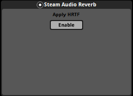

Reverb
~~~~~~

Applies reverb based on the listener position to any audio flowing through the bus to which this effect is attached. The type of reverb applied (convolution, parametric, or hybrid) can be configured in the game engine.

Reverb simulation must be configured using the game engine.

Apply HRTF
    If checked, applies HRTF-based 3D audio rendering to reverb. Results in an improvement in spatialization quality when using convolution or hybrid reverb, at the cost of slightly increased CPU usage. Default: off.
