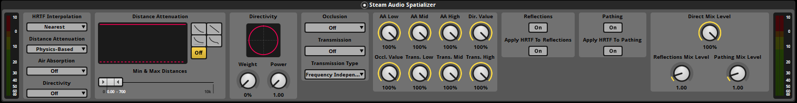

Spatializer
~~~~~~~~~~~

Provides options for controlling how an event is spatialized.

HRTF Interpolation
    Controls how HRTFs are interpolated when the source moves relative to the listener.

    -  *Nearest*: Uses the HRTF from the direction nearest to the direction of the source for which HRTF data is available. The fastest option, but can result in audible artifacts for certain kinds of audio clips, such as white noise or engine sounds.

    -  *Bilinear*: Uses an HRTF generated after interpolating from four directions nearest to the direction of the source, for which HRTF data is available. This may result in smoother audio for some kinds of sources when the listener looks around, but has higher CPU usage (up to 2x).

Distance Attenuation
    Specifies how distance attenuation is calculated and applied to the event.

    -   *Off*. Distance attenuation is not applied.

    -   *Curve-Driven*. Distance attenuation is controlled by the curves on the Steam Audio Spatializer effect. These work identically to the curves on FMOD's built-in spatializer effect.

    -   *Physics-Based*. A physics-based distance attenuation model is used. This is an inverse distance falloff. The curves defined on the Steam Audio Spatializer are ignored.

Air Absorption
    Specifies how frequency-dependent distance-based air absorption is calculated and applied to the event.

    -   *Off*. Air absorption is not applied.

    -   *Simulation-Defined*. Uses a physics-based air absorption model. This is an exponential falloff, with higher frequencies falling off faster with distance than lower frequencies.

    -   *User-Defined*. Uses the values specified in the **Air Absorption Low**, **Air Absorption Mid**, and **Air Absorption High** dials as the EQ values. The air absorption value will not automatically change with distance to the source. You are expected to control the **Air Absorption Low**, **Air Absorption Mid**, and **Air Absorption High** dials using a parameter to achieve this effect.

Air Absorption Low
    The low frequency (up to 800 Hz) EQ value for air absorption. Only used if **Air Absorption** is set to **User-Defined**. 0% = low frequencies are completely attenuated, 100% = low frequencies are not attenuated at all.

Air Absorption Mid
    The middle frequency (800 Hz - 8 kHz) EQ value for air absorption. Only used if **Air Absorption** is set to **User-Defined**. 0% = middle frequencies are completely attenuated, 100% = middle frequencies are not attenuated at all.

Air Absorption High
    The high frequency (8 kHz and above) EQ value for air absorption. Only used if **Air Absorption** is set to **User-Defined**. 0% = high frequencies are completely attenuated, 100% = high frequencies are not attenuated at all.

Directivity
    Specifies how attenuation based on the source's directivity pattern and orientation is calculated and applied to the event.

    -   *Off*. Directivity is not applied.

    -   *Simulation-Defined*. Uses a dipole directivity model. You can control the dipole shape using the **Weight** and **Power** dials.

    -   *User-Defined*. Uses the value specified in the **Directivity Value** dial. This value will *not* automatically change as the source rotates. You are expected to control the **Directivity Value** dial using a parameter to achieve this effect.

Directivity Value
    The directivity attenuation value. Only used if **Directivity** is set to **User-Defined**. 0% = sound is completely attenuated, 100% = sound is not attenuated at all.

Weight
    Blends between monopole (omnidirectional) and dipole directivity patterns. 0 = pure monopole (sound is emitted in all directions with equal intensity), 100% = pure dipole (sound is focused to the front and back of the source). At 50%, the source has a cardioid directivity, with most of the sound emitted to the front of the source. Only used if **Directivity** is set to **Simulation-Defined**.

Power
    Controls how focused the dipole directivity is. Higher values result in sharper directivity patterns. Only used if **Directivity** is set to **Simulation-Defined**.

Occlusion
    Specifies how occlusion is simulated and applied to the event.

    -   *Off*. Occlusion is not applied.

    -   *Simulation-Defined*. Occlusion is applied. The occlusion value must be supplied by the game engine via the ``SIMULATION_OUTPUTS`` DSP parameter.

    -   *User-Defined*. Uses the **Occlusion Value** dial to control occlusion. The occlusion value will *not* automatically change based on surrounding geometry. You are expected to control the **Occlusion Value** dial using a parameter to achieve this effect. This option is intended for integrating your own occlusion model with Steam Audio.

Occlusion Value
    The occlusion attenuation value. Only used if **Occlusion** is set to **User-Defined**. 0% = sound is completely attenuated, 100% = sound is not attenuated at all.

Transmission
    Specifies how transmission is simulated and applied to the event.

    -   *Off*. Transmission is not applied.

    -   *Simulation-Defined*. Transmission is applied. The transmission filter EQ values must be supplied by the game engine via the ``SIMULATION_OUTPUTS`` DSP parameter.

    -   *User-Defined*. Uses the **Transmission Low**, **Transmission Mid**, and **Transmission High** dials to control transmission. The transmission values will *not* automatically change based on surrounding geometry. You are expected to control the dials using a parameter to achieve this effect. This option is intended for integrating your own occlusion and transmission model with Steam Audio.

Transmission Type
    Specifies how the transmission filter is applied.

    -  *Frequency Independent*. Transmission is modeled as a single attenuation factor.

    -  *Frequency Dependent*. Transmission is modeled as a 3-band EQ.

Transmission Low
    The low frequency (up to 800 Hz) EQ value for transmission. Only used if **Transmission** is set to **User-Defined**. 0% = low frequencies are completely attenuated, 100% = low frequencies are not attenuated at all.

Transmission Mid
    The middle frequency (800 Hz to 8 kHz) EQ value for transmission. Only used if **Transmission** is set to **User-Defined**. 0% = middle frequencies are completely attenuated, 100% = middle frequencies are not attenuated at all.

Transmission High
    The high frequency (8 kHz and above) EQ value for transmission. Only used if **Transmission** is set to **User-Defined**. 0% = high frequencies are completely attenuated, 100% = high frequencies are not attenuated at all.

Direct Mix Level
    The contribution of the direct sound path to the overall mix for this event. Lower values reduce the contribution more.

Reflections
    If enabled, reflections reaching the listener from the source will be applied to the event. The reflections data must be specified via the ``SIMULATION_OUTPUTS`` DSP parameter.

Apply HRTF To Reflections
    If checked, applies HRTF-based 3D audio rendering to reflections. Results in an improvement in spatialization quality when using convolution or hybrid reverb, at the cost of slightly increased CPU usage. Default: off.

Reflections Mix Level
    The contribution of reflections to the overall mix for this event. Lower values reduce the contribution more.

Pathing
    If checked, shortest paths taken by sound as it propagates from the source to the listener will be simulated, and appropriate spatialization will be applied to the event for these indirect paths. The pathing data must be specified via the ``SIMULATION_OUTPUTS`` DSP parameter.

Apply HRTF To Pathing
    If checked, applies HRTF-based 3D audio rendering to pathing. Results in an improvement in spatialization quality, at the cost of slightly increased CPU usage. Default: off.

Pathing Mix Level
    The contribution of pathing to the overall mix for this event. Lower values reduce the contribution more.
