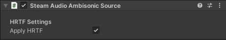

Steam Audio Ambisonic Source
~~~~~~~~~~~~~~~~~~~~~~~~~~~~

Provides options for controlling how an Ambisonic audio source is rendered.

Must be attached to a GameObject containing an Audio Source. The Audio Clip of the Audio Source must be set to an Ambisonic audio clip. See the `Unity documentation <https://docs.unity3d.com/Manual/AmbisonicAudio.html>`_ for details.

Apply HRTF
    If on, the Ambisonic audio clip is spatialized using HRTF-based binaural rendering. Provides an improvement in spatialization quality at the cost of a slight increase in CPU usage. Default: on.
