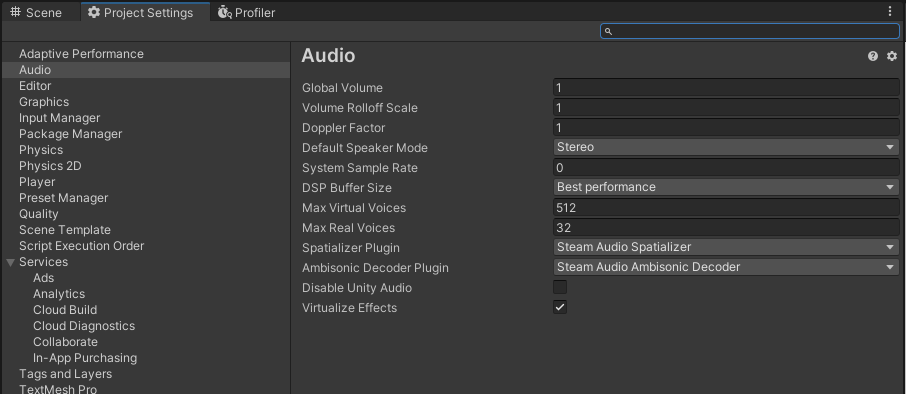

Getting Started
===============

Requirements
------------

Steam Audio requires **Unity 2017.3** or later.

The Steam Audio Unity integration supports the following platforms:

-  Windows 7 or later (32-bit and 64-bit)
-  Linux (32-bit and 64-bit, tested with Ubuntu 16.04 LTS)
-  macOS 10.7 or later (64-bit Intel)
-  Android 5.0 or later (32-bit ARM, 64-bit ARM, 32-bit Intel)

Add Steam Audio to your Unity project
-------------------------------------

To add Steam Audio to your Unity project:

1. Download the latest version of the Steam Audio Unity integration: ``steamaudio_unity.zip``. Extract the contents of this file to any directory of your choosing.
2. In Unity’s main menu, choose **Assets** > **Import Package** > **Custom Package**.
3. Navigate to the ``unity`` subdirectory of the directory into which you extracted ``steamaudio_unity.zip``, and double-click the ``SteamAudio.unitypackage`` file.
4. In the Import dialog box, make sure everything is selected, and click **Import**.
5. Once the import finishes, in the main menu, choose **Edit** > **Project Settings** > **Audio**.

6. Set **Spatializer Plugin** to **Steam Audio Spatializer**, and **Ambisonic Decoder Plugin** to **Steam Audio Ambisonics**.

Spatialize an Audio Source
--------------------------

Once Steam Audio is added to your project, you can spatialize any Audio Source:

1. Select any GameObject that contains an Audio Source component.

.. image:: media/audiosource_spatialize.png

2. In the Inspector tab, under Audio Source, check **Spatialize**.
