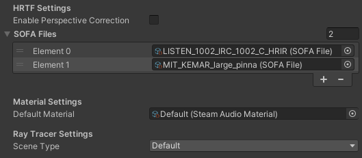

User’s Guide
============

Spatialize an audio source
--------------------------

To spatialize an Audio Source:

1. Select the Audio Source.
2. In the Audio Source Inspector, check **Spatialize**.

.. image:: media/audiosource_spatialize.png

Steam Audio will apply HRTF-based binaural rendering to the Audio Source, using default settings. You can control many properties of the spatialization using the :doc:`Steam Audio Source <source>` component, including occlusion, reflections, and more.

Spatialize an Ambisonic source
------------------------------

Ambisonic audio is a surround sound format that is well-suited to spatial audio applications. Unlike traditional surround sound formats, it covers a full sphere of directions around the listener, including vertical. Instead of discrete speaker locations, you specify the *order* of an Ambisonic clip, which determines the spatial resolution of the audio. Higher orders lead to more accurate spatialization. For more details, click `here <https://en.wikipedia.org/wiki/Ambisonics>`_.

You can use Ambisonic audio clips for *sound fields*: sounds playing from many directions around the listener. Ambient sounds are often a good candidate for Ambisonics.

In Unity, you configure individual audio clips as Ambisonic, instead of audio sources. To configure an audio clip as Ambisonic:

1. Select the audio clip.
2. In the Inspector, check **Ambisonic**.
3. Click **Apply**.

.. image:: media/audioclip_ambisonic.png

.. note::

    Uncheck **Spatialize** on any Audio Source that will play an Ambisonic audio clip.

.. note::

    Unity supports up to 1st order Ambisonic clips. They must use AmbiX (ACN/SN3D) layout. For more information, refer to the `Unity documentation <https://docs.unity3d.com/Manual/AmbisonicAudio.html>`_.

You can control how an Ambisonic audio clip is spatialized using the :doc:`Steam Audio Ambisonic Source <ambisonic-source>` component.

Apply distance falloff
----------------------

You can continue to use Unity’s built-in tools to control how the volume of an audio source falls off with distance. To do so:

1. Select the audio source.
2. In the Inspector, expand **3D Sound Settings**.
3. Use the **Volume Rolloff**, **Min Distance**, **Max Distance**, and curve editor to control the distance falloff. Refer to the `Unity documentation <https://docs.unity3d.com/Manual/class-AudioSource.html>`_ for more information.

.. image:: media/audiosource_distanceattenuation.png

Steam Audio will automatically use this curve to apply distance attenuation.

Blend between spatialized and unspatialized audio
-------------------------------------------------

You can dynamically blend between spatialized and unspatialized audio. For example, you may have an in-game radio playing spatialized music at a distance, which smoothly transitions into the unspatialized soundtrack as you approach it. To do this:

1. Select the audio source.
2. In the Inspector, set **Spatial Blend** to the desired value. (**2D** means unspatialized audio, **3D** means spatialized. Values in between are a blend of spatialized and unspatialized.)

.. image:: media/audiosource_spatialblend.png

You can also use the curve editor to control how Spatial Blend changes with distance.

Apply frequency-dependent air absorption
----------------------------------------

You can control how different sound frequencies fall off with distance. For example, when playing a distant explosion sound, higher frequencies can fall off more than lower frequencies, leading to a more muffled sound. To do this:

1. Select the audio source.
2. In the Inspector, click **Add Component** > **Steam Audio** > **Steam Audio Source**. (Skip this step if a Steam Audio Source is already attached to the Audio Source.)
3. Check **Air Absorption**.

.. image:: media/source_airabsorption.png

Steam Audio will now use its default air absorption model to apply frequency-dependent distance falloff to the Audio Source. You can also use a :doc:`Steam Audio Source <source>` to directly control the filter, either manually or via scripting.

Specify a source directivity pattern
------------------------------------

You can configure a source that emits sound with different intensities in different directions. For example, a megaphone that projects sound mostly to the front. To do this:

1. Select the audio source.
2. In the Inspector, click **Add Component** > **Steam Audio** > **Steam Audio Source**. (Skip this step if a Steam Audio Source is already attached to the Audio Source.)
3. Check **Directivity**.
4. Use the **Dipole Weight** and **Dipole Power** sliders to control the directivity pattern.

.. image:: media/source_directivity.png

For more information, see :doc:`Steam Audio Source <source>`.

Use a custom HRTF
-----------------

You (or your players) can replace Steam Audio’s built-in HRTF with any HRTF of your choosing. This is useful for comparing different HRTF databases, measurement or simulation techniques, or even allowing players to use a preferred HRTF with your game or app.

Steam Audio loads custom HRTFs from SOFA files. These files have a ``.sofa`` extension.

.. note::

    The Spatially-Oriented Format for Acoustics (SOFA) file format is defined by an Audio Engineering Society (AES) standard. For more details, click `here <https://www.sofaconventions.org>`_.

To tell Steam Audio to load a SOFA file at startup:

1. In the main menu, choose **Assets** > **Import New Asset**, then navigate to the SOFA file you want to import, and click **Import**. You can import this asset to any folder under your project's ``Assets`` folder.
2. In the main menu, choose **Steam Audio** > **Settings**.
3. In the Inspector, expand **SOFA Files**.
4. If there are no empty fields under **SOFA Files**, click the **+** button.
5. Double-click one of the empty fields, and select the SOFA file.

The current SOFA file can now be changed at run-time:

1.  In Play mode, select the **Steam Audio Manager** object in the hierarchy. This GameObject is automatically created by Steam Audio upon entering Play mode.
2.  In the Inspector, under **Current HRTF**, select the SOFA file you want to use. Note that **Default** refers to Steam Audio’s built-in HRTF, which does not require a SOFA file.

.. image:: media/manager.png

This field can also be controlled by custom scripts, so you can provide your own UI for changing the SOFA file in your built game.

HRTFs loaded from SOFA files affect direct and indirect sound generated by audio sources, as well as reverb rendered using the Steam Audio Reverb mixer effect.

.. warning::

    The SOFA file format allows for very flexible ways of defining HRTFs, but Steam Audio only supports a restricted subset. The following restrictions apply (for more information, including definitions of the terms below, click `here <https://www.sofaconventions.org>`_:

   -   SOFA files must use the ``SimpleFreeFieldHRIR`` convention.
   -   The ``Data.SamplingRate`` variable may be specified only once, and may contain only a single value. Steam Audio will automatically resample the HRTF data to the user's output sampling rate at run-time.
   -   The ``SourcePosition`` variable must be specified once for each measurement.
   -   Each source must have a single emitter, with ``EmitterPosition`` set to ``[0 0 0]``.
   -   The ``ListenerPosition`` variable may be specified only once (and not once per measurement). Its value must be ``[0 0 0]``.
   -   The ``ListenerView`` variable is optional. If specified, its value must be ``[1 0 0]`` (in Cartesian coordinates) or ``[0 0 1]`` (in spherical coordinates).
   -   The ``ListenerUp`` variable is optional. If specified, its value must be ``[0 0 1]`` (in Cartesian coordinates) or ``[0 90 1]`` (in spherical coordinates).
   -   The listener must have two receivers. The receiver positions are ignored.
   -   The ``Data.Delay`` variable may be specified only once. Its value must be 0.

Tag acoustic geometry
---------------------

You can use Steam Audio to model how your scene geometry causes occlusion, reflection, reverb, and other effects on your audio sources. You start by tagging the GameObjects that you want to use for acoustic calculations:

1. Select the GameObject you want to tag. It (or its children) must have either a Mesh Filter component or a Terrain component.
2. In the Inspector, click **Add Component** > **Steam Audio** > **Steam Audio Geometry**.

.. image:: media/geometry.png

Not all objects have a noticeable influence on acoustics. For example, in a large hangar, the room itself obviously influences the acoustics. A small tin can on the floor, though, most likely doesn’t. But large amounts of small objects can collectively influence the acoustics. For example, while a single wooden crate might not influence the hangar reverb, large stacks of crates are likely to have some impact.

.. note::

    You don’t need to create an additional mesh just to tag an object as Steam Audio Geometry. You can directly use the same meshes used for visual rendering.

Once you’ve tagged all the geometry in the scene, export it:

1. In the menu, click **Steam Audio** > **Export Active Scene**.

By default, all geometry is treated as static. In other words, you can’t move, deform, or otherwise change the geometry at run-time. If you need to do this, set it up as a dynamic object, as discussed in the next section.

You can simplify geometry before it’s exported, export multiple meshes with a single Steam Audio Geometry component, and more. For more information, see :doc:`Steam Audio Geometry <geometry>`.

Set up dynamic (movable) geometry
---------------------------------

You can mark specific GameObjects as *dynamic geometry*, which tells Steam Audio to update occlusion, reverb, and other acoustic effects as the GameObject and its children move. To do this:

1. Select the GameObject you want to tag.
2. In the Inspector, click **Add Component** > **Steam Audio** > **Steam Audio Dynamic Object**.
3. Attach Steam Audio Geometry components to the GameObject or its children as needed.
4. On the Steam Audio Dynamic Object component, click **Export Dynamic Object**.

.. image:: media/dynamic_object.png

At run-time, any changes made to the Transform of the GameObject to which the Steam Audio Dynamic Object component has been attached will automatically be passed to Steam Audio.

You can attach a Steam Audio Dynamic Object component in a prefab as well. After exporting it, the prefab can be freely instantiated in any scene and moved around; Steam Audio will automatically update acoustic effects accordingly. For example, this can be used to create a door prefab that automatically occludes sound when added to any scene, or large walls that a player can build, which automatically reflect sound.

.. warning::

    Changes made to the transforms of children of the Steam Audio Dynamic Object will *not* be passed to Steam Audio. The entire object and all its children must move/animate as a rigid body.

For more information, see :doc:`Steam Audio Dynamic Object <dynamic-object>`.

Associate an acoustic material with geometry
--------------------------------------------

You can specify acoustic material properties for any object that has a Steam Audio Geometry component. These properties control how the object reflects, absorbs, and transmits sound, for different frequencies. To specify an acoustic material:

1. Select the geometry.
2. In the Inspector, click **Add Component** > **Steam Audio** > **Steam Audio Geometry**. (Skip this step if a Steam Audio Geometry is already attached to the object.)
3. Click the button to the right of **Material**, and select a Material asset from the list that appears.

.. image:: media/geometry_material.png

Steam Audio contains a small library of built-in materials, but you can create your own and reuse them across your project. To create a new material:

1. In the Project tab, navigate to the directory where you want to create your material.
2. Click **Create** > **Steam Audio** > **Steam Audio Material**.
3. Give your new material a name, and configure its acoustic properties.

For more information on individual material properties, see :doc:`Steam Audio Material <material>`.

Model occlusion by geometry
---------------------------

You can configure an audio source to be occluded by scene geometry. To do this:

1. Select the audio source.
2. Make sure a Steam Audio Source component is attached to it.
3. In the Inspector, check **Occlusion**.

.. image:: media/source_occlusion.png

Steam Audio will now use raycast occlusion to check if the source is occluded from the listener by any geometry. This assumes that the source is a single point. You can also model sources with larger spatial extent, or explicitly control occlusion manually or via scripting. For more information, see :doc:`Steam Audio Source <source>`.

Model transmission through geometry
-----------------------------------

You can configure an audio source to be transmitted through occluding geometry, with the sound attenuated based on material properties. To do this:

1. Select the audio source.
2. Make sure a Steam Audio Source component is attached to it.
3. In the Inspector, make sure **Occlusion** is checked, then check **Transmission**.

.. image:: media/source_transmission.png

Steam Audio will now model how sound travels through occluding geometry, based on the acoustic material properties of the geometry. You can also control whether the transmission effect is frequency-dependent, or explicitly control transmission manually or via scripting. For more information, see :doc:`Steam Audio Source <source>`.

Model reflection by geometry
----------------------------

You can configure an audio source to be reflected by surrounding geometry, with the reflected sound attenuated based on material properties. Reflections often enhance the sense of presence when used with spatial audio. To do this:

1. Select the audio source.
2. Make sure a Steam Audio Source component is attached to it.
3. In the Inspector, check **Reflections**.

.. image:: media/source_reflections.png

Steam Audio will now use real-time ray tracing to model how sound is reflected by geometry, based on the acoustic material properties of the geometry. You can control many aspects of this process, including how many rays are traced, how many successive reflections are modeled, how reflected sound is rendered, and much more. Since modeling reflections is CPU-intensive, you can pre-compute reflections for a static sound source, or even offload the work to the GPU. For more information, see :doc:`Steam Audio Source <source>` and :doc:`Steam Audio Settings <settings>`.

Simulate physics-based reverb at the listener position
------------------------------------------------------

You can also use ray tracing to automatically calculate physics-based reverb at the listener’s position. Physics-based reverbs are *directional*, which means they can model the direction from which a distant echo can be heard, and keep it consistent as the player looks around. Physics-based reverbs also model smooth transitions between different spaces in your scene, which is crucial for maintaining immersion as the player moves. To set up physics-based reverb:

1. In the Audio Mixer tab, select a mixer group, or create a new one.
2. At the bottom of the mixer group, click **Add** > **Steam Audio Reverb**.
3. Configure a *send* from one or more mixer groups to the mixer group containing the Steam Audio Reverb effect. Refer to the `Unity documentation <https://docs.unity3d.com/Manual/AudioMixerInspectors.html>`_ for more information on how to do this.

.. image:: media/audiomixer.png

4. Select the audio source to which you want to apply the reverb effect.
5. In the Inspector, make sure **Output** is set to one of the mixer groups containing a send configured in step 3.

.. image:: media/audiosource_reverb.png

6. Select the audio listener.
7. In the Inspector, click **Add Component** > **Steam Audio** > **Steam Audio Listener**.
8. Check **Apply Reverb**.

.. image:: media/listener_reverb.png

Steam Audio will now use real-time ray tracing to simulate physics-based reverb. You can control many aspects of this simulation, including how many rays are traced, the length of the reverb tail, whether the reverb is rendered a convolution reverb, and much more. Since modeling physics-based reverb is CPU-intensive, you can (and typically will) pre-compute reverb throughout your scene. You can even offload simulation as well as rendering work to the GPU. For more information, see :doc:`Steam Audio Reverb <reverb>`, :doc:`Steam Audio Listener <listener>`, and :doc:`Steam Audio Settings <settings>`.

Create sound probes for baked sound propagation
-----------------------------------------------

Modeling reflections and reverb can be very CPU-intensive. For scenes with mostly static geometry, you can pre-compute (or *bake*) these effects in the editor. Before doing so, you must create one or more *sound probes*, which are the points at which Steam Audio will simulate reflections or reverb when baking. At run-time, the source and listener positions relative to the probes are used to quickly estimate the reflections or reverb. To set up sound probes:

1. In the main menu, click **GameObject** > **Create Empty**. Give the newly-created GameObject any preferred name.
2. In the Inspector, click **Add Component** > **Steam Audio** > **Steam Audio Probe Batch**.
3. Adjust the position and size of the probe batch using Unity’s built-in translate, rotate, and scale tools.
4. Click **Generate Probes**.

.. image:: media/probe_batch.png

Steam Audio will generate several probes within the volume contained by the probe batch. You can configure how many probes are created, and how they are placed. For more information, see :doc:`Steam Audio Probe Batch <probe-batch>`.

Bake reflections from a static source
-------------------------------------

If an audio source doesn’t move (or only moves within a small distance), you can bake reflections for it. To do this:

1. Select the audio source.
2. In the Inspector, click **Add Component** > **Steam Audio** > **Steam Audio Baked Source**.
3. Click **Bake**. Baking may take a while to complete.

.. image:: media/baked_source.png

4. Make sure a Steam Audio Source component is attached, and **Reflections** is checked.
5. Set **Reflections Type** to **Baked Static Source**.
6. Set **Current Baked Source** to the GameObject containing the Steam Audio Baked Source added in step 2.

.. image:: media/source_bakedsource.png

You can control many aspects of the baking process. For more information, see :doc:`Steam Audio Source <source>`, :doc:`Steam Audio Baked Source <baked-source>`, and :doc:`Steam Audio Settings <settings>`.

Bake reflections to a static listener
-------------------------------------

In some applications, the listener may only be able to teleport between a few pre-determined positions. In this case, you can bake reflections for any moving audio source. To do this:

1. Select (or create, if needed) an object at one of the listener positions.
2. In the Inspector, click **Add Component** > **Steam Audio** > **Steam Audio Baked Listener**.
3. Click **Bake**. Baking may take a while to complete.

.. image:: media/baked_listener.png

4. Select the audio source.
5. Make sure a Steam Audio Source component is attached, and **Reflections** is checked.
6. Set **Reflections Type** to **Baked Static Listener**.

.. image:: media/source_bakedlistener.png

7. Select the audio listener.
8. In the Inspector, click **Add Component** > **Steam Audio** > **Steam Audio Listener**.
9.  Set **Current Baked Listener** to the GameObject containing the Steam Audio Baked Listener added in step 2.

.. image:: media/listener_bakedlistener.png

Typically, you would use scripting to control the value of **Current Baked Listener** every time the listener teleports to a new position.

You can control many aspects of the baking process. For more information, see :doc:`Steam Audio Listener <listener>`, :doc:`Steam Audio Baked Listener <baked-listener>`, and :doc:`Steam Audio Settings <settings>`.

Bake physics-based reverb
-------------------------

You can bake physics-based reverb throughout a scene, if the geometry is mostly static. To do this:

1. Select the audio listener.
2. Make sure a Steam Audio Listener component is attached, and **Apply Reverb** is checked.
3. Set **Reverb Type** to **Baked**.
4. Click **Bake**.

.. image:: media/listener_bakedreverb.png

You can control many aspects of the baking process. For more information, see :doc:`Steam Audio Listener <listener>` and :doc:`Steam Audio Settings <settings>`.

Model sound paths from a moving source to a moving listener
-----------------------------------------------------------

You may want to model sound propagation from a source to the listener, along a long, complicated path, like a twisting corridor. The main goal is often to ensure that the sound is positioned as if it’s coming from the correct door, window, or other opening. This is known as the *pathing* or *portaling* problem.

While you can solve this by enabling reflections on an audio source, it would require too many rays (and so too much CPU) to simulate accurately. Instead, you can use Steam Audio to bake pathing information in a probe batch, and use it to efficiently find paths from a moving source to a moving listener. To do this:

1. Select the probe batch you want to bake pathing information for.
2. Click **Bake**.

.. image:: media/probebatch_pathing.png

3. Select the audio source you want to enabling pathing effects for.
4. Make sure a Steam Audio Source component is attached.
5. Check **Pathing**.

.. image:: media/source_pathing.png

You can control many aspects of the baking process, as well as the run-time path finding algorithm. For more information, see :doc:`Steam Audio Source <source>`, :doc:`Steam Audio Probe Batch <probe-batch>`, and :doc:`Steam Audio Settings <settings>`.

Enable GPU acceleration
-----------------------

Simulating and rendering complex sound propagation effects is very compute-intensive. For example, rendering long convolution reverbs with high Ambisonic order, or rendering many sources with reflections enabled, can cause the audio thread to use significant CPU time, which may lead to audible artifacts. And while Steam Audio runs real-time simulation in a separate thread, simulating large numbers of sources or tracing many millions of rays may result in a noticeable lag between the player moving and the acoustics updating to match.

You can choose to offload some or all of the most compute-intensive portions of Steam Audio to the GPU. This can be useful in several ways:

-  You can run convolution reverb on the GPU, which lets you run very long convolutions with many channels, without blocking the audio thread.
-  You can run real-time reverb or reflection simulations on the GPU, which results in much more responsive updates.
-  You can use the GPU while baking reverb or reflections, which allows designers to spend much less time waiting for bakes to complete.

To enable GPU acceleration for real-time simulations or baking:

1. In the main menu, click **Steam Audio** > **Settings**.
2. Set **Scene Type** to **Radeon Rays**.

`Radeon Rays <https://gpuopen.com/radeon-rays>`_ is an OpenCL-based GPU ray tracer that works on a wide range of GPUs, including both NVIDIA and AMD models. Radeon Rays support in Steam Audio is available on Windows 64-bit only.

To enable GPU acceleration for convolution reverb:

1. In the main menu, click **Steam Audio** > **Settings**.
2. Set **Reflection Effect Type** to **TrueAudio Next**.

`TrueAudio Next <https://gpuopen.com/true-audio-next>`_ is an OpenCL-based GPU convolution tool that requires supported AMD GPUs. TrueAudio Next support in Steam Audio is available on Windows 64-bit only.

You can configure many aspects of GPU acceleration. In particular, on supported AMD GPUs, you can restrict Steam Audio to use only a portion of the GPU’s compute resources, ensuring that visual rendering and physics simulations can continue to run at a steady rate. For more information, see :doc:`Steam Audio Settings <settings>`.
