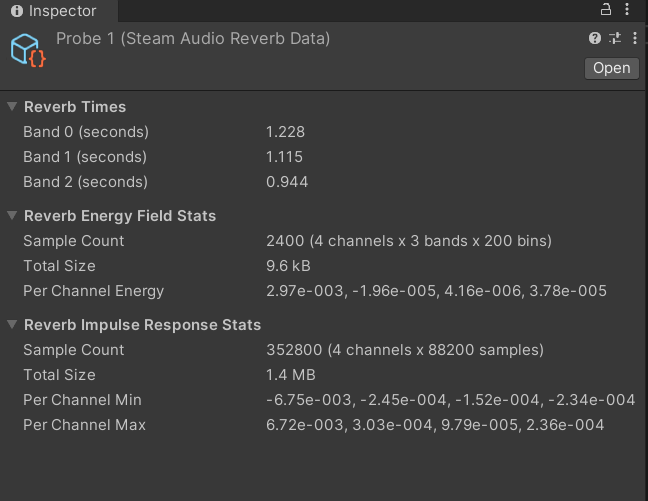

Steam Audio Reverb Data
~~~~~~~~~~~~~~~~~~~~~~~

The baked reverb data stored for a single **Steam Audio Reverb Data Point** component. This includes an impulse response (for convolution reverb), reverb decay times (for parametric reverb), and optionally, energy fields (for more fine-grained control and visualization of reverb).

The component shows high-level statistics for the data it contains. To access the underlying data, use :doc:`the C# API <reverbdata-api>`.
