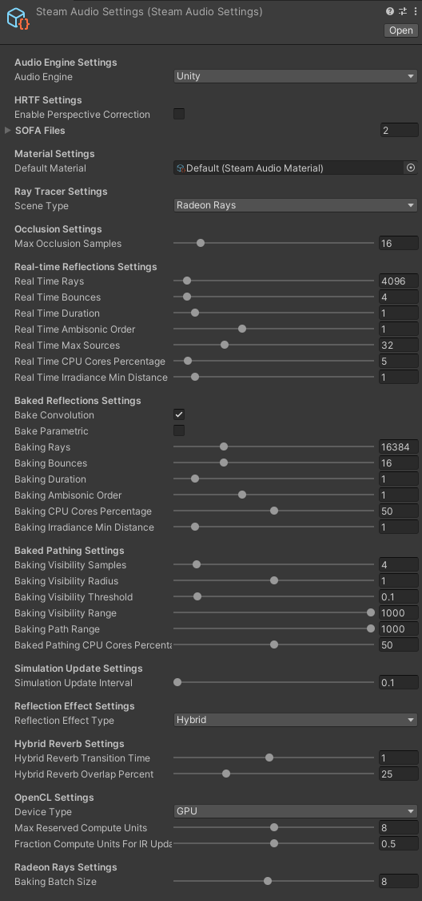

Steam Audio Settings
~~~~~~~~~~~~~~~~~~~~

Contains all the project-wide settings used by Steam Audio.

Audio Engine
    Specifies the audio engine that Steam Audio should integrate with.

    -   *Unity*. Integrate with Unity's built-in audio engine.

    -   *FMOD Studio*. Integrate with FMOD Studio. The Steam Audio plugin for FMOD Studio should be installed in your FMOD Studio project, and the FMOD Studio plugin for Unity should be installed in your Unity project.

Enable Perspective Correction
    If checked, enables *perspective correction* for spatialized sound sources. When perspective correction is enabled, instead of spatializing sounds from their world-space position relative to the listener, sounds are spatialized from their *on-screen position* relative to the *user*. This can improve perceived localization accuracy in 3D non-VR applications.

    To apply perspective correction, you must also check **Perspective Correction** on each **Steam Audio Source** to which you want to apply perspective correction. Some sounds, e.g. spatialized UI sounds, may not need perspective correction.

    Perspective correction works by using the main camera's projection matrix to adjust source positions before applying spatialization. In addition to the projection matrix, Steam Audio also needs a measure of the screen/viewport size as seen at the user's position. This is controlled by adjusting the **Perspective Correction Factor**.

    This setting should not be checked for VR applications.

    *Only available if using Unity's built-in audio engine.*

Perspective Correction Factor
    When **Enable Perspective Correction** is checked, this value is used as a measure of the size of the screen/viewport at the user's position. This is used to determine the perceived position of sounds emitted by a source, based on its on-screen position.

    The default value of 1 is calibrated for a full-screen application displayed on a 30-32 inch desktop monitor with the user seated at the desk. Lower values should be used for smaller screens, or if the user is further away from the screen. Higher values should be used for larger screens, or if the user is closer to the screen.

    Since this value is dependent on the user's display and viewing configuration, you will most likely need to allow the user to calibrate this value in your in-game settings UI.

    *Only available if using Unity's built-in audio engine.*

HRTF Volume Gain (dB)
    Adjusts the volume of the HRTF filters contained in the default HRTF. This parameter can be used to ensure that the volume of Steam Audio's default HRTF works well within your overall mix.

HRTF Normalization Type
    Specifies the algorithm to use (if any) to normalize the volumes of the default HRTF filters across all directions.

    -   *None*. No normalization is applied, and the default HRTF is used as-is. This is identical to the behavior prior to v4.3.0. Sources in some directions may sound slightly louder than others.
    -   *RMS*. Root-Mean Squared normalization. HRTF volumes are normalized based on their root-mean-square value. Sources in any direction will have a similar volume.

SOFA Files
    List of SOFA files containing custom HRTFs. Each of these SOFA files will be loaded at app startup. The SOFA files should be imported into your project's ``Assets`` folder, and will automatically be packaged along with your project's assets.

Default Material
    Reference to a Material asset that defines the acoustic properties of any geometry for which a material is not specified.

Scene Type
    Specifies the ray tracing implementation to use for simulations.

    -   *Default*. Steam Audio's built-in ray tracer. Runs on all platforms that Steam Audio supports.
    -   *Embree*. The Intel\ |reg| Embree ray tracer. Provides improved performance compared to Steam Audio's built-in ray tracer. Supported only on Windows, Linux, and macOS.
    -   *Radeon Rays*. The AMD Radeon\ |tm| Rays ray tracer. This is an OpenCL implementation, and can use either the CPU or any GPU that supports OpenCL 1.2 or later. If using the GPU, it is likely to be significantly faster than Steam Audio's built-in ray tracer. However, with heavy real-time simulation workloads, it may impact your application's frame rate. On supported AMD GPUs, you can use the Resource Reservation feature to mitigate this issue. Supported only on Windows 64-bit.
    -   *Unity*. Unity's built-in ray tracer. Runs on all platforms that Steam Audio supports. Does not require Steam Audio Geometry components to be attached anywhere, or scene data to be exported. However, this is the slowest of the available options, and is not suitable for modeling reflections, reverb, or pathing.

Layer Mask
    If **Scene Type** is set to **Unity**, this specifies the layers that an object with geometry must be in for the Unity ray tracer to treat it as solid for the purposes of sound propagation.

Max Occlusion Samples
    The maximum possible value of **Occlusion Samples** that can be specified on any Source. The number of occlusion samples can be change on the fly for any source, but it cannot exceed the value of this setting.

Real Time Rays
    The number of rays traced from the listener when simulating reflections or reverb in real-time. Increasing this value results in more accurate reflections, at the cost of increased CPU usage.

Real Time Bounces
    The number of times each ray traced from the listener is reflected when simulating reflections or reverb in real-time. Increasing this value results in longer, more accurate reverb tails, at the cost of increased CPU usage during simulation.

Real Time Duration
    The duration (in seconds) of the impulse responses (IRs) generated when simulating reflections or reverb in real-time. Increasing this value results in longer, more accurate reverb tails, at the cost of increased CPU usage during audio processing.

    This is also the duration of the IRs that are interpolated from baked data. If the data was baked with shorter IRs, the IRs used for rendering will be appropriately padded with zeroes. If the data was baked with longer IRs, the IRs used for rendering will be truncated.

Real Time Ambisonic Order
    The Ambisonic order of the IRs generated when simulating reflections or reverb in real-time. Increasing this value results in more accurate directional variation of reflected sound, at the cost of increased CPU usage during audio processing.

    This is also the Ambisonic order of the IRs that are interpolated from baked data. If the data was baked with a lower Ambisonic order, the higher-order terms in the IRs are set to zero. If the data was baked with a higher Ambisonic order, the higher-order terms in the baked data are ignored.

Real Time Max Sources
    The maximum number of sources for which reflections should be simulated in real-time.

Real Time CPU Cores Percentage
    The percentage of available CPU cores that should be used for real-time simulation of reflections or reverb.

Real Time Irradiance Min Distance
    When calculating how much sound energy reaches a surface directly from a source, if simulating reflections in real-time, any source that is closer than this distance (in meters) to the surface is assumed to be at this distance, for the purposes of energy calculations.

Bake Convolution
    If checked, when reflections or reverb is baked, convolution data (IRs) are stored in the baked data.

Bake Parametric
    If checked, when reflections or reverb is baked, parametric reverb data are stored in the baked data.

Baking Rays
    The number of rays traced from the listener when baking reflections or reverb. Increasing this value results in more accurate reflections, at the cost of increased bake times.

Baking Bounces
    The number of times each ray traced from the listener is reflected when baking reflections or reverb. Increasing this value results in longer, more accurate reverb tails, at the cost of increased bake times.

Baking Duration
    The duration (in seconds) of the IRs generated when baking reflections or reverb. Increasing this value results in longer, more accurate reverb tails, at the cost of increased disk space usage.

Baking Ambisonic Order
    The Ambisonic order of the IRs generated when baking reflections or reverb. Increasing this value results in more accurate directional variation of reflected sound, at the cost of increased disk space usage.

Baking CPU Cores Percentage
    The percentage of available CPU cores that should be used for baking reflections or reverb.

Baking Irradiance Min Distance
    When calculating how much sound energy reaches a surface directly from a source, if baking reflections, any source that is closer than this distance (in meters) to the surface is assumed to be at this distance, for the purposes of energy calculations.

Baking Visibility Samples
    Number of point samples to use around each probe when testing whether one probe can see another. To determine if two probes are mutually visible, rays are traced from each point sample of the first probe, to every other point sample of the second probe. Increasing this value prevents paths from being considered occluded by small objects, at the cost of increased bake times.

Baking Visibility Radius
    When testing for mutual visibility between a pair of probes, each probe is treated as a sphere of this radius (in meters), and point samples are generated within this sphere.

Baking Visibility Threshold
    When tracing rays to test for mutual visibility between a pair of probes, the fraction of rays that are unoccluded must be greater than this threshold for the pair of probes to be considered mutually visible.

Baking Visibility Range
    If the distance between two probes is greater than this value, the probes are not considered mutually visible. Increasing this value can result in simpler paths, at the cost of increased bake times.

Baking Path Range
    If the distance between two probes is greater than this value, the probes are considered to not have any path between them. Increasing this value allows sound to propagate over greater distances, at the cost of increased bake times and memory usage.

Baked Pathing CPU Cores Percentage
    The percentage of available CPU cores that should be used for baking pathing.

Simulation Update Interval
    The minimum interval (in seconds) between successive updates to reflection and pathing simulations.

Reflection Effect Type
    Specifies the algorithm used for rendering reflections and reverb.

    -   *Convolution*. Multi-channel convolution reverb. Reflections reaching the listener are encoded in an Impulse Response (IR), which is a filter that records each reflection as it arrives. This algorithm renders reflections with the most detail, but may result in significant CPU usage.

    -   *Parametric*. Parametric (or artificial) reverb, using feedback delay networks. The reflected sound field is reduced to a few numbers that describe how reflected energy decays over time. This is then used to drive an approximate model of reverberation in an indoor space. This algorithm results in lower CPU usage, but cannot render individual echoes, especially in outdoor spaces.

    -   *Hybrid*. A hybrid of convolution and parametric reverb. The initial portion of the IR is rendered using convolution reverb, but the later part is used to estimate a parametric reverb. The point in the IR where this transition occurs can be controlled. This algorithm allows a trade-off between rendering quality and CPU usage.

    -   *TrueAudio Next*. Multi-channel convolution reverb, using AMD TrueAudio Next for GPU acceleration. This algorithm is similar to **Convolution**, but uses the GPU instead of the CPU for processing, allowing significantly more sources to be processed.

Hybrid Reverb Transition Time
    If **Reflection Effect Type** is set to **Hybrid**, this is the length (in seconds) of impulse response to use for convolution reverb. The rest of the impulse response will be used for parametric reverb estimation only. Increasing this value results in more accurate reflections, at the cost of increased CPU usage.

Hybrid Reverb Overlap Percent
    If **Reflection Effect Type** is set to **Hybrid**, this is the amount of overlap between the convolution and parametric parts. To ensure smooth transitions from the early convolution part to the late parametric part, the two are cross-faded towards the end of the convolution part. For example, if **Hybrid Reverb Transition Time** is 1.0, and **Hybrid Reverb Overlap Percent** is 0.25, then the first 0.75 seconds are pure convolution, the next 0.25 seconds are a blend between convolution and parametric, and the portion of the tail beyond 1.0 second is pure parametric.

Device Type
    Specifies the type of OpenCL device to use with Radeon\ |tm| Rays or TrueAudio Next.

    -   *CPU*. Runs OpenCL computations on the user's CPU.

    -   *GPU*. Runs OpenCL computations on the user's GPU. If multiple GPUs are available, this will pick the first one reported by the OpenCL runtime.

    -   *Any*. Runs OpenCL computations on any available device. The device selected will be the first one reported by the OpenCL runtime.

    Note that if Resource Reservation is enabled (by setting **Max Reserved CUs** to a non-zero value), then OpenCL computations will be restricted to run on supported AMD GPUs only. If no such device is installed on the user's system, OpenCL initialization will fail.

Max Reserved Compute Units
    The number of GPU compute units (CUs) that should be reserved for use by Steam Audio. If set to a non-zero value, then a GPU will be included in the device list only if it can reserve at least this many CUs. Set to 0 to indicate that Steam Audio can use the entire GPU, in which case all available GPUs will be considered.

Fraction Compute Units For IR Update
    The fraction of reserved CUs that should be used for impulse response (IR) update. IR update includes: a) ray tracing using Radeon Rays to simulate sound propagation, and/or b) pre-transformation of IRs for convolution using TrueAudio Next. Steam Audio will only list GPU devices that are able to subdivide the reserved CUs as per this value. The value must be between 0 and 1.

Baking Batch Size
    If **Scene Type** is set to **Radeon Rays**, this is the number of probes for which data is baked simultaneously.

TAN Duration
    Overrides the value of **Real Time Duration** when **Reflection Effect Type** is set to **TrueAudio Next**.

TAN Ambisonic Order
    Overrides the value of **Real Time Ambisonic Order** when **Reflection Effect Type** is set to **TrueAudio Next**.

TAN Max Sources
    Overrides the value of **Real Time Max Sources** when **Reflection Effect Type** is set to **TrueAudio Next**.

Enable Validation
    If checked, Steam Audio will perform several extra validation checks while doing any processing. Note that this will significantly increase CPU usage, since Steam Audio will check all input and output buffers, as well as most function parameters for invalid values. Use this only when trying to diagnose issues.

.. |reg|    unicode:: U+000AE .. REGISTERED SIGN
.. |tm|     unicode:: U+2122  .. TRADE MARK SIGN