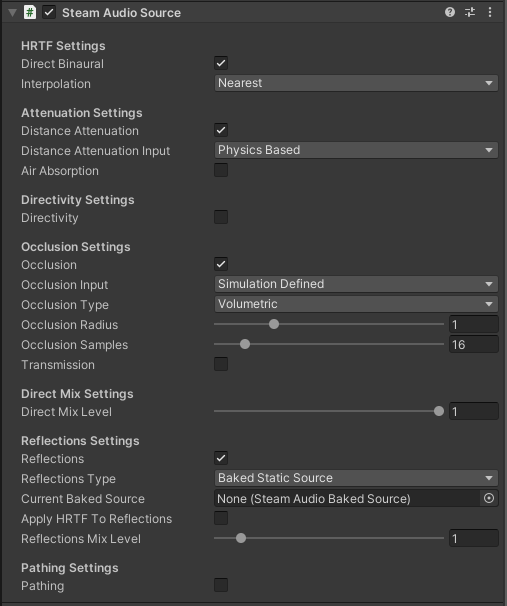

Steam Audio Source
~~~~~~~~~~~~~~~~~~

Provides options for controlling how an Audio Source is rendered, as well as controlling how occlusion and sound propagation are simulated.

Must be attached to a GameObject containing an Audio Source (if using Unity's built-in audio engine) or an FMOD Event Emitter (if using FMOD Studio).

Direct Binaural
    If checked, HRTF-based binaural rendering will be used to spatialize the source. This requires 2-channel (stereo) audio output. If unchecked, panning will be used to the spatialize the source using the user's speaker layout. Binaural rendering provides improved spatialization at the cost of slightly increased CPU usage.

Interpolation
    Controls how HRTFs are interpolated when the source moves relative to the listener.

    -  *Nearest*: Uses the HRTF from the direction nearest to the direction of the source for which HRTF data is available. The fastest option, but can result in audible artifacts for certain kinds of audio clips, such as white noise or engine sounds.

    -  *Bilinear*: Uses an HRTF generated after interpolating from four directions nearest to the direction of the source, for which HRTF data is available. This may result in smoother audio for some kinds of sources when the listener looks around, but has higher CPU usage (up to 2x).

    *Only available if using Unity's built-in audio engine.*

Perspective Correction
    If checked, perspective correction (based on the projection matrix of the current main camera) is applied to this source during spatialization. This can improve the perceived positional accuracy in non-VR applications. See :doc:`Steam Audio Settings <settings>` for more details.
    
    Requires **Enable Perspective Correction** to be checked in **Steam Audio Settings**.

    *Only available if using Unity's built-in audio engine.*

Distance Attenuation
    If checked, distance attenuation will be calculated and applied to the Audio Source. This takes into account the **Spatial Blend** setting on the Audio Source, so if **Spatial Blend** is set to **2D**, distance attenuation is effectively not applied.

    *Only available if using Unity's built-in audio engine.*

Distance Attenuation Input
    Specifies how the distance attenuation value is determined.

    -  *Curve Driven*: Distance attenuation is controlled by the Volume curve on the Audio Source.

    -  *Physics Based*: A physics-based distance attenuation model is used. This is an inverse distance falloff. The curves defined on the Audio Source are ignored.

    *Only available if using Unity's built-in audio engine.*

Air Absorption
    If checked, frequency-dependent distance based air absorption will be calculated and applied to the Audio Source.

    *Only available if using Unity's built-in audio engine.*

Air Absorption Input
    Specifies how the air absorption values (which are 3-band EQ values) are determined.

    -  *Simulation Defined*: Uses a physics-based air absorption model. This is an exponential falloff, with higher frequencies falling off faster with distance than lower frequencies.

    -  *User Defined*: Uses the values specified in the **Air Absorption Low**, **Air Absorption Mid**, and **Air Absorption High** sliders as the EQ values. The air absorption value will not automatically change with distance to the source. You are expected to control the **Air Absorption Low**, **Air Absorption Mid**, and **Air Absorption High** sliders using a custom script to achieve this effect.

    *Only available if using Unity's built-in audio engine.*

Air Absorption Low
    The low frequency (up to 800 Hz) EQ value for air absorption. Only used if **Air Absorption Input** is set to **User Defined**. 0 = low frequencies are completely attenuated, 1 = low frequencies are not attenuated at all.

    *Only available if using Unity's built-in audio engine.*

Air Absorption Mid
    The middle frequency (800 Hz - 8 kHz) EQ value for air absorption. Only used if **Air Absorption Input** is set to **User Defined**. 0 = middle frequencies are completely attenuated, 1 = middle frequencies are not attenuated at all.

    *Only available if using Unity's built-in audio engine.*

Air Absorption High
    The high frequency (8 kHz and above) EQ value for air absorption. Only used if **Air Absorption Input** is set to **User Defined**. 0 = high frequencies are completely attenuated, 1 = high frequencies are not attenuated at all.

    *Only available if using Unity's built-in audio engine.*

Directivity
    If checked, attenuation based on the source’s directivity pattern and orientation will be applied to the Audio Source.

    *Only available if using Unity's built-in audio engine.*

Directivity Input
    Specifies how the directivity attenuation value is determined.

    -  *Simulation Defined*. Uses a dipole directivity model. You can control the dipole shape using the **Dipole Weight** and **Dipole Power** properties.

    -  *User Defined*. Uses the value specified in the **Directivity Value** property. This value will *not* automatically change as the source rotates. You are expected to control the **Directivity Value** property using a custom script to achieve this effect.

    *Only available if using Unity's built-in audio engine.*

Dipole Weight
    Blends between monopole (omnidirectional) and dipole directivity patterns. 0 = pure monopole (sound is emitted in all directions with equal intensity), 1 = pure dipole (sound is focused to the front and back of the source). At 0.5, the source has a cardioid directivity, with most of the sound emitted to the front of the source. Only used if **Directivity Input** is set to **Simulation Defined**.

    *Only available if using Unity's built-in audio engine.*

Dipole Power
    Controls how focused the dipole directivity is. Higher values result in sharper directivity patterns. Only used if **Directivity Input** is set to **Simulation Defined**.

    *Only available if using Unity's built-in audio engine.*

Directivity Value
    The directivity attenuation value. Only used if **Directivity Input** is set to **User Defined**. 0 = sound is completely attenuated, 1 = sound is not attenuated at all.

    *Only available if using Unity's built-in audio engine.*

Occlusion
    *If using Unity's built-in audio engine*
        If checked, attenuation based on the occlusion of the source by the scene geometry will be applied to the Audio Source.

    *If using FMOD Studio*
        If checked, ray tracing will be used to determine how much of the source is occluded.

Occlusion Input
    Specifies how the occlusion attenuation value is determined.

    -  *Simulation Defined*. Uses ray tracing to determine how much of the source is occluded.

    -  *User Defined*. Uses the **Occlusion Value** slider to control occlusion. The occlusion value will *not* automatically change based on surrounding geometry. You are expected to control the **Occlusion Value** slider using a custom script to achieve this effect. This option is intended for integrating your own occlusion model with Steam Audio.

    *Only available if using Unity's built-in audio engine.*

Occlusion Type
    Specifies how rays should be traced to model occlusion.

    -  *Raycast*. Trace a single ray from the listener to the source. If the ray is occluded, the source is considered occluded.

    -  *Volumetric*. Trace multiple rays from the listener to the source based on the **Occlusion Radius** setting. The proportion of rays that are occluded determine how much of the direct sound is considered occluded. Transmission calculations, if enabled, are only applied to the occluded portion of the direct sound.

Occlusion Radius
    The apparent size of the sound source. The larger the source radius, the larger an object must be in order to fully occlude sound emitted by the source.

Occlusion Samples
    The number of rays to trace from the listener to various points in a sphere around the source. Only used if **Occlusion Type** is set to **Volumetric**. Increasing this number results in smoother transitions as the source becomes more (or less) occluded. This comes at the cost of increased CPU usage.

Occlusion Value
    The occlusion attenuation value. Only used if **Occlusion Input** is set to **User Defined**. 0 = sound is completely attenuated, 1 = sound is not attenuated at all.

    *Only available if using Unity's built-in audio engine.*

Transmission
    *If using Unity's built-in audio engine*
        If checked, a filter based on the transmission of sound through occluding scene geometry will be applied to the Audio Source.

    *If using FMOD Studio*
        If checked, ray tracing will be used to determine how much of the sound is transmitted through occluding scene geometry.

Transmission Type
    Specifies how the transmission filter is applied.

    -  *Frequency Independent*. Transmission is modeled as a single attenuation factor.

    -  *Frequency Dependent*. Transmission is modeled as a 3-band EQ.

    *Only available if using Unity's built-in audio engine.*

Transmission Input
    Specifies how the transmission attenuation or EQ values are determined.

    -  *Simulation Defined*. Uses ray tracing to determine how much of the sound is transmitted.

    -  *User Defined*. Uses the **Transmission Low**, **Transmission Mid**, and **Transmission High** sliders to control transmission. The transmission values will *not* automatically change based on surrounding geometry. You are expected to control the sliders using a custom script to achieve this effect. This option is intended for integrating your own occlusion and transmission model with Steam Audio.

    *Only available if using Unity's built-in audio engine.*

Transmission Low
    The low frequency (up to 800 Hz) EQ value for transmission. Only used if **Transmission Input** is set to **User Defined**. 0 = low frequencies are completely attenuated, 1 = low frequencies are not attenuated at all.

    *Only available if using Unity's built-in audio engine.*

Transmission Mid
    The middle frequency (800 Hz to 8 kHz) EQ value for transmission. Only used if **Transmission Input** is set to **User Defined**. 0 = middle frequencies are completely attenuated, 1 = middle frequencies are not attenuated at all.

    *Only available if using Unity's built-in audio engine.*

Transmission High
    The high frequency (8 kHz and above) EQ value for transmission. Only used if **Transmission Input** is set to **User Defined**. 0 = high frequencies are completely attenuated, 1 = high frequencies are not attenuated at all.

    *Only available if using Unity's built-in audio engine.*

Max Transmission Surfaces
    The maximum number of surfaces, starting from the closest surface to the listener, whose transmission coefficients will be considered when calculating the total amount of sound transmitted. Increasing this value will result in more accurate results when multiple surfaces lie between the source and the listener, at the cost of increased CPU usage.

Direct Mix Level
    The contribution of the direct sound path to the overall mix for this Audio Source. Lower values reduce the contribution more.

    *Only available if using Unity's built-in audio engine.*

Reflections
    *If using Unity's built-in audio engine*
        If checked, reflections reaching the listener from the source will be simulated and applied to the Audio Source.

    *If using FMOD Studio*
        If checked, reflections reaching the listener from the source will be simulated.

Reflections Type
    Specifies how reflections should be simulated for this source.

    - *Realtime*. Rays are traced in real-time, and bounced around the scene to simulate sound reflecting from the source and reaching the listener. This allows for smooth variations, and reflections off of dynamic geometry, at the cost of significant CPU usage.

    - *Baked Static Source*. The source is assumed to be static, and the listener position is used to interpolate reflected sound from baked data. This results in relatively low CPU usage, but cannot model reflections off of dynamic geometry, and requires more memory and disk space.

    - *Baked Static Listener*. The listener is assumed to be static, and the source position is used to interpolate reflected sound from baked data. This results in relatively low CPU usage, but cannot model reflections off of dynamic geometry, and requires more memory and disk space.

Current Baked Source
    If **Reflections Type** is set to **Baked Static Source**, the position and orientation of the GameObject specified in this field will be used as the position and orientation of the source.

Apply HRTF To Reflections
    If checked, applies HRTF-based 3D audio rendering to reflections. Results in an improvement in spatialization quality when using convolution or hybrid reverb, at the cost of slightly increased CPU usage. Default: off.

    *Only available if using Unity's built-in audio engine.*

Reflections Mix Level
    The contribution of reflections to the overall mix for this Audio Source. Lower values reduce the contribution more.

    *Only available if using Unity's built-in audio engine.*

Pathing
    *If using Unity's built-in audio engine*
        If checked, shortest paths taken by sound as it propagates from the source to the listener will be simulated, and appropriate spatialization will be applied to the Audio Source for these indirect paths.

    *If using FMOD Studio*
        If checked, shortest paths taken by sound as it propagates from the source to the listener will be simulated.

Pathing Probe Batch
    When simulating pathing, the baked data stored in this probe batch will be used to look up paths from the source to the listener.

Path Validation
    If checked, each baked path from the source to the listener is checked in real-time to see if it is occluded by dynamic geometry. If so, the path is not rendered.

Find Alternate Paths
    If checked, if a baked path from the source to the listener is found to be occluded by dynamic geometry, alternate paths are searched for in real-time, which account for the dynamic geometry.

Apply HRTF To Pathing
    If checked, applies HRTF-based 3D audio rendering to pathing. Results in an improvement in spatialization quality, at the cost of slightly increased CPU usage. Default: off.

    *Only available if using Unity's built-in audio engine.*

Pathing Mix Level
    The contribution of pathing to the overall mix for this Audio Source. Lower values reduce the contribution more.

    *Only available if using Unity's built-in audio engine.*
