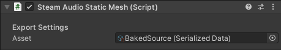

Steam Audio Static Mesh
~~~~~~~~~~~~~~~~~~~~~~~

References the asset containing the exported geometry data for the static geometry of the scene. This component is automatically added to an empty GameObject when you export a scene from the main menu. You shouldn’t have to attach this component manually.

Asset
    Reference to the asset that contains the exported geometry data for this scene. Automatically generated by Steam Audio.
