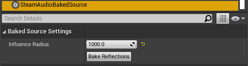

Steam Audio Baked Source
~~~~~~~~~~~~~~~~~~~~~~~~

Marks the position and orientation of the object it's attached to as a static source that can be used for baking reflections.

Can be attached to any actor.

Influence Radius
    Distance (in meters) within which a probe must lie for it to contain reflections data for this static source.

Bake Reflections
    Starts baking reflections for this static source.
