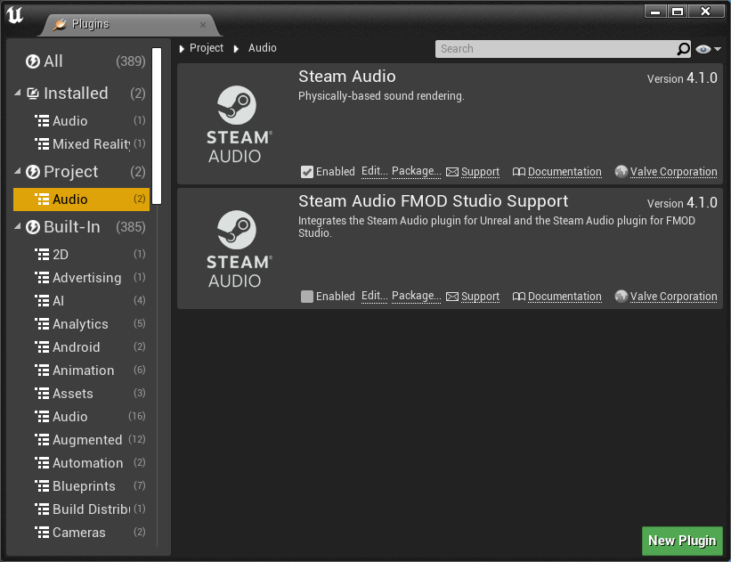

Getting Started
===============

Requirements
------------

Steam Audio requires **Unreal Engine 4.27** or later.

The Steam Audio Unreal Engine integration supports the following platforms:

-  Windows 7 or later (32-bit and 64-bit)
-  Linux (64-bit, tested with Ubuntu 18.04 LTS)
-  macOS 10.7 or later (64-bit Intel)
-  Android 5.0 or later (32-bit ARM, 64-bit ARM, 32-bit Intel)
-  iOS 11.0 or later (64-bit ARM)

.. note::
    The Steam Audio Unreal Engine integration currently does not ship with macOS binaries. However, opening a project containing the Steam Audio plugin in the Unreal Editor will automatically trigger a rebuild of the plugin for macOS, after which the plugin should work normally on macOS systems. This issue will be resolved in a future patch release of Steam Audio.

Add Steam Audio to your Unreal Engine project
---------------------------------------------

To add Steam Audio to your Unreal project:

1. Download the latest version of the Steam Audio Unreal Engine integration: ``steamaudio_unreal.zip``. Extract the contents of this file to any directory of your choosing.
2. Copy the ``unreal/Plugins/SteamAudio`` into the ``Plugins`` subfolder of your project, in order to install Steam Audio for your project. Delete the Steam Audio plugin bundled with Unreal Engine. It is located at ``Engine/Plugins/Runtime/Steam/SteamAudio`` inside the folder where Unreal Engine has been installed.
3. In Unreal's main menu, choose **Edit** > **Plugins**.
4. In the Plugins window, under **Audio**, check **Enabled** in the entry for Steam Audio.
5. In the main menu, choose **Edit** > **Project Settings**.
6. Under **Platforms** > **Windows**, set **Spatialization Plugin** to **Steam Audio Spatialization**, **Occlusion Plugin** to **Steam Audio Occlusion**, and **Reverb Plugin** to **Steam Audio Reverb**. Repeat this for every platform you intend to use Steam Audio on.

Spatialize an Audio Cue
-----------------------

Once Steam Audio is added to your project, you can spatialize any Audio Component:

1. Select any actor that contains an Audio component.
2. In the Details tab, select the Audio component.

.. image:: media/audio_spatialize.png

3. Under **Attenuation**, check **Override Attenuation**.
4. Under **Attenuation (Spatialization)**, set **Spatialization Method** to **Binaural**.
