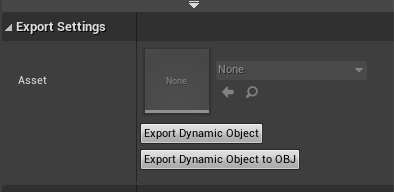
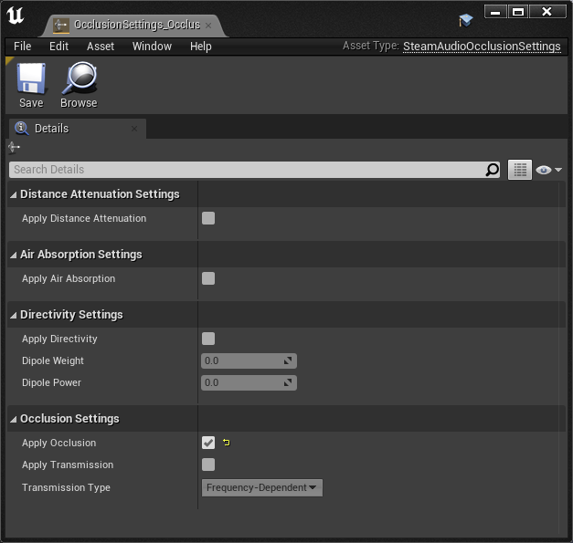
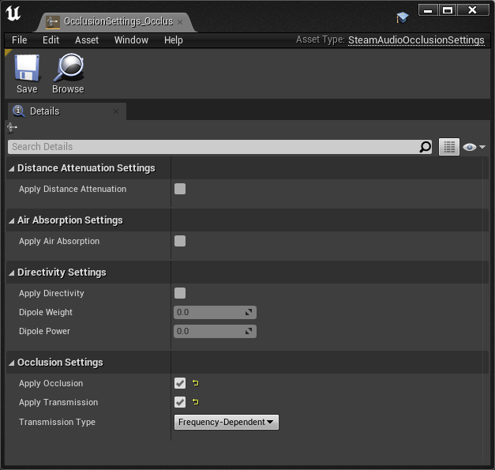
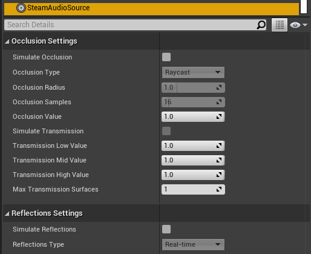
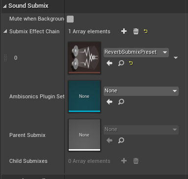
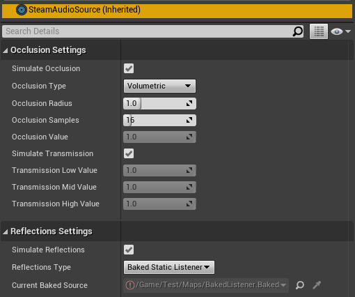

User's Guide
============

Spatialize an audio source
--------------------------

To spatialize an Audio component:

1. Select the actor containing the Audio component, then select the Audio component in the Details tab.
2. Under **Attenuation**, check **Override Attenuation**.
3. Under **Attenuation (Spatialization)**, set **Spatialization Method** to **Binaural**.

.. image:: media/audio_spatialize.png

Steam Audio will apply HRTF-based binaural rendering to the Audio Source, using default settings. You can control many properties of the spatialization using the :doc:`Steam Audio Source <source>` component and :doc:`Steam Audio Spatialization Settings <spatialization-settings>` asset.

Apply distance falloff
----------------------

You can continue to use Unreal's built-in tools to control how the volume of an audio source falls off with distance. To do so:

1. Select the actor containing the Audio component, then select the Audio component in the Details tab.
2. Under **Attenuation (Volume)**, check **Enable Volume Attenuation**.
3. Use the **Attenuation Function**, **Attenuation Shape**, **Inner Radius**, and **Falloff Distance** to control the distance falloff. Refer to the `Unreal documentation <https://docs.unrealengine.com/4.27/en-US/WorkingWithAudio/DistanceModelAttenuation/>`_ for more information.

Steam Audio will automatically use this curve to apply distance attenuation.

Apply frequency-dependent air absorption
----------------------------------------

You can control how different sound frequencies fall off with distance. For example, when playing a distant explosion sound, higher frequencies can fall off more than lower frequencies, leading to a more muffled sound. To do this:

1. Select the actor containing the Audio component, then select the Audio component in the Details tab.
2. In the Details tab, under **Attenuation (Occlusion)**, check **Occlusion**.
3. Click the **+** icon next to **Occlusion Plugin Settings**, then use the drop-down that appears to select an existing Occlusion Plugin Settings asset, or create a new one. Skip this step if a Occlusion Plugin Settings asset has already been set for this Audio component.
4. Open the Occlusion Plugin Settings asset associated with the Audio component.
5. Under **Air Absorption Settings**, check **Apply Air Absorption**.

.. image:: media/occlusionsettings_airabsorption.png

Steam Audio will now use its default air absorption model to apply frequency-dependent distance falloff to the Audio component.

Specify a source directivity pattern
------------------------------------

You can configure a source that emits sound with different intensities in different directions. For example, a megaphone that projects sound mostly to the front. To do this:

1. Select the actor containing the Audio component, then select the Audio component in the Details tab.
2. In the Details tab, under **Attenuation (Occlusion)**, check **Occlusion**.
3. Click the **+** icon next to **Occlusion Plugin Settings**, then use the drop-down that appears to select an existing Occlusion Plugin Settings asset, or create a new one. Skip this step if a Occlusion Plugin Settings asset has already been set for this Audio component.
4. Open the Occlusion Plugin Settings asset associated with the Audio component.
5. Under **Directivity Settings**, check **Apply Directivity**.
6. Use the **Dipole Weight** and **Dipole Power** sliders to control the directivity pattern.

.. note::

    If a :doc:`Steam Audio Source <source>` component is attached to the actor, then selecting the actor will cause a visualization of the directivity pattern to be displayed in the viewport.

.. image:: media/occlusionsettings_directivity.png

For more information, see :doc:`Steam Audio Occlusion Settings <occlusion-settings>`.

Use a custom HRTF
-----------------

You (or your players) can replace Steam Audio’s built-in HRTF with any HRTF of your choosing. This is useful for comparing different HRTF databases, measurement or simulation techniques, or even allowing players to use a preferred HRTF with your game or app.

Steam Audio loads custom HRTFs from SOFA files. These files have a ``.sofa`` extension.

.. note::

    The Spatially-Oriented Format for Acoustics (SOFA) file format is defined by an Audio Engineering Society (AES) standard. For more details, click `here <https://www.sofaconventions.org>`_.

To tell Steam Audio to load a SOFA file at startup:

1.  In the Content Browser, click **Add/Import** > **Import To ...**, then navigate to the SOFA file you want to import and click **Open**.
2.  In the main menu, click **Edit** > **Project Settings**, then select **Steam Audio** from the list on the left.
3.  Under **Custom HRTF Settings**, click the dropdown next to **SOFA File**, then select the SOFA file you imported.

HRTFs loaded from SOFA files affect direct and indirect sound generated by audio sources, as well as reverb.

.. warning::

    The SOFA file format allows for very flexible ways of defining HRTFs, but Steam Audio only supports a restricted subset. The following restrictions apply (for more information, including definitions of the terms below, click `here <https://www.sofaconventions.org>`_):

   -   SOFA files must use the ``SimpleFreeFieldHRIR`` convention.
   -   The ``Data.SamplingRate`` variable may be specified only once, and may contain only a single value. Steam Audio will automatically resample the HRTF data to the user's output sampling rate at run-time.
   -   The ``SourcePosition`` variable must be specified once for each measurement.
   -   Each source must have a single emitter, with ``EmitterPosition`` set to ``[0 0 0]``.
   -   The ``ListenerPosition`` variable may be specified only once (and not once per measurement). Its value must be ``[0 0 0]``.
   -   The ``ListenerView`` variable is optional. If specified, its value must be ``[1 0 0]`` (in Cartesian coordinates) or ``[0 0 1]`` (in spherical coordinates).
   -   The ``ListenerUp`` variable is optional. If specified, its value must be ``[0 0 1]`` (in Cartesian coordinates) or ``[0 90 1]`` (in spherical coordinates).
   -   The listener must have two receivers. The receiver positions are ignored.
   -   The ``Data.Delay`` variable may be specified only once. Its value must be 0.

Tag acoustic geometry
---------------------

You can use Steam Audio to model how your level geometry causes occlusion, reflection, reverb, and other effects on your audio sources. You start by tagging the actors that you want to use for acoustic calculations:

1. Select the actor you want to tag. It must be either an actor containing a Static Mesh component, or a Landscape actor.
2. In the Details tab, click **Add Component** > **Steam Audio Geometry**.

.. image:: media/geometry.png

Not all objects have a noticeable influence on acoustics. For example, in a large hangar, the room itself obviously influences the acoustics. A small tin can on the floor, though, most likely doesn't. But large amounts of small objects can collectively influence the acoustics. For example, while a single wooden crate might not influence the hangar reverb, large stacks of crates are likely to have some impact.

.. note::

    You don't need to create an additional mesh just to tag an object as Steam Audio Geometry. You can directly use the same meshes used for visual rendering.

Once you've tagged all the geometry in the level, export it:

1. In the toolbar, click **Steam Audio** > **Export Static Geometry**.

By default, all geometry is treated as static. In other words, you can't move, deform, or otherwise change the geometry at run-time. If you need to do this, set it up as a dynamic object, as discussed in the next section.

You can simplify geometry before it's exported, export multiple meshes with a single Steam Audio Geometry component, and more. For more information, see :doc:`Steam Audio Geometry <geometry>`.

Set up dynamic (movable) geometry
---------------------------------

You can mark specific actors as *dynamic geometry*, which tells Steam Audio to update occlusion, reverb, and other acoustic effects as the actor moves. To do this:

1. Select the actor you want to tag.
2. In the Details tab, click **Add Component** > **Steam Audio Dynamic Object**.
3. Attach Steam Audio Geometry components to the actor as needed.
4. On the Steam Audio Dynamic Object component, click **Export Dynamic Object**.

At run-time, any changes made to the transform of the actor to which the Steam Audio Dynamic Object component has been attached will automatically be passed to Steam Audio.

You can attach a Steam Audio Dynamic Object component in a Blueprint as well. After exporting it, the Blueprint can be freely instantiated in any level and moved around; Steam Audio will automatically update acoustic effects accordingly. For example, this can be used to create a door Blueprint that automatically occludes sound when added to any level, or large walls that a player can build, which automatically reflect sound.

.. warning::

    Changes made to the transforms of children of the actor containing the Steam Audio Dynamic Object will *not* be passed to Steam Audio. The entire object and all its children must move/animate as a rigid body.

For more information, see :doc:`Steam Audio Dynamic Object <dynamic-object>`.

Associate an acoustic material with geometry
--------------------------------------------

You can specify acoustic material properties for any actor that has a Steam Audio Geometry component. These properties control how the actor reflects, absorbs, and transmits sound, for different frequencies. To specify an acoustic material:

1. Select the actor containing the Steam Audio Geometry component, then click the Steam Audio Geometry component in the Details tab.
2. Set **Material** to a new or existing Steam Audio Material asset.

.. image:: media/geometry.png

Steam Audio contains a small library of built-in materials (**Plugins/SteamAudio/Content/**), but you can create your own and reuse them across your project. To create a new material:

1. In the Content Browser, navigate to the directory where you want to create your material.
2. Click **Add/Import** > **Sounds** > **Steam Audio** > **Steam Audio Material**.
3. Give your new material a name, and configure its acoustic properties.

For more information on individual material properties, see :doc:`Steam Audio Material <material>`.

Model occlusion by geometry
---------------------------

You can configure an audio source to be occluded by scene geometry. To do this:

1. Select the actor containing the Audio component, then select the Audio component in the Details tab.
2. In the Details tab, under **Attenuation (Occlusion)**, check **Enable Occlusion**.

.. image:: media/audio_occlusion.png

3. Click the **+** icon next to **Occlusion Plugin Settings**, then use the drop-down that appears to select an existing Occlusion Plugin Settings asset, or create a new one. Skip this step if a Occlusion Plugin Settings asset has already been set for this Audio component.
4. Open the Occlusion Plugin Settings asset associated with the Audio component.
5. Under **Occlusion Settings**, check **Apply Occlusion**.

6. Click **Add Component** > **Steam Audio Source**. Skip this step if a Steam Audio Source component is already attached to the actor.
7. Under **Occlusion Settings**, check **Simulate Occlusion**.

.. image:: media/sasource_occlusion.png

Steam Audio will now use raycast occlusion to check if the source is occluded from the listener by any geometry. This assumes that the source is a single point. You can also model sources with larger spatial extent, or explicitly control occlusion manually or via scripting. For more information, see :doc:`Steam Audio Source <source>`.

Model transmission through geometry
-----------------------------------

You can configure an audio source to be transmitted through occluding geometry, with the sound attenuated based on material properties. To do this:

1. Select the actor containing the Audio component, then select the Audio component in the Details tab.
2. In the Details tab, under **Attenuation (Occlusion)**, check **Occlusion**.
3. Click the **+** icon next to **Occlusion Plugin Settings**, then use the drop-down that appears to select an existing Occlusion Plugin Settings asset, or create a new one. Skip this step if a Occlusion Plugin Settings asset has already been set for this Audio component.
4. Open the Occlusion Plugin Settings asset associated with the Audio component.
5. Under **Occlusion Settings**, check **Apply Transmission**.

6. Click **Add Component** > **Steam Audio Source**. Skip this step if a Steam Audio Source component is already attached to the actor.
7. Under **Occlusion Settings**, check **Simulate Occlusion** and **Simulate Transmission**.

Steam Audio will now model how sound travels through occluding geometry, based on the acoustic material properties of the geometry. You can also control whether the transmission effect is frequency-dependent, or explicitly control transmission manually or via scripting. For more information, see :doc:`Steam Audio Source <source>`.

Model reflection by geometry
----------------------------

You can configure an audio source to be reflected by surrounding geometry, with the reflected sound attenuated based on material properties. Reflections often enhance the sense of presence when used with spatial audio. To do this:

1. Select the actor containing the Audio component, then select the Audio component in the Details tab.
2. In the Details tab, under **Attenuation (Reverb)**, check **Enable Reverb Send**.

.. image:: media/audio_reflections.png

3. Click the **+** icon next to **Reverb Plugin Settings**, then use the drop-down that appears to select an existing Reverb Plugin Settings asset, or create a new one. Skip this step if a Reverb Plugin Settings asset has already been set for this Audio component.
4. Open the Reverb Plugin Settings asset associated with the Audio component.
5. Under **Reflections Settings**, check **Apply Reflections**.

.. image:: media/reverbsettings_reflections.png

6. Select the actor containing the Audio component.
7. Click **Add Component** > **Steam Audio Source**. Skip this step if a Steam Audio Source component is already attached to the actor.
8. Under **Reflections Settings**, check **Simulate Reflections**.

.. image:: media/sasource_reflections.png

Steam Audio will now use real-time ray tracing to model how sound is reflected by geometry, based on the acoustic material properties of the geometry. You can control many aspects of this process, including how many rays are traced, how many successive reflections are modeled, how reflected sound is rendered, and much more. Since modeling reflections is CPU-intensive, you can pre-compute reflections for a static sound source, or even offload the work to the GPU. For more information, see :doc:`Steam Audio Source <source>` and :doc:`Steam Audio Settings <settings>`.

Simulate physics-based reverb at the listener position
------------------------------------------------------

You can also use ray tracing to automatically calculate physics-based reverb at the listener's position. Physics-based reverbs are *directional*, which means they can model the direction from which a distant echo can be heard, and keep it consistent as the player looks around. Physics-based reverbs also model smooth transitions between different spaces in your level, which is crucial for maintaining immersion as the player moves. To set up physics-based reverb:

1. In the main menu, click **Edit** > **Project Settings**.
2. Click **Plugins** > **Steam Audio** to open the Steam Audio Settings.
3. Under **Reverb Settings**, set **Reverb Submix** to a new or existing Sound Submix asset, then double-click the asset to open it.

.. image:: media/settings_reverbsubmix.png

4. Under **Sound Submix**, click the **+** icon next to **Submix Effect Chain** to add a new effect to the submix.
5. Use the drop-down that appears to select a new or existing Submix Effect Preset asset, then double-click the asset to open it.

6. Under **Submix Preset**, check **Apply Reverb**.

.. image:: media/reverbpreset_reverb.png

7. Select the actor containing the Audio component to which you want to apply the listener-centric reverb, then select the Audio component in the Details tab.
8. In the Details tab, under **Attenuation (Reverb)**, check **Enable Reverb Send**.
9. Select any actor in your level (a good choice might be the Player Start actor).
10. In the Details tab, click **Add Component** > **Steam Audio Listener**.
11. On the Steam Audio Listener component, under **Reverb Settings**, check **Simulate Reverb**.

.. image:: media/salistener_reverb.png

Steam Audio will now use real-time ray tracing to simulate physics-based reverb. You can control many aspects of this simulation, including how many rays are traced, the length of the reverb tail, whether the reverb is rendered a convolution reverb, and much more. Since modeling physics-based reverb is CPU-intensive, you can (and typically will) pre-compute reverb throughout your level. You can even offload simulation as well as rendering work to the GPU. For more information, see :doc:`Steam Audio Reverb <reverb>`, :doc:`Steam Audio Listener <listener>`, and :doc:`Steam Audio Settings <settings>`.

Create sound probes for baked sound propagation
-----------------------------------------------

Modeling reflections and reverb can be very CPU-intensive. For levels with mostly static geometry, you can pre-compute (or *bake*) these effects in the editor. Before doing so, you must create one or more *sound probes*, which are the points at which Steam Audio will simulate reflections or reverb when baking. At run-time, the source and listener positions relative to the probes are used to quickly estimate the reflections or reverb. To set up sound probes:

1. In the Place Actors tab, click **Volumes**, then drag a **Steam Audio Probe Volume** actor into your level. Adjust the size and shape of the Steam Audio Probe Volume like any other volume actor.
2. In the Details tab, under **Probe Batch Settings**, click **Generate Probes**.

.. image:: media/saprobevolume.png

Steam Audio will generate several probes within the volume contained by the probe batch. You can configure how many probes are created, and how they are placed. For more information, see :doc:`Steam Audio Probe Volume <probe-volume>`.

Bake reflections from a static source
-------------------------------------

If an audio source doesn't move (or only moves within a small distance), you can bake reflections for it. To do this:

1. Select the actor that is at the static source's position.
2. In the Details tab, click **Add Component** > **Steam Audio Baked Source**.
3. Click **Bake Reflections**. Baking may take a while to complete.

.. image:: media/sabakedsource.png

4. Select the actor containing the Audio component to which you want to apply reflections.
5. Make sure a Steam Audio Source component is attached to the actor, and **Simulate Reflections** is checked.
6. Set **Reflections Type** to **Baked Static Source**.
7. Set **Current Baked Source** to the actor containing the Steam Audio Baked Source added in step 2.

.. image:: media/sasource_bakedsource.png

You can control many aspects of the baking process. For more information, see :doc:`Steam Audio Source <source>`, :doc:`Steam Audio Baked Source <baked-source>`, and :doc:`Steam Audio Settings <settings>`.

Bake reflections to a static listener
-------------------------------------

In some applications, the listener may only be able to teleport between a few pre-determined positions. In this case, you can bake reflections for any moving audio source. To do this:

1. Select (or create, if needed) an actor at one of the listener positions.
2. In the Details tab, click **Add Component** > **Steam Audio Baked Listener**.
3. Click **Bake Reflections**. Baking may take a while to complete.

.. image:: media/sabakedlistener.png

4. Select the actor containing the Audio component to which you want to apply reflections.
5. Make sure a Steam Audio Source component is attached, and **Simulate Reflections** is checked.
6. Set **Reflections Type** to **Baked Static Listener**.

7. Select any actor in your level (a good choice might be the Player Start actor).
8. In the Details tab, click **Add Component** > **Steam Audio Listener**.
9.  Set **Current Baked Listener** to the actor containing the Steam Audio Baked Listener added in step 2.

.. image:: media/salistener_bakedlistener.png

Typically, you would use scripting to control the value of **Current Baked Listener** every time the listener teleports to a new position.

You can control many aspects of the baking process. For more information, see :doc:`Steam Audio Listener <listener>`, :doc:`Steam Audio Baked Listener <baked-listener>`, and :doc:`Steam Audio Settings <settings>`.

Bake physics-based reverb
-------------------------

You can bake physics-based reverb throughout a level, if the geometry is mostly static. To do this:

1. Select any actor in your level (a good choice might be the Player Start actor).
2. Make sure a Steam Audio Listener component is attached, and **Simulate Reverb** is checked.
3. Set **Reverb Type** to **Baked**.
4. Click **Bake Reverb**.

.. image:: media/salistener_bakedreverb.png

You can control many aspects of the baking process. For more information, see :doc:`Steam Audio Listener <listener>` and :doc:`Steam Audio Settings <settings>`.

Model sound paths from a moving source to a moving listener
-----------------------------------------------------------

.. note::
    This feature currently requires the use of third-party audio middleware, due to a bug/limitation in Unreal's
    built-in audio engine. This issue may be resolved in a future release of Unreal Engine.

You may want to model sound propagation from a source to the listener, along a long, complicated path, like a twisting corridor. The main goal is often to ensure that the sound is positioned as if it's coming from the correct door, window, or other opening. This is known as the *pathing* or *portaling* problem.

While you can solve this by enabling reflections on an audio source, it would require too many rays (and so too much CPU) to simulate accurately. Instead, you can use Steam Audio to bake pathing information in a probe volume, and use it to efficiently find paths from a moving source to a moving listener. To do this:

1. Select the Steam Audio Probe Volume actor you want to bake pathing information for.
2. In the Details tab, click **Bake Pathing**.
3. Select the actor containing the Audio component you want to enabling pathing effects for.
4. Make sure a Steam Audio Source component is attached.
5. Check **Simulate Pathing**.

.. image:: media/sasource_pathing.png

You can control many aspects of the baking process, as well as the run-time path finding algorithm. For more information, see :doc:`Steam Audio Source <source>`, :doc:`Steam Audio Probe Volume <probe-volume>`, and :doc:`Steam Audio Settings <settings>`.

Enable GPU acceleration
-----------------------

Simulating and rendering complex sound propagation effects is very compute-intensive. For example, rendering long convolution reverbs with high Ambisonic order, or rendering many sources with reflections enabled, can cause the audio thread to use significant CPU time, which may lead to audible artifacts. And while Steam Audio runs real-time simulation in a separate thread, simulating large numbers of sources or tracing many millions of rays may result in a noticeable lag between the player moving and the acoustics updating to match.

You can choose to offload some or all of the most compute-intensive portions of Steam Audio to the GPU. This can be useful in several ways:

-  You can run convolution reverb on the GPU, which lets you run very long convolutions with many channels, without blocking the audio thread.
-  You can run real-time reverb or reflection simulations on the GPU, which results in much more responsive updates.
-  You can use the GPU while baking reverb or reflections, which allows designers to spend much less time waiting for bakes to complete.

To enable GPU acceleration for real-time simulations or baking:

1. In the main menu, click **Edit** > **Project Settings**.
2. Click **Plugins** > **Steam Audio** to open the Steam Audio Settings.
3. Under **Ray Tracer Settings**, set **Scene Type** to **Radeon Rays**.

`Radeon Rays <https://gpuopen.com/radeon-rays>`_ is an OpenCL-based GPU ray tracer that works on a wide range of GPUs, including both NVIDIA and AMD models. Radeon Rays support in Steam Audio is available on Windows 64-bit only.

To enable GPU acceleration for convolution reverb:

1. In the main menu, click **Edit** > **Project Settings**.
2. Click **Plugins** > **Steam Audio** to open the Steam Audio Settings.
3. Under **Reflection Effect Settings**, set **Reflection Effect Type** to **TrueAudio Next**.

`TrueAudio Next <https://gpuopen.com/true-audio-next>`_ is an OpenCL-based GPU convolution tool that requires supported AMD GPUs. TrueAudio Next support in Steam Audio is available on Windows 64-bit only.

You can configure many aspects of GPU acceleration. In particular, on supported AMD GPUs, you can restrict Steam Audio to use only a portion of the GPU's compute resources, ensuring that visual rendering and physics simulations can continue to run at a steady rate. For more information, see :doc:`Steam Audio Settings <settings>`.
