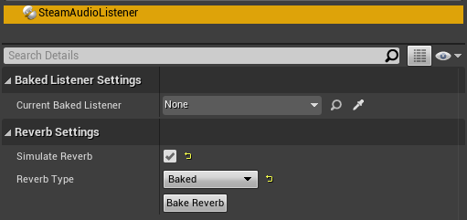

Steam Audio Listener
~~~~~~~~~~~~~~~~~~~~

Provides options for controlling how the listener is incorporated into sound propagation simulation.

Can be attached to any actor.

Current Baked Listener
    When simulating reflections for a source whose **Reflections Type** is set to **Baked Static Listener**, the position and orientation of the actor specified in this field will be used as the position and orientation of the listener.

Simulate Reverb
    If checked, listener-centric reverb will be simulated. You can use the Steam Audio Reverb submix effect to apply the reverb to some portion of your audio mix.

Reverb Type
    Specifies how listener-centric reverb is simulated.

    -   *Realtime*. Rays are traced from the listener in real-time, and bounced around the scene to simulate reverberation. This allows reverb to vary smoothly and account for dynamic geometry, at the cost of significant CPU usage.

    -   *Baked*. Baked reverb data is used to interpolate the reverberation at the listener position. This prevents reverb from accounting for dynamic geometry and results in relatively low CPU usage, at the cost of increased memory and disk space usage.

Bake Reverb
    Starts baking reverb for this scene.
