% Steam Audio Unreal Engine 4 Plugin

# Steam Audio Unreal Engine 4 Plugin
**Steam&reg; Audio, Copyright 2016 - 2019, Valve Corp. All rights reserved.**

## Introduction

Thanks for trying out Steam Audio. It is a complete solution to add 3D audio and environmental effect to your game or VR
experience. It has the following capabilities:

- **3D audio for direct sound.** Steam Audio binaurally renders direct sound using HRTFs to accurately model the
  direction of a sound source relative to the listener. Users can get an impression of the height of the source, as well
  as whether the source is in front of or behind them.

- **Occlusion and partial occlusion**. Steam Audio can quickly model raycast occlusion of direct sound by solid objects.
  Steam Audio also models partial occlusion for non-point sources.

- **Model a wide range of environmental effects.** Steam Audio can model many kinds of environmental audio effects,
  including slap echoes, flutter echoes, occlusion of sound by buildings, propagation of occluded sound along alternate
  paths, through doorways, and more.

- **Create environmental effects and reverbs tailored to your scene.** Steam Audio analyzes the size, shape, layout, and
  material properties of rooms and objects in your scene. It uses this information to automatically calculate
  environmental effects by simulating the physics of sound.

- **Automate the process of creating environmental effects.** With Steam Audio, you don’t have to manually place effect
  filters throughout your scene, and you don’t have to manually tweak the filters everywhere. Steam Audio uses an
  automated real-time or pre-computation based process where environmental audio properties are calculated (using
  physics principles) throughout your scene.

- **Generate high-quality convolution reverb.** Steam Audio can calculate convolution reverb. This involves calculating
  Impulse Responses (IRs) at several points throughout the scene. Convolution reverb results in compelling environments
  that sound more realistic than with parametric reverb. This is particularly true for outdoor spaces, where parametric
  reverbs have several limitations.

- **Head tracking support.** For VR applications, Steam Audio can use head tracking information to make the sound field
  change smoothly and accurately as the listener turns or moves their head.

### How Steam Audio Works

This section describes the various parts of Steam Audio, focusing on the way in which the computational load is divided
between multiple threads. Steam Audio interacts with three main threads:

1. **Game Thread**. This thread controls the game state, and sends this information to the Simulation Thread. This
   thread is managed by the game engine, and runs as fast as the game engine chooses to execute it, which might be 60 Hz
   assuming vsync is enabled.

2. **Simulation Thread.** This thread actually carries out the sound propagation simulation, and performs the bulk of
  the computational work. It uses source and listener information provided by the Game Thread, and calculates an impulse
  response for use by the Rendering Thread. This process involves ray tracing. This thread is managed internally by
  Steam Audio, and runs as fast as it can, but no faster than the Rendering Thread.

3. **Rendering Thread.** This thread applies direct occlusion, 3D audio, and environmental effects to each sound source.
  Steam Audio inserts DSP code into the main audio thread, to perform convolutions with multi-channel impulse responses.
  This thread runs at the audio DSP rate, which is typically 1024 samples per frame, and 44100 samples per second.

### Integration and Platforms

Steam Audio supports **Unreal Engine 4.20 or higher**. If you are using Unity, refer to the _Steam Audio Unity Plugin
Manual_. If you are using a different game engine or audio middleware, you will need to use the Steam Audio C API.
Refer to the *Steam Audio API Reference* for further information.

The Steam Audio Unreal Engine 4 plugin currently supports Windows 7 or later, and Android.

## Unreal Engine 4 Integration

This chapter explains how to use Steam Audio with Unreal Engine. It assumes that you are using Unreal's built-in audio engine.

### Setting up Your Unreal Project
To get started, users must make sure they are running with the newest audio engine, enable the plugin, and enable the plugin on a per-platform basis.

> **NOTE** <br/>
> For developers using UE4.20-4.24, you will need to manually enable the Audio Mixer Functionality, such as by passing -audiomixer to the Unreal executable on startup.

#### Enabling Steam Audio
Before using the Steam Audio plugin with Unreal, you must enable it for your project. To do so:

1. In the Unreal Editor main menu, click **Edit** > **Plugins**.
2. In the left pane of the Plugins window, under **Built-In**, click **Audio**.
3. Scroll the list of plugins until you see **Steam Audio**, then check **Enabled**.

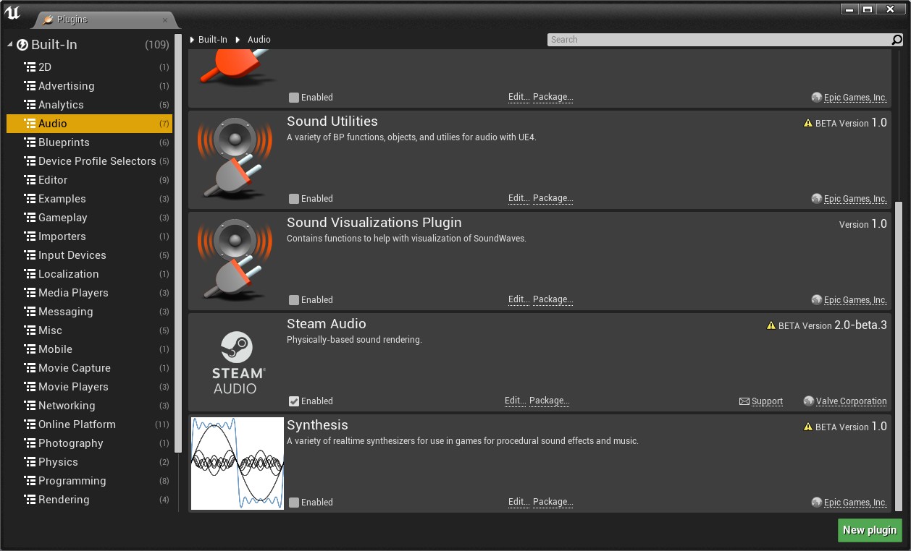

#### Enabling Individual Plugins
Unreal allows users to individually configure spatialization, occlusion, and reverb
plugins, per-platform. For example, you may choose to use Steam Audio's spatialization
plugin on Windows and Android, but use default spatialization on PS4.

To get started on Windows:

1. In the Unreal Editor main menu, click **Edit** > **Project Settings**.
2. In the **Platforms** section, select **Windows**.
3. In the **Audio** section, you will see three dropdowns. Change these to **Steam Audio**.
4. Restart the editor.

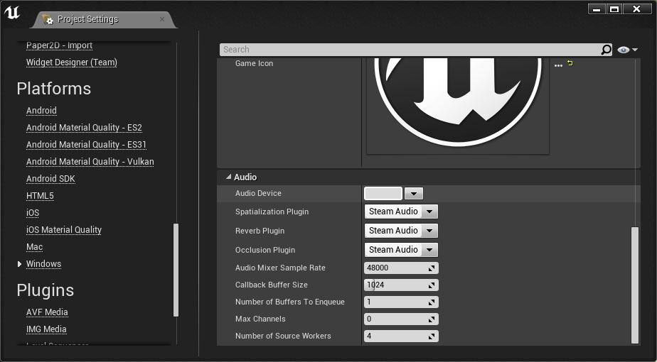

### Spatialization Plugin
The Steam Audio spatialization plugin allows users to apply HRTF-based binaural audio for their games and VR experiences.
You can enable Steam Audio spatialization on any Audio Component in your scene. To do this:

1. In the **World Outliner** tab, select the Actor that contains the Audio Component you want to spatialize.
2. In the **Details** tab, select the Audio Component you want to spatialize.
3. Under **Attenuation Spatialization**, check **Override Attenuation**.
4. In the **Spatialization Method** drop-down, select **Binaural**.

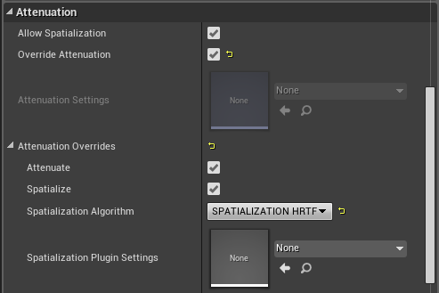

This configures Steam Audio to use HRTF-based binaural rendering for this sound. If you want to fine-tune how the
spatialization is performed, you can configure advanced spatialization settings as described in the next section.

#### Spatialization Settings Assets
Spatialization Settings assets may be used to configure how Steam Audio spatializes a sound by following these steps:

1. Select the Audio Component whose spatialization settings you want to modify.
2. Under **Attenuation Plugin Settings**, expand the **Plugin Settings** section.
3. Add an element to the **Spatialization Plugin Settings** array.
4. If you have already created a Spatialization Settings asset, you can select it from the list. Otherwise, click
   **Phonon Spatialization Source Settings** under **Create New Asset**.
5. Give the newly-created asset any name you prefer, then double-click it in the **Content Browser** tab.

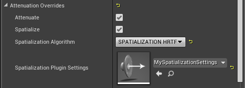

In the window that opens, you can configure the following settings:

##### Spatialization Method
Select _HRTF_ to use Steam Audio's HRTF-based binaural rendering algorithm (this is the default). You can also select
_Panning_ to revert to a standard panning algorithm. This is mostly useful for comparison purposes only.

##### HRTF Interpolation Method
HRTF Interpolation specifies what interpolation scheme to use for HRTF-based 3D audio processing:

- **Nearest**. This option uses the HRTF from the direction nearest to the direction of the source for which HRTF data
  is available.

- **Bilinear**. This option uses an HRTF generated after interpolating from four directions nearest to the direction of
  the source, for which HRTF data is available. Bilinear HRTF interpolation may result in smoother audio for some kinds
  of sources when the listener looks around, but has higher CPU usage than Nearest HRTF interpolation.


### Occlusion Plugin
The Steam Audio occlusion plugin lets you model the transmission of direct sound from the source to the listener. In particular, 
Steam Audio allows you to model occlusion, air absorption, physics-based attenuation, and directivity. There are several key
configuration steps to be aware of when using the Steam Audio occlusion plugin:

- Before you can model occlusion, you must tag and export the scene as described in [scene setup](#scene-setup).
- When the occlusion plugin is enabled and configured for a source, the attenuation settings other than **Enable Occlusion** 
  found in the **Attenuation Occlusion** settings section will not be applied.
- Unreal Engine has a native ability to model distance attenuation and air absorption. These settings are found in the **Attenuation Distance** and
  **Attenuation Air Absorption** sections, respectively. For best results with Steam Audio, we recommend making sure that **Enable Volume Attenuation** and
  **Enable Air Absorption** remain **unchecked**.

You can enable Steam Audio occlusion on any Audio Component in your scene. To do this:

1. In the **World Outliner** tab, select the Actor that contains the Audio Component you want to spatialize.
2. In the **Details** tab, select the Audio Component you want to spatialize.
3. Under **Attenuation Occlusion**, check **Enable Occlusion**.
4. Under **Attenuation Plugin Settings**, expand the **Plugin Settings** section.
5. Add an element to the **Occlusion Plugin Settings** array.
6. If you have already created an Occlusion Settings asset, you can select it from the list. Otherwise, click
   **Phonon Occlusion Source Settings** under **Create New Asset**.
7. Give the newly-created asset any name you prefer.

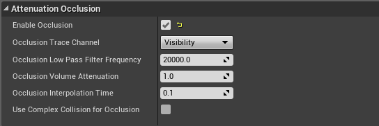

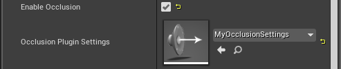

> **NOTE** <br/>
> When your project is configured to use the Steam Audio occlusion plugin, UE4 will ignore all settings in the **Attenuation Occlusion** section, except for **Enable Occlusion**.

This configures Steam Audio's direct sound effect with the default settings. To fine-tune how Steam Audio models
direct sound, you can configure advanced occlusion settings as described in the next section.

#### Occlusion Settings Assets
In the **Content Browser** tab, double-click the Occlusion Settings asset you created. In the window that opens, you
can configure how Steam Audio models direct sound.

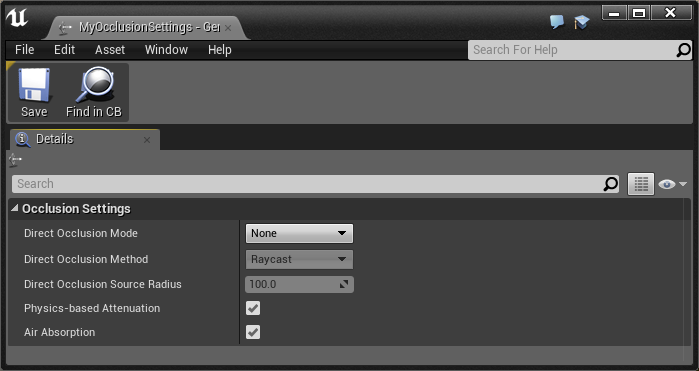

##### Direct Occlusion Mode
Direct Occlusion Mode specifies how to model sources that are occluded by solid objects.

- **None**. Occlusion calculations are disabled. Sounds can be heard through walls and other solid objects.

- **Direct Occlusion, No Transmission**. Occlusion calculations are enabled. Occluded sound is inaudible.

- **Direct Occlusion, Frequency Independent Transmission**. Occlusion calculations are enabled. Occluded sound is attenuated as it
  passes through geometry, based on the material properties of the occluding object. The attenuation is independent of
  frequency.

- **Direct Occlusion, Frequency Dependent Transmission**. Occlusion calculations are enabled. Occluded sound is filtered as it passes
  through geometry, based on the material properties of the occluding object. The filtering is dependent on frequency,
  so for example high frequencies may be attenuated more than low frequencies as the sound passes through geometry.

##### Direct Occlusion Method
This dropdown is enabled whenever Direct Occlusion Mode is set to anything other than None. Specifies the algorithm used by
Steam Audio for modeling occlusion. The options are:

- **Raycast**. Performs a single ray cast from source to the listener to determine occlusion. If the ray is occluded,
  direct sound is blocked.

- **Partial**. Performs multiple ray casts from source to the listener, treating the source as a sphere with a specified
  radius. The volume of the sound source is adjusted based on the portion of the source visible from the listener. Transmission calculations,
  if enabled, are only applied to the occluded portion of the direct sound.

##### Direct Occlusion Source Radius
Specifies the radius of the sphere to use when modeling Partial occlusion. Ignored if Direct Occlusion Method is set to
Raycast.

##### Physics-Based Attenuation
When checked, physics-based distance attenuation (inverse distance falloff) is applied to the audio.

> **NOTE** <br/>
> To avoid applying physics-based distance attenuation on top of Unreal Engine's native distance attenuation, ensure that
  **Enable Volume Attenuation** is unchecked under **Attenuation Distance**.

##### Air Absorption
When checked, frequency-dependent, distance-based air absorption is applied to the audio. Higher frequencies are
attenuated more quickly than lower frequencies over distance.

> **NOTE** <br/>
> To avoid applying air absorption on top of Unreal Engine's native air absorption, ensure that
  **Enable Air Absorption** is unchecked under **Attenuation Air Absorption**.

#### Global Occlusion Settings
You can access global occlusion plugin settings for Steam Audio by:

1. In the main menu, click **Edit** > **Project Settings**.
2. In the left pane, under **Plugins**, select **Steam Audio**.

##### Occlusion Samples
The number of rays that are traced from the listener to various points in a sphere around the source. Increasing this number results in smoother transitions as the source becomes more (or less) occluded. This comes at the cost of increased CPU usage.

### Reverb Plugin
The Steam Audio reverb plugins allows you to model the transmission of indirect sound from the source to the listener. In particular,
there are two types of reverb, source-centric and listener-centric, that you may apply to a source. **Source-centric reverb** is a per-source
effect that models how sound emitted from the source bounces around the environment before reaching the listener. **Listener-centric reverb**
is a global effect that models how sound emitted from the listener bounces around the environment before returning to the listener. 
Listener-centric reverb is often used as a less expensive approximate alternative to source-centric reverb, although the two effects may be combined.
There are several key configuration steps to be aware of when using the Steam Audio reverb plugin:

- Before you can model reverb, you must tag and export the scene as described in [scene setup](#scene-setup).
- Both source-centric and listener-centric reverb can be configured as real-time or baked.
- Both source-centric and listener-centric reverb are computed as an ambisonics sound field at the listener that must be spatialized before making it into the final mix.
  You can configure how detailed this sound field is and how it is spatialized in the global Steam Audio settings.

#### Enabling Source-Centric Reverb
You can enable source-centric reverb on any Audio Component in your scene. To do this:

1. In the **Details** tab, select the Audio Component for which you want to enable sound propagation.
2. Under **Attenuation Plugin Settings**, expand the **Plugin Settings** section.
3. Add an element to the **Reverb Plugin Settings** array.
4. If you have already created an Reverb Settings asset, you can select it from the list. Otherwise, click
   **Phonon Reverb Source Settings** under **Create New Asset**.
5. Give the newly-created asset any name you prefer.

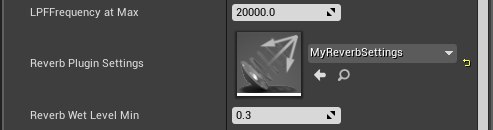

This configures Steam Audio's source-centric reverb with the default settings. To fine-tune source-centric
reverb settings for this source, see [reverb settings assets](#reverb-settings-assets).

#### Enabling Listener-Centric Reverb
You can enable listener-centric reverb on any Audio Component in your scene. To do this:

1. In the **World Outliner** tab, select the Actor that contains the Audio Component you want to spatialize.
2. In the **Details** tab, select the Audio Component you want to spatialize.
3. Under **Attenuation Reverb Send**, check **Enable Reverb Send**.
4. Under **Attenuation Reverb Send**, change **Reverb Send Method** to **Manual**.
5. Under **Attenuation Reverb Send**, change **Manual Reverb Send Level** to **1.0**.
6. Under **Attenuation Plugin Settings**, expand the **Plugin Settings** section.
7. Add an element to the **Reverb Plugin Settings** array.
8. If you have already created an Reverb Settings asset, you can select it from the list. Otherwise, click
   **Phonon Reverb Source Settings** under **Create New Asset**.
9. Give the newly-created asset any name you prefer.

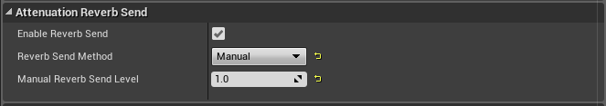


This configures the audio component to use both listener-centric and source-centric reverb with the default settings. **Listener-centric
reverb must also be enabled in the global project settings, since it is disabled by default.** To enable listener-centric
reverb globally and configure other settings, see [global reverb settings](#global-reverb-settings). If you only want listener-centric
reverb for this source, then you can disable source-centric reverb simulation as described in [reverb settings assets](#reverb-settings-assets).

#### Reverb Settings Assets
To fine-tune source-centric reverb settings for a source, in the **Content Browser** tab, double-click the Reverb Settings asset you
created. In the window that opens, you can configure the following settings:


##### Source-Centric Reverb Simulation
This determines what kind of simulation is performed to calculate source-centric reverb.

- **Realtime.** Environmental effects are continuously simulated in real-time, during gameplay. This allows for more flexibility in incorporating changes to the scene and sources, but incurs a CPU overhead.
- **Baked.** The Audio Component must be static to use this simulation mode. Environmental effects are precomputed from the source position during the design phase and saved with the scene. For largely static scenes, this mode allows you to reduce CPU overhead at the cost of increased memory consumption.
- **Disabled.** Do not apply source-centric reverb.

##### Source-Centric Reverb Contribution
Increasing this value increases the contribution of indirect sound relative to the overall mix for this source.

#### Global Reverb Settings
You can access global reverb plugin settings for Steam Audio by:

1. In the main menu, click **Edit** > **Project Settings**.
2. In the left pane, under **Plugins**, select **Steam Audio**.

You can fine-tune various settings that control how Steam Audio simulates physics-based indirect sound. 
This can help you achieve the right balance between simulation quality and in-game performance. 
These settings apply to both listener-centric and source-centric reverb (for all sources that use it).


##### Listener-Centric Reverb Simulation
How to simulate listener-centric reverb, if at all. 

##### Listener-Centric Reverb Contribution
How much listener-centric reverb should contribute to the overall mix.

##### Ambisonics Order
This determines the directionality of environmental effects. Increasing this increases the compute complexity
quadratically. Use zero order Ambisonics if no directionality is needed in environmental effects. Otherwise, first order
Ambisonics should provide a good tradeoff between directionality and CPU usage.

##### Impulse Response Duration
This is the length of the impulse responses to generate, in seconds. Increasing this improves the quality of the
simulation, but beyond a certain point (depending on the number of sound sources), may result in audio glitching.

##### Indirect Spatialization Method
If set to **Panning**, Steam Audio will apply a standard panning algorithm to render the Ambisonics-encoded
environmental effects. If set to **HRTF**, Steam Audio will decode the environmental effects using an HRTF-based
binaural rendering algorithm, for improved spatialization of indirect sound.

##### Irradiance Min Distance
The minimum distance between a source and a scene surface, used when calculating the energy received at the surface from the source during indirect sound simulation. Increasing this number reduces the loudness of reflections when standing close to a wall; decreasing this number results in a more physically realistic model.

##### Max Sources
This is the maximum number of sound sources that can have source-centric reverb enabled. For the purposes of this
setting, listener-centric reverb counts as a source. For example, if Max Sources is set to 8, and you are using
listener-centric reverb, then you can have up to 7 sources that use source-centric reverb.

##### Real-Time Quality Settings
These settings let you fine-tune how Steam Audio simulates physics-based indirect sound. You can select one of the
presets from the **Quality Preset** drop-down, or select **Custom**, and adjust the following settings.

- **Real-time CPU Cores (%).** Percentage of CPU cores to use on an end user’s machine for performing real-time computation of environmental effects. The percentage can also be interpreted as the number of threads to create as a percentage of the total logical cores available on the machine of an end user. Increasing realtime CPU usage leads to faster update of the simulation and lower latency.
- **Rays.** This is the number of primary and reflection rays to trace from the listener position for real-time computation of
environmental effects. Increasing this improves the quality of the simulation, at the cost of performance.
- **Secondary Rays.** This is the number of directions that are sampled when simulating diffuse reflection. Setting this number too low may
reduce the overall quality.
- **Bounces.** Number of times the rays are allowed to bounce off of solid objects in real-time. Increasing this improves the quality
of the simulation, at the cost of performance.

##### Baked Quality Settings
These settings let you fine-tune how Steam Audio simulates physics-based indirect sound. You can select one of the
presets from the **Quality Preset** drop-down, or select **Custom**, and adjust the following settings.

- **Baking CPU Cores (%).** Percentage of CPU cores to use on a developer’s machine for baking environmental effects during the design phase. The percentage can also be interpreted as the number of threads to create as a percentage of the total logical cores available on the machine of a developer. Increasing baking CPU usage leads to lower bake times and faster turnaround.
- **Rays.** This is the number of primary and reflection rays to trace from the listener position for baked computation of environmental effects. 
Increasing this improves the quality of the simulation while increasing the overall time to bake environmental effects.
- **Secondary Rays.** This is the number of directions that are sampled when simulating diffuse reflection. Setting this number too low may reduce the overall quality.
- **Bounces.** Number of times the rays are allowed to bounce off of solid objects during baking. Increasing this improves the quality of the simulation 
while increasing the overall time to bake environmental effects.

#### Baked Reverb
As an alternative to simulating physics-based environmental effects in real time, you can choose to _bake_ them in
the Unreal editor. At run-time, the baked environmental effect information is used to look up the appropriate filters
to apply based on the source and/or listener position. This way, you can perform much more detailed simulations as a
pre-process, trading off CPU usage at run-time for additional disk space and memory usage for the baked data.

##### Placing Probes
Before you can bake environmental audio effects, you must place _probes_ at all points in your scene where you want to
bake environmental effects. A probe is a point at which environmental audio effects are sampled.

###### Probe Volumes
To create probes, you must first create a _Probe Volume_, which is a box-shaped region of space in which multiple
probes will automatically be generated by Steam Audio. To create a Probe Volume:

1. In the **Modes** tab, click **Volumes**.
2. Drag a **Phonon Probe Volume** actor into your scene.
3. Using Unreal's built-in translation and scaling gizmos, adjust the position and size of the Probe Volume so that it
   covers the geometry on/in which you want to generate probes.

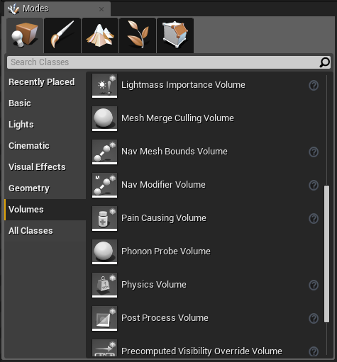

You can create multiple Probe Volumes throughout the scene, Steam Audio will bake environmental effects for all
probes in all Probe Volumes.

###### Probe Generation
Once a Probe Volume has been created, you must generate probes within it:

1. In the **World Outliner** tab, click the Probe Volume in which you wish to generate probes.
2. In the **Details** tab, select a **Placement Strategy** (see below).
3. Click **Generate Probes**.

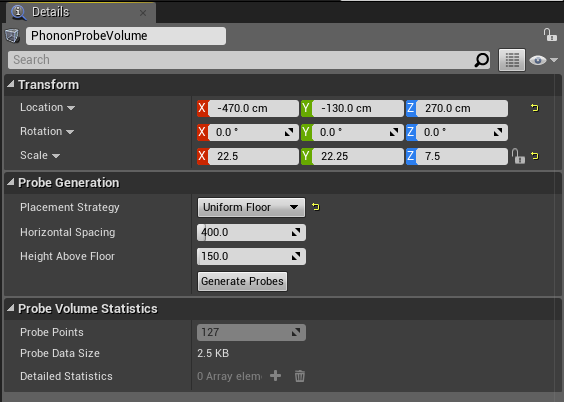

The probes will be displayed as blue dots in the scene.


The probe **Placement Strategy** determines how Steam Audio generates probes within a Probe Volume. Steam Audio currently
supports the following strategies:

- **Centroid.** Places a single probe at the center of the Probe Volume.
- **Uniform Floor.** Places probes at a certain height above the floor with a certain horizontal spacing between them. The height is specified by the **Height Above Floor** parameter. Spacing is specified by the **Horizontal Spacing** parameter.

##### Baked Source-Centric Reverb
This section describes how to configure Steam Audio to generate and use baked data for source-centric reverb.

###### Generating Baked Source-Centric Reverb
To pre-compute source-centric reverb for a specific source:

1. In the **World Outliner**, select the actor containing the Audio component for you want to bake sound propagation.
2. In the **Details** view, click **Add Component**.
3. In the Add Component menu, click **Phonon Source**.
4. Specify a **Unique Identifier** for this source. Each baked source must have a distinct Unique Identifier.
5. Adjust the **Baking Radius** as needed. This radius, measured in game units, defines a sphere such that sound
   propagation is baked at all probes that lie within the sphere.
6. Click **Bake Propagation**.


###### Using Baked Source-Centric Reverb
To configure a sound source to use baked data, follow these steps:

1. In the **World Outliner** tab, select the actor containing the Audio component you want to configure.
2. In the **Details** tab, click the Audio component.
3. Under **Attenuation**, expand **Attenuation Overrides**.
4. In the **Reverb Plugin Settings** drop-down, click **Edit**.
5. In the window that appears, in the **Source-Centric Reverb Simulation** drop-down, select **Baked**.

##### Baked Listener-Centric Reverb
This section describes how to configure Steam Audio to generate and use baked data for listener-centric reverb.

###### Generating Baked Listener-Centric Reverb
To pre-compute listener-centric reverb:

1. In the toolbar, click the down arrow next to **Build**.
2. Click **Bake Indirect Sound...**.
3. Select **\_\_reverb\_\_** and click **Bake Selected**.


###### Using Baked Listener-Centric Reverb
To configure Steam Audio to use baked data for listener-centric reverb:

1. In the main menu, click **Edit** > **Project Settings**.
2. In the left pane, under **Plugins**, select **Steam Audio**.
3. In the **Listener-Centric Reverb Simulation** drop-down, select **Baked**.


### Scene Setup
To use Steam Audio for occlusion and reverb in your project, you must first export a scene by tagging geometry 
and specifying acoustic materials for the objects in your scene.

#### Tagging Geometry
Steam Audio needs to know what objects in your scene should be used to model occlusion and calculate environmental
effects. You can specify this by tagging the relevant objects in multiple different ways.

##### Tagging Static Meshes
Any Static Mesh component can be tagged with a **Phonon Geometry** component:

1. Select the Static Mesh component you wish to tag.
2. Click **Add Component**.
3. Select **Phonon Geometry**.

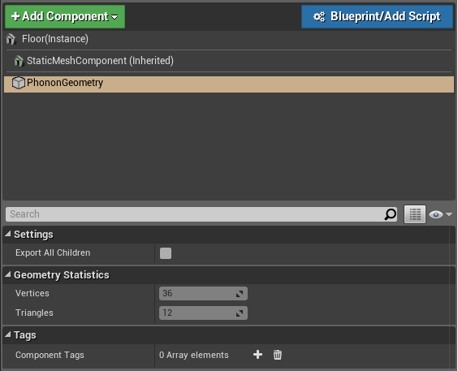

> **NOTE** <br/>
> Tagging an object with Phonon Geometry does not require you to create an additional mesh first. Steam Audio can
  directly use the same meshes used for visual rendering. Not all objects have a noticeable influence on environmental
  effects. For example, in a large hangar, the room itself obviously influences the environmental effect. A small tin
  can on the floor, though, most likely doesn’t. But large amounts of small objects can collectively influence the
  environmental effect. For example, while a single wooden crate might not influence the hangar reverb, large stacks of
  crates are likely to have some impact.

##### Tagging Static Meshes in Bulk
You may also add or remove Phonon Geometry components from all Static Mesh components in
the scene by using buttons provided in the Steam Audio editor mode.

1. Click on the Steam Audio editor mode.
2. Click on **Add All** or **Remove All** to add or remove from all Static Mesh components.


##### Tagging a Hierarchy of Objects
To tag a large number of Static Mesh components that share a common parent actor in the World Outliner view:

1. Select the parent actor of all the components you wish to tag.
2. Click **Add Component**, then select **Phonon Geometry**.
3. Select the **Phonon Geometry** component, then under **Settings**, click **Export All Children**.

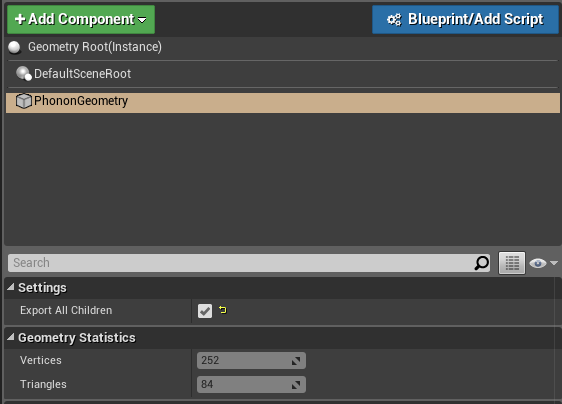

##### Tagging Landscape Terrain
In the current version of Steam Audio for Unreal Engine 4, you cannot select individual parts of Landscape terrain to
use for physics-based environmental audio simulation. You can either use all terrain in a scene, or none of it. To
configure Steam Audio to use Landscape terrain:

1. In the main menu, click **Edit** > **Project Settings**.
2. In the Project Settings window, under **Plugins**, click **Steam Audio**.
3. Under **Scene Export**, check **Export Landscape Geometry**.

##### Tagging BSP Geometry
In the current version of Steam Audio for Unreal Engine 4, you cannot select individual parts of BSP geometry to use
for physics-based environmental audio simulation. You can either use all BSP geometry in a scene, or none of it. To
configure Steam Audio to use BSP geometry:

1. In the main menu, click **Edit** > **Project Settings**.
2. In the Project Settings window, under **Plugins**, click **Steam Audio**.
3. Under **Scene Export**, check **Export BSP Geometry**.

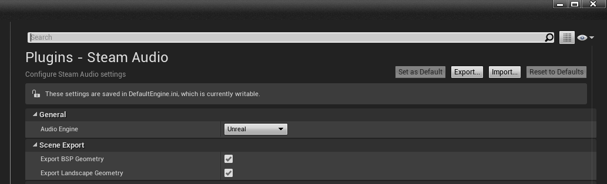

#### Specifying Acoustic Materials
After tagging objects, the next step is to tell Steam Audio what they are made of. You can specify the acoustic
material of an object as follows:

- Select the Actor whose material you wish to specify.
- In the **Details** view, click **Add Component**.
- Select **Phonon Material**.

In the Phonon Material component that appears, click the **Material Preset** drop-down and choose a material preset.

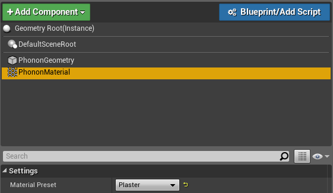

##### Acoustic Material for Object Hierarchies
If you have an object with a Phonon Geometry component with Export All Children checked, and you attach a Phonon
Material component to it, all its children are assigned the material of the root object. It is possible to assign a
child object a different material by attaching a Phonon Material component to the child object.

##### Global Default Materials
For scenes where most objects are made of the same material, barring a few exceptions, you can save time by specifying
a global default material. Then, you only have to add Phonon Material components to objects whose material is different
from the default. To specify a global default material:

1. In the main menu, click **Edit** > **Project Settings**.
2. In the Project Settings window, under **Plugins**, click **Steam Audio**.
3. Under **Default Static Mesh Material**, select a preset from the **Material Preset** drop-down.
4. Under **Default Landscape Material**, select a preset from the **Material Preset** drop-down.
5. Under **Default BSP Material**, select a preset from the **Material Preset** drop-down.

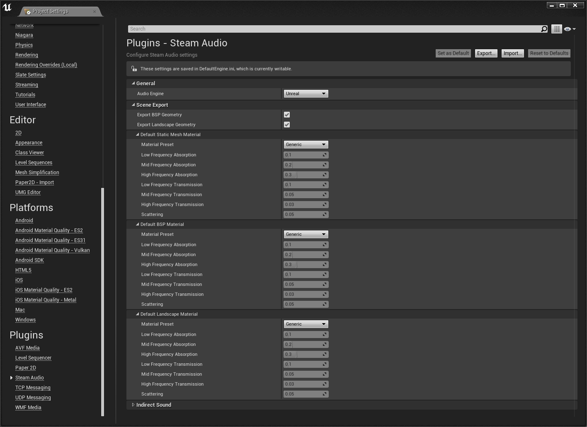

#### Adjusting Material Properties
Instead of choosing a material preset, you can use a custom material. To do so, select **Custom** from the Material
Preset drop-down, either on a Phonon Material component, or for the global default materials. Seven sliders appear,
allowing you to customize the material.


##### Absorption
The first three sliders, **Low Frequency Absorption**, **Mid Frequency Absorption**, and **High Frequency Absorption**,
let you specify how much sound the material absorbs at different frequencies. For example, setting High Frequency
Absorption to 1 means that the material absorbs all high frequency sound that reaches it. This adds a low-pass
filtering effect to any sound reflected by the object.

> **NOTE** <br/>
> The center frequencies for the three frequency bands are 800 Hz, 4 KHz, and 15 KHz.

##### Transmission
The fourth through sixth sliders, **Low Freq Transmission**, **Mid Freq Transmission**, and **High Freq Transmission**,
let you specify how much sound the material transmits at different frequencies. For example, setting High Freq
Transmission to 0 means that no high frequency sound passes through the material. This adds a low-pass filtering effect
to any sound passing through the object.

##### Scattering
The seventh slider, **Scattering**, lets you specify how "rough" the surface is when reflecting sound. Surfaces with a
high scattering value randomly reflect sound in all directions; surfaces with a low scattering value reflect sound in a
mirror-like manner.

#### Scene Export
You must "export" the scene before hitting Play in the Unreal editor or building a player, to ensure scene setup changes
are available to Steam Audio. To export:

1. Click on the **Steam Audio** editor mode.
2. Click on **Export Scene**.


After exporting, you should see the number of triangles in the scene and overall
data size. If you wish to view the scene that will be used by Steam Audio, you may
export to an OBJ file by clicking **Export OBJ**. The resulting OBJ file may be loaded and viewed in the Unreal editor.

#### Dynamic Geometry
Steam Audio can model the effect of dynamic geometry when simulating occlusion, transmission, and indirect sound in real-time. For example, if a door opens, a previously occluded sound can become unoccluded; if a room is made larger, reverb may change substantially.

This functionality requires the use of Embree as your ray tracer (see section on Intel&reg; Embree for more info). It allows geometry to be moved, rotated, and scaled at run-time. However, runtime geometry deformations and/or edits are not supported. 
  
##### Tagging Dynamic Geometry
Similar to static geometry, a **Phonon Geometry** component can be attached to any Actor with a Static Mesh Component in your level. However, the Static Mesh component's mobility _must_ be set to **Movable**. Doing so tells Steam Audio to treat that Actor as a dynamic object:

1. Select the Static Mesh component you wish to tag.
2. Ensure that the Static Mesh Component's **Mobility** is set to **Movable**
3. Click **Add Component**.
4. Select **Phonon Geometry**.

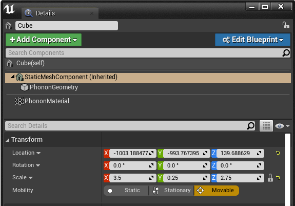

At run-time, any changes made to the Transform of the **Static Mesh Component** where the Phonon Geometry Component is attached will automatically be passed to Steam Audio.

You can also tag several Static Mesh components in a single Actor by adding a Phonon Geometry component to them as a child component (see above instructions). You can then make changes to the Transform of each tagged Static Mesh component during runtime and they will automatically be passed to Steam Audio.

##### Tagging Materials for Dynamic Geometry
The Actor containing the Phonon Geometry component must also have a Phonon Material component attached. This Material is treated as the default material for the Dynamic Geometry. 

Tagging materials for dynamic geometry works similarly to static geometry:

- Select the Actor whose material you wish to specify.
- In the **Details** view, click **Add Component**.
- Select **Phonon Material**.

##### Exporting Dynamic Objects
After tagging a Dynamic Object with Phonon Geometry and Material components, you must export your level. The Scene Export will automatically recognize all dynamic geometry in the scene. Check above on how to do Scene Exports.

### AMD TrueAudio Next

Steam Audio provides optional support for AMD TrueAudio Next, which allows you to reserve a portion of the GPU for
accelerating convolution operations. TrueAudio Next requires a supported AMD Radeon GPU. 
If you choose to enable TrueAudio Next support in your UE4 project, then Steam Audio will try to use the GPU to 
accelerate the rendering of indirect sound, including real-time source-centric reverb, real-time listener-centric reverb, 
and baked listener-centric reverb.

##### Enabling TrueAudio Next

To enable TrueAudio Next for Steam Audio:

1. In the main menu, click **Edit** > **Project Settings**.
2. In the left pane, under **Plugins**, select **Steam Audio**.
3. In the **Convolution Type** dropdown, select **AMD TrueAudio Next**.

##### Settings Overrides

When TrueAudio Next is enabled, you can also override some of the simulation settings
that are normally configured on the Steam Audio Manager Settings component. These include 
**Impulse Response Duration**, **Ambisonics Order**, and **Max Sources**.

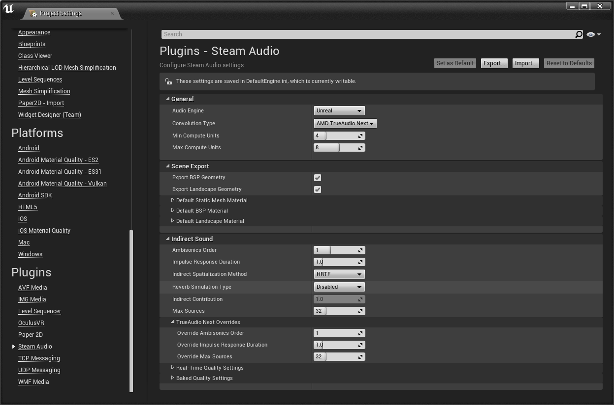

These overrides allow you to switch to a higher level of acoustic detail when the user's PC has a supported
GPU, while seamlessly falling back to using the CPU with the default settings if a supported GPU is not found.

##### Resource Reservation

When TrueAudio Next is enabled, you can configure the following Resource 
Reservation settings, which allow you to control how much of the GPU is set 
aside for audio processing tasks:

- **Max Compute Units To Reserve**. This is the largest number of CUs that Steam Audio will try to reserve for audio
  processing at runtime. When set to 0, entire GPU is used for audio processing. If compute units fewer than minimum
  possible reservable on a particular GPU are requested, TrueAudio Next initialization will fail. For example, if
  **Max Compute Units To Reserve** is set to 2 and minimum number of compute units that can be reserved on a user's 
  GPU are 4, TrueAudio Next initialization will fail.

- **Fraction Compute Units for IR Update**. Multiple resources can be reserved by Steam Audio on GPU for audio 
  processing and other tasks like preparing IR calculated on CPU for audio processing or indirect sound processing 
  on GPU (see section on **Radeon Rays** below). This value determines the fraction of **Max Compute Units To Reserve** 
  used for IR update. For example, if **Max Compute Units To Reserve** is set to 8 and **Fraction Compute Units for IR Update** 
  is set to 0.5, then 4 compute units are used for audio processing and 4 compute units are used for IR update.

### Intel&reg; Embree
Steam Audio provides optional support for Intel&reg; Embree, which uses highly optimized CPU ray tracing for accelerating 
real-time simulation and baking. Embree support in Steam Audio is currently restricted to a single CPU core. Embree 
support will work on any modern CPU based on the x86 or x86_64 architectures, as long as Streaming SIMD Extensions 2 
(SSE2) instructions are supported. CPUs that support Advanced Vector eXtensions (AVX) or AVX2 instructions will 
result in improved performance when using Embree support.

> **NOTE** <br/>
  Embree support is only available on Windows (64-bit).

#### Enabling Embree
To enable Intel&reg; Embree for Steam Audio:

1. In the main menu, click **Edit** > **Project Settings**.
2. In the left pane, under **Plugins**, select **Steam Audio**.
3. In the **Ray Tracer** dropdown, select **Intel Embree**.

### AMD Radeon Rays
Steam Audio provides optional support for AMD Radeon Rays, which uses GPU-optimized ray tracing for accelerating
real-time simulation and baking. Radeon Rays support in Steam Audio requires a supported AMD GPU or other OpenCL 1.2+
device.

> **NOTE** <br/>
  Radeon Rays support is only available on Windows (64-bit).

#### Enabling Radeon Rays
To enable AMD Radeon Rays for Steam Audio:

1. In the main menu, click **Edit** > **Project Settings**.
2. In the left pane, under **Plugins**, select **Steam Audio**.
3. In the **Ray Tracer** dropdown, select **AMD Radeon Rays**.

#### Radeon Rays Settings
When Radeon Rays is enabled, you can configure the following settings, which allow you to control how the GPU used for baking:

- **Baking Batch Size**. This is the number of probes that are simultaneously baked on the GPU. Increasing this number
  results in better utilization of available GPU compute resources, at the cost of increased GPU memory consumption.
  If this number is set too high, you may encounter errors when baking; if this happens, reduce the Baking Batch Size 
  value until baking succeeds.

#### GPU Resource Reservation
GPU Resource Reservation reserves a portion of GPU (specified as number of compute units) for calculating real-time indirect 
sound. This way, real-time indirect sound calculation is restricted to reserved GPU resources only and they do not interfere
with other rendering or other game logic using GPU resources during runtime. For baking, entire GPU is always used.

- **Max Compute Units To Reserve**. Maximum number of compute units to reserve on GPU for real-time indirect sound simulation. 
When set to 0, entire GPU is used for real-time simulation. For baking, entire GPU is always used. If TrueAudio Next is enabled, 
dual resource reservation is active and different amout of GPU resources are reserved for IR update / real-time indirect sound 
and real-time convolution.

### Packaging Your Game
For developers using UE4.20-4.24, once you're ready to package your game, you need to make sure that you copy the
Steam Audio runtime data directory. To do so:

1. In the main menu, click **Edit** > **Project Settings**.
2. In the left pane, under **Project**, select **Packaging**.
3. In the **Packaging** section, expand the advanced section.
4. Add a new directory to the **Additional Non-Asset Directories to Copy** array.
5. Browse and select **SteamAudio/Runtime**.

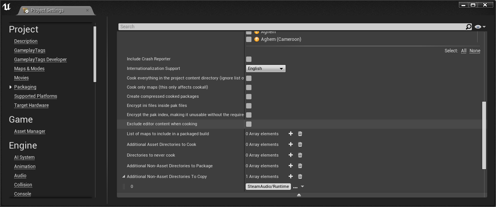

> **NOTE** <br/>
> For developers using UE4.20-4.24, on some platforms, you may need to edit the platform engine config file to make sure your executable will use the new audio mixer at runtime. For example, on Windows, edit **Config/Windows/WindowsEngine.ini** and ensure the **Audio** section contains:
> ```
> [Audio]
> UseAudioMixer=true
> ```
