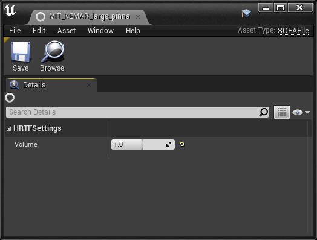

SOFA File
---------

A SOFA file containing the data for a custom HRTF.

Volume Gain (dB)
    Adjusts the volume of the HRTF filters contained in the SOFA file. Different SOFA files may be normalized to different average volumes, and this parameter can be used to ensure that a given SOFA file works well within your overall mix.

Normalization Type
    Specifies the algorithm to use (if any) to normalize the volumes of the SOFA file's HRTF filters across all directions. See :doc:`Steam Audio Settings <settings>` for more details.
