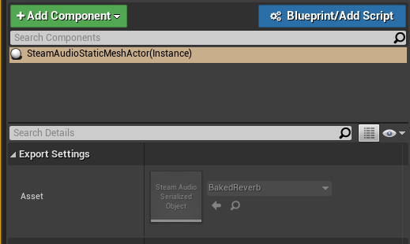

Steam Audio Static Mesh
~~~~~~~~~~~~~~~~~~~~~~~

References the asset containing the exported geometry data for the static geometry of the level. This actor is automatically added to the level when you export geometry. You shouldn't have to create an actor of this type manually.

Asset
    Reference to the asset that contains the exported geometry data for this level. Automatically generated by Steam Audio.
