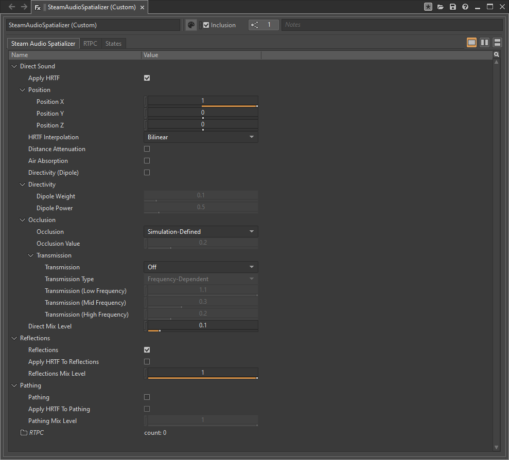

Getting Started
===============

.. highlight:: c++

Requirements
------------

Steam Audio requires **Wwise 2023.1.0** or later.

The Steam Audio Wwise integration supports the following platforms:

-  Windows 7 or later (32-bit and 64-bit)
-  Linux (64-bit, tested with Ubuntu 18.04 LTS)
-  macOS 10.7 or later (64-bit Intel, 64-bit ARM)
-  Android 5.0 or later (32-bit ARM, 64-bit ARM, 32-bit Intel, 64-bit Intel)
-  iOS 11.0 or later (64-bit ARM)


Add Steam Audio to your Wwise installation
------------------------------------------

To add Steam Audio to your Wwise installation:

1.  Download the latest version of the Steam Audio Wwise integration: ``steamaudio_wwise.zip``. Extract the contents of this file to any directory of your choosing.
2.  Open the Wwise Launcher.
3.  In the left column, click **Plugins**, then click the **Add from directory** button that appears.
4.  In the dialog box that appears, select the ``wwise`` subdirectory of the directory you extracted ``steamaudio_wwise.zip`` into, then click **Select Folder**.


Spatialize an event
-------------------

Once Steam Audio is added to Wwise, you can spatialize any event:

1.  In the **Actor-Mixer Hierarchy**, select the sound object you want to spatializer.
2.  Click the **Effects** tab.
3.  Right-click in the **Effects** list, then click **Add Effect** > **Steam Audio Spatializer** > **Default (Custom)**.




Integrate Steam Audio with your game engine
-------------------------------------------

Before you can use the Steam Audio Wwise integration in your game, you must configure your game engine to use Steam Audio and load the Steam Audio Wwise integration.

If you are using Unreal Engine as your game engine, see the Unreal Engine tab below. Otherwise, see the C++ tab for instructions on how to configure your game engine to load the Steam Audio Wwise integration via C++ code.

.. tabs::

    .. group-tab:: Unity

        These instructions assume that you have added the Wwise Unity integration and the Steam Audio Unity integration to your Unity project.

        .. rubric:: Import the Steam Audio Wwise support package

        1.  In Unity's main menu, click **Assets** > **Import Package** > **Custom Package**.
        2.  Navigate to the ``unity`` subdirectory of the directory into which you extracted ``steamaudio_unity.zip``, and double-click the ``SteamAudioWwise.unitypackage`` file.
        3.  In the Import dialog box, make sure everything is selected, and click **Import**.

        .. rubric:: Configure the Wwise Unity integration to use Steam Audio

        Wwise stores information in its generated sound banks about which plugins are used by your project. This is used by the Wwise Unity integration to make sure that the necessary plugin binaries are loaded. No additional steps are necessary.

        .. rubric:: Configure the Steam Audio Unity integration to use Wwise

        1.  In Unity's main menu, click **Steam Audio** > **Settings**.
        2.  Set **Audio Engine** to **Wwise**.

        .. image:: media/unity_steamaudiosettings.png

    .. group-tab:: Unreal Engine

        These instructions assume that you have enabled the Wwise Unreal Engine plugin and the Steam Audio Unreal Engine plugin for your Unreal Engine project.

        .. rubric:: Enable the Steam Audio Wwise Support plugin

        1.  In Unreal's main menu, click **Edit** > **Plugins**.
        2.  Under **Audio**, check **Enabled** under **Steam Audio Wwise Support**.

        .. image:: media/unreal_plugin.png

        .. rubric:: Configure the Wwise Unreal Engine plugin to use Steam Audio

        Wwise stores information in its generated sound banks about which plugins are used by your project. This is used by the Wwise Unreal integration to make sure that the necessary plugin binaries are loaded. No additional steps are necessary.

        .. rubric:: Configure the Steam Audio Unreal Engine plugin to use Wwise

        1.  In Unreal's main menu, click **Edit** > **Project Settings**.
        2.  Under **Plugins** > **Steam Audio**, set **Audio Engine** to **Wwise**.

        .. image:: media/unreal_wwise_audio_engine.png

    .. group-tab:: C++

        These instructions assume that you have integrated Steam Audio with your game engine via the Steam Audio SDK.

        .. rubric:: Load the Steam Audio Wwise integration

        If your C++ project links to Wwise plugins using static linking:

        1.  Include the following header in one of your source files:

            ```
            #include <AK/Plugin/SteamAudioWwiseFXFactory.h>
            ```

        2.  Link against ``SteamAudioWwiseFX.lib`` (on Windows) or ``libSteamAudioWwiseFX.a`` (on other platforms). This file will be installed into your Wwise SDK directory by the Wwise launcher. The exact subdirectory in which this file can be found depends on your platform, build tools, and build configuration.

        If your C++ project links to Wwise plugins using dynamic linking:

        1.  Make sure the file ``SteamAudioWwise.dll`` (on Windows), or ``libSteamAudioWwise.dylib`` (on macOS), or ``libSteamAudioWwise.so`` (on other platforms) is present in a directory which your project's executable can access.

        2.  When initializing Wwise, configure ``AkInitSettings::szPluginDLLPath`` to point to the directory from step 1. Wwise will automatically find the plugin and load it.

        For more information on linking to and registering Wwise plugins, refer to the `Wwise SDK documentation <https://www.audiokinetic.com/en/library/edge/?source=SDK&id=soundengine_plugins.html#register_effects>`_.

        .. rubric:: Initialize the Steam Audio Wwise integration

        1.  Call ``iplWwiseInitialize`` after creating the Steam Audio context.
        2.  Create an HRTF (typically the default HRTF), and call ``iplWwiseSetHRTF``.
        3.  Determine the simulation settings to use for subsequent simulations, and call ``iplWwiseSetSimulationSettings``.
