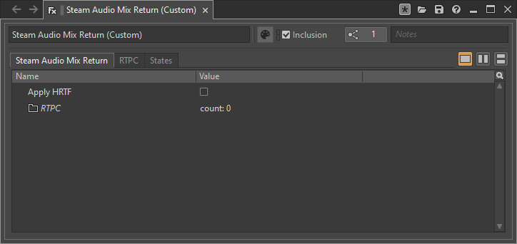

Mixer Return
~~~~~~~~~~~~

When **Reflections** are enabled for multiple sound objects in a scene, this effect can be used to reduce the CPU cost of audio processing. When this mixer effect is added to a bus, the reflected portion of every sound object's output is taken out of Wwise's audio pipeline, mixed, spatialized, and re-inserted at the mixer to which this effect is attached. The direct sound path of sound objects is not affected.

.. note::
    
    Since reflected sound is taken out of Wwise's audio pipeline at the Steam Audio Spatializer effect, any effects applied between the Steam Audio Spatializer effect and the Steam Audio Mixer Return effect will not apply to the reflected sound.

.. note::
    
    This effect should only be used if using **Convolution** or **TrueAudio Next** for reflections. It is *required* when using **TrueAudio Next**.

Apply HRTF
    If checked, applies HRTF-based 3D audio rendering to mixed reflected sound. Results in an improvement in spatialization quality, at the cost of slightly increased CPU usage. Default: off.
